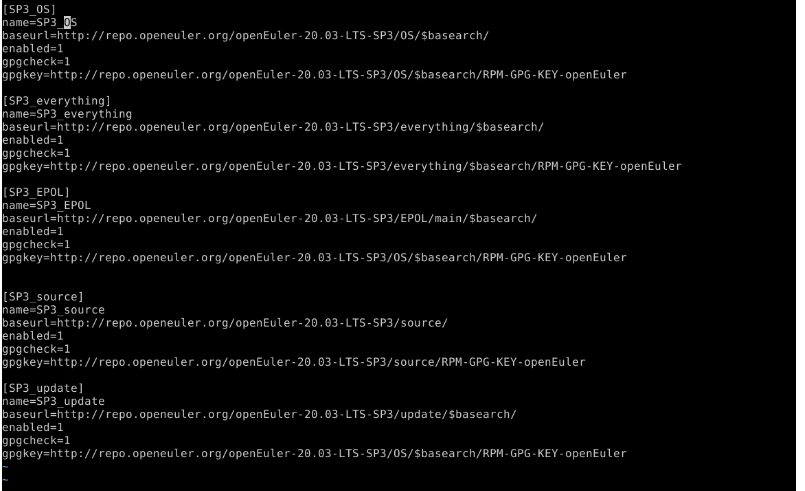
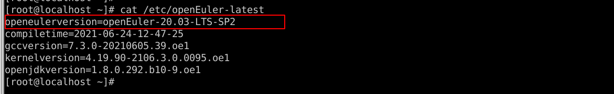
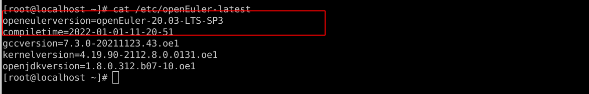
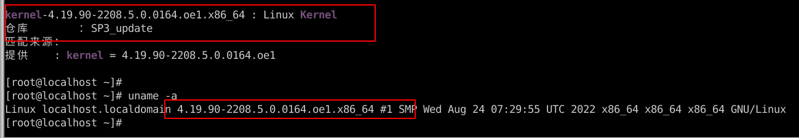

## **1**. **配置相关源**

### 1.1 添加20.03-LTS-SP3 repo源，均默认启用

```
SP3_OS 、SP3_everything、SP3_EPOL、SP3_UPDATE 
```



### 1.2   查看当前环境openEuler 版本




## **2** **安装**

### **2.1 查询SP3中可用包名并生成all_list文件**

```
dnf list --available | grep -E "SP3_update|SP3_OS|SP3_everything|SP3_EPOL" | grep "arch\|x86_64" | awk '{print $1}' | awk -F. 'OFS="."{$NF="";print}' | awk '{print substr($0, 1, length($0)-1)}' > all_list
```


## **3.** **执行升级**

```
dnf clean all

dnf install -y $(cat all_list) | tee update_log
```

```
说明：安装报错时 dnf install -y -x conflict_pkg1 --skip-broken --nobest  $(cat all_list) |tee install_log 可规避安装冲突问题，如果有多个包冲突，添加多个-x conflict_pkg1，-x conflict_pkg2,-x conflict_pkg3,待升级完成后，对跳过的软件包单独进行分析、验证、升级
```


## **4.** **重启**

```
reboot
```


## 5. 重启后查看openEuler、kernel版本

 




