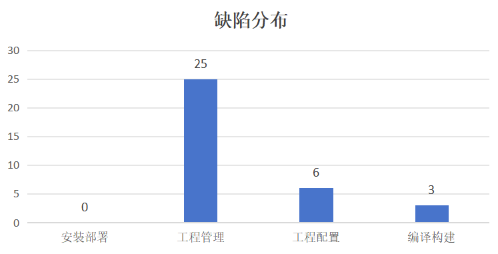
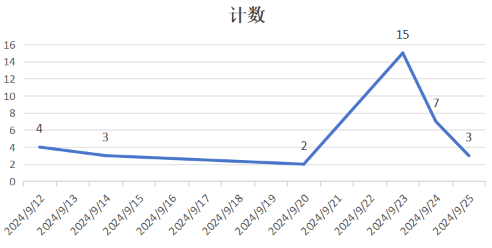

**国创混合部署插件-测试报告v1.0.2**

文档版本： v1.0.2

发布日期：2024-09-27

|编号|版本号|修订内容简述|修订日期|修订人|审阅人|
| :-: | :-: | :-: | :-: | :-: | :-: |
|1|V1.0.1|初稿|2024-09-25|孙扬扬|何小云|
|2|V1.0.2|回归问题后内容修订|2024-09-27|` `孙扬扬|` `何小云|
|||||||

目录

[1.概述	](#_toc11617)

[1.1. 混合部署插件简介	](#_toc16783)

[1.2. 测试目的	](#_toc13648)

[1.3. 测试类型	](#_toc4897)

[1.4. 测试时间	](#_toc12454)

[2. 测试资源	](#_toc19615)

[2.1. 硬件资源	](#_toc3784)

[2.2. 软件资源	](#_toc27391)

[3. 测试结果	](#_toc32626)

[3.1. 测试策略	](#_toc21314)

[3.2. 测试结果	](#_toc16142)

[4. 缺陷分析	](#_toc13800)

[4.1. 问题单概况	](#_toc4814)

[4.2. 按模快分布	](#_toc10028)

[4.3. 按级别分	](#_toc23185)

[4.4. 遗留问题	](#_toc23000)

[5. 总结	](#_toc3792)

[5.1. 风险评估	](#_toc6638)

[5.2. 测试结论	](#_toc29489)

[6. 参考文档	](#_toc19844)

**概述**
## **混合部署插件简介**
QSemOS-Hybrid-Deployment-plugin是面向智能设备开发者提供的一站式集成开发环境，支持代码编辑、编译、烧录、调试和仿真等功能，支持C/C++语言，以插件的形式部署在Visual Studio Code上。
 ## **测试目的**
本报告目的在于总结混合部署第一轮测试阶段质量做一个阶段性总结，

验证各个功能是否正常，使用和操作是否流畅，数据保存是否完整、正确，提供的产品操作文档和实际产品是否一致。
 ## **测试类型**
混合部署插件主要在功能的基础上做集成和验收测试。

|**测试类型**|**是否实施**|**备注**|
| :-: | :-: | :-: |
|集成测试|是|验证各模块集成与数据拉通|
|验收测试|是|验证各场景功能点是否满足需求|

## **测试时间**

|**测试模快**|**覆盖用例数**|**测试人员**|**测试时间**|
| :-: | :-: | :-: | :-: |
|安装部署|10|孙扬扬|2024/09/20-2024/09/27|
|插件管理|78|孙扬扬|2024/09/20-2024/09/27|
|工程配置|25|孙扬扬|2024/09/20-2024/09/27|
|编译构建|10|孙扬扬|2024/09/20-2024/09/27|

# **测试资源**
## **硬件资源**

|测试平台|CPU|内存|磁盘|系统版本|
| :-: | :-: | :-: | :-: | :-: |
|10\.10.14.42|4C|8G|100G|Ubuntu22.04|

## **软件资源**

|**软件名称**|**用途说明**|
| :- | :- |
|VSCode19.2|安装软实时插件|
|Python3|插件运行依赖|
|pip3|安装Python依赖包|
|apt-get|安装Ubuntu系统依赖包|
|gcc-linaro-14.0.0-2023.06-x86\_64\_aarch64-linux-gnu|工程交叉编译|
|gcc-linaro-14.0.0-2023.06-x86\_64\_arm-linux-gnueabihf|工程交叉编译|
|hybrid-deployment-1.0.47|混合部署插件|

# **测试结果**
## **测试策略**
- 使用插件供应商提供的插件进行安装、更新、卸载验证
- 优先使用插件供应商提供的模版依赖资源进行插件核心流程功能验。
- 测试板卡主要使用rk3568，采用默认配置和模版。
- 整体进行一轮测试。
## **测试结果**
参考用例文档，及自己补充的测试场景执行混合部署插件测试。

|**混合部署插件测试执行结果**|||||
| - | :- | :- | :- | :- |
|**模快**|**用例总数**|**执行用例**|**通过用例数**|**失败（fail/block）**|
|安装部署|10|10|10|0|
|工程管理|197|78|23|41|
|工程配置|50|25|19|6|
|构建|51|10|0|10|

# **缺陷分析**
## **问题单概况**
本次测试共计提出34个确认需要修改的问题与建议、解决29个、遗留1个严重级别问题、4个一般级别问题，统计数据来源源飞书中的测试问题跟踪多维表格。
## **按模快分布**

|**模名称块**|**总缺陷数**|**备注不解决**|**已解决**|**未解决**|
| - | - | - | - | - |
|安装部署|0|0|0|0|
|工程管理|25|13|10|2|
|工程配置|6|1|4|1|
|编译构建|3|3|0|0|

如图所示，问题主要分布在工程管理模快。
 ## **按级别分**

|**问题级别**|**值**|**百分比**|
| - | - | - |
|致命|1|3%|
|严重|10|29%|
|一般|16|47%|
|提示|7|21%|

备注：本次测试中影响核心功能或数据均定义为严重级别。
 ## **问题收敛趋势**

从图中可见测试策略覆盖的功能模块在整个测试周期内暴露的问题总体呈现波动趋势，风险不可控。
 ## **遗留问题**
无
 # **总结**
## **风险评估**
- 本次测试根据测试策略管维工具、远程调试等需要实际连接开发板的工程任务未测试。
- 工程配置中存在大量与嵌入式开发密切相关的参数配置，参数配置保存后是否在开发流程中确实生效需要插件供应商进行保证。
- 本次测试过程中插件版本不断更新，存在回归测试未覆盖的部分引入新问题的可能。
- 提测周期比较晚、存在很多没有覆盖的场景。
 ## **测试结论**
- 测试策略所覆盖的功能范围需要解决一般以上级别遗留问题。
- 结合风险评估中的内容，建议将本测试报告结合插件供应商提供的测试报告汇总分析是否满足交付客户使用的质量要求。
 # **参考文档**
《混合部署测试用例.xlsx》

《混合部署插件用户手册.docx》

