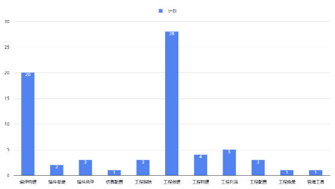
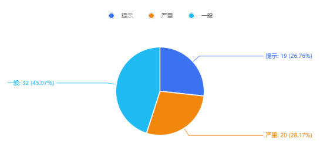
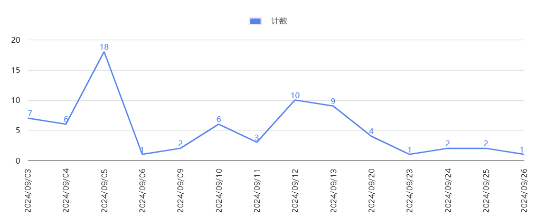



**国创软实时插件**

**测试报告V1.3**

|**编号**|**版本号**|**修订内容简述**|**修订日期**|**修订人**|**审核**|
| :- | :- | :- | :- | :- | :- |
|1|V1.0|初版|2024/09/24|罗志祥|何小云|
|2|V1.1|插件版本更新后内容修正|2024/09/25|罗志祥|何小云|
|3|V1.2|用例数据调整|2024/09/25|罗志祥|何小云|
|4|V1.3|插件版本更新后内容修正|2024/09/26|罗志祥|何小云|
|||||||
**
# **目录**
[1 测试背景	](#_toc9497)

[1.1 插件简介	](#_toc2801)

[1.2 测试目的	](#_toc15838)

[1.3 测试类型	](#_toc10346)

[1.4 测试时间	](#_toc3261)

[2 测试资源	](#_toc10764)

[1.1. 硬件资源	](#_toc4279)

[1.2. 软件资源	](#_toc2212)

[3 测试执行	](#_toc9732)

[3.1 测试策略	](#_toc25501)

[3.2 测试覆盖	](#_toc14869)

[3.3 测试结果	](#_toc22417)

[4 问题单统计	](#_toc28769)

[4.1 问题单概况	](#_toc5721)

[4.2 按模块分布	](#_toc18094)

[4.3 按级别分布	](#_toc13478)

[4.4 问题收敛趋势	](#_toc31945)

[4.5 遗留问题	](#_toc367)

[5 总结	](#_toc25280)

[5.1 风险评估	](#_toc7603)

[5.2 测试结论	](#_toc2583)

[6 测试参考文档	](#_toc32608)

**

 # **测试背景**
 ## **插件简介**
IDE软实时插件是面向智能设备开发者提供的一站式集成开发环境,提供了工程管理、参数配置、代码编辑、编译构建、仿真模拟、远程调试、管维工具、工程烧录等能力。插件采用Windows+Ubuntu混合开发环境，在Ubuntu上主要进行代码开发、代码调试、编译构建能操作，在windows上实现烧录操作。

 ## **测试目的**
测试目的是为了检测软实时插件是否达到预期的设计目的，其中包括：

- 各功能点是否正常
- 使用流程是否顺畅
- 数据的保存是否完整、正确
- 是否具有良好的易用性和可操作性

 ## **测试类型**

|**测试类型**|**是否实施**|**备注**|
| :-: | :-: | :-: |
|集成测试|是|验证各模块集成与数据拉通|
|验收测试|是|验证各场景功能点是否满足需求|

 ## **测试时间**

|**测试人员**|**测试时间**|
| :-: | :-: |
|罗志祥|2024/09/03-2024/09/26|

 # **测试资源**
 ## **硬件资源**

|**测试平台**|**CPU**|**内存**|**磁盘**|**系统版本**|
| :-: | :-: | :-: | :-: | :-: |
|172\.19.208.1|6C|8G|500G|Windows10|
|10\.10.11.225|8C|16G|100G|Ubuntu22.04|

## **软件资源**

|**软件名称**|**用途说明**|
| :-: | :-: |
|VSCode19.2|安装软实时插件|
|Python3|插件运行依赖|
|pip3|安装Python依赖包|
|apt-get|安装Ubuntu系统依赖包|
|agcc-arm-10.3-2021.07-x86\_64-aarch64-none-linux-gnu|工程交叉编译|
|gcc-linaro-7.5.0-2019.12-x86\_64\_aarch64-linux-gnu|工程交叉编译|

 # **测试执行**
 ## **测试策略**
- 优先使用插件供应商提供的Git项目、SDK、RPM等项目依赖资源进行插件核心流程功能验。
- 工程烧录主要取决于各板卡供应商提供的烧入软件，IDE关注在windows平台下能正常调用烧录配置，打开已经安装好的windows烧录工具
- 管维工具需要连接安装了指定软件的开发板，尝试使用模拟的方式验证，如模拟受阻则暂缓测试
- 测试板卡优先使用rk3568、rk3588；其他板卡、平台与工程配置采取配置保存后检查工程配置文件的方式验证
- 整体进行二轮测试，一轮功能验证，一轮基于问题的回归验证

 ## **测试覆盖**
本次测试的模块有：

- 插件安装：windows平台安装、ubuntu平台安装、插件卸载、插件更新
- 插件功能：主页、工程创建、工程配置、编译构建、工程烧录、管维工具、命令行执行

 ## **测试结果**

<table><tr><th colspan="4"><b>测试用例执行结果</b></th></tr>
<tr><td colspan="1"><b>一级特性</b></td><td colspan="1" valign="top"><b>二级特性</b></td><td colspan="1" valign="top"><b>用例总数</b></td><td colspan="1" valign="top"><b>通过率</b></td></tr>
<tr><td colspan="1" rowspan="2">插件菜单</td><td colspan="1" valign="top">工程列表</td><td colspan="1" valign="top">85</td><td colspan="1" valign="top">100%</td></tr>
<tr><td colspan="1" valign="top">工程配置</td><td colspan="1" valign="top">119</td><td colspan="1" valign="top">100%</td></tr>
<tr><td colspan="1" rowspan="4">

工程任务
</td><td colspan="1" valign="top">工程构建</td><td colspan="1" valign="top">68</td><td colspan="1" valign="top">100%</td></tr>
<tr><td colspan="1" valign="top">管维工具</td><td colspan="1" valign="top">6</td><td colspan="1" valign="top">100%</td></tr>
<tr><td colspan="1" valign="top">工程烧录</td><td colspan="1" valign="top">1</td><td colspan="1" valign="top">100%</td></tr>
<tr><td colspan="1" valign="top">终端命令</td><td colspan="1" valign="top">10</td><td colspan="1" valign="top">100%</td></tr>
</table>

 # **问题单统计**
 ## **问题单概况**
本次测试共计提出59个确认需要修改的问题与建议、解决55个、遗留2个严重级别问题、2个一般级别问题、1一个提示级别问题，统计数据来源源飞书中的测试问题跟踪多维表格。

 ## ` `**按模块分布**

<table><tr><th valign="top"><b>一级模块</b></th><th valign="top"><b>二级模块</b></th><th valign="top"><b>总数</b></th><th valign="top"><b>已解决</b></th><th valign="top"><b>未解决</b></th></tr>
<tr><td rowspan="4">插件菜单</td><td valign="top">插件安装</td><td valign="top">2</td><td valign="top">3</td><td valign="top">0</td></tr>
<tr><td valign="top">插件启动</td><td valign="top">3</td><td valign="top">2</td><td valign="top">1</td></tr>
<tr><td valign="top">工程创建</td><td valign="top">28</td><td valign="top">26</td><td valign="top">0</td></tr>
<tr><td valign="top">工程列表</td><td valign="top">5</td><td valign="top">5</td><td valign="top">0</td></tr>
<tr><td rowspan="6">工程任务</td><td valign="top">编译构建</td><td valign="top">24</td><td valign="top">22</td><td valign="top">1</td></tr>
<tr><td valign="top">仿真配置</td><td valign="top">1</td><td valign="top">1</td><td valign="top">0</td></tr>
<tr><td valign="top">缓存擦除</td><td valign="top">3</td><td valign="top">3</td><td valign="top">0</td></tr>
<tr><td valign="top">工程配置</td><td valign="top">3</td><td valign="top">3</td><td valign="top">0</td></tr>
<tr><td valign="top">工程烧录</td><td valign="top">1</td><td valign="top">1</td><td valign="top">0</td></tr>
<tr><td valign="top">管维工具</td><td valign="top">1</td><td valign="top">1</td><td valign="top">0</td></tr>
</table>

如图表所示，问题主要分布在工程创建与编辑构建模块。
 ## **按级别分布**

|**问题级别**|**值**|**百分比**|
| - | - | - |
|致命|0|0|
|严重|20|28\.17%|
|一般|32|45\.07%|
|提示|19|26\.76%|

备注：本次测试中影响核心功能或数据均定义为严重级别。
 ## **问题收敛趋势**

从图中可见测试策略覆盖的功能模块在整个测试周期内暴露的问题总体呈现明显的收敛趋势，风险可控。

## **遗留问题**
`    `当前遗留1个概率性问题、1个优化建议

遗留原因：概率性问题出现频率低且未找到重现路径；优化建议不影响插件功能的使用。
 # **总结**
 ## **风险评估**
- 本次测试根据测试策略管维工具、远程调试等需要实际连接开发板的工程任务未测试。
- 工程配置中存在大量与嵌入式开发密切相关的参数配置，参数配置保存后是否在开发流程中确实生效需要插件供应商进行保证。
- 本次测试过程中插件版本不断更新，存在回归测试未覆盖的部分引入新问题的可能。
 ## **测试结论**
- 测试策略所覆盖的功能范围测试通过。
- 结合风险评估中的内容，建议将本测试报告结合插件供应商提供的测试报告汇总分析是否满足交付客户使用的质量要求。
 # **测试参考文档**
《软实时插件用户手册.docx》

《国创IDE软实时插件软件包安装及使用说明V1.1.docx》

《软实时测试用例.xlsx》

软件测试质量报告第 1 页
