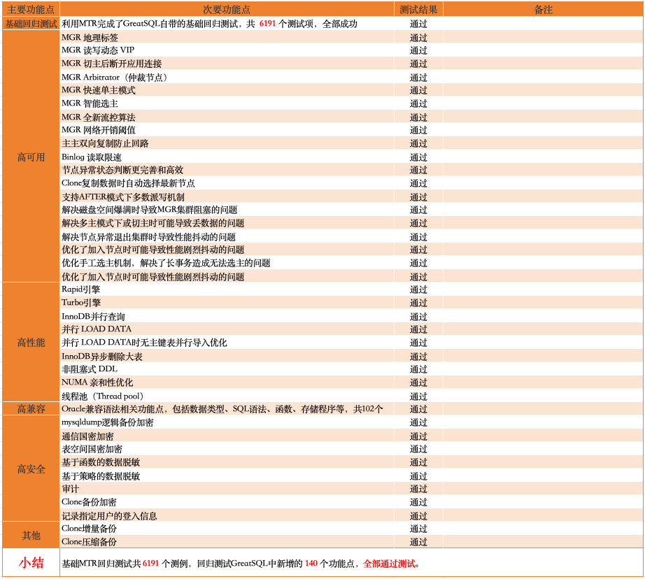

# openEuler-25.09-GreatSQL测试报告

版权所有 © 2025  openEuler社区
 您对“本文档”的复制、使用、修改及分发受知识共享(Creative Commons)署名—相同方式共享4.0国际公共许可协议(以下简称“CC BY-SA 4.0”)的约束。为了方便用户理解，您可以通过访问https://creativecommons.org/licenses/by-sa/4.0/ 了解CC BY-SA 4.0的概要 (但不是替代)。CC BY-SA 4.0的完整协议内容您可以访问如下网址获取：https://creativecommons.org/licenses/by-sa/4.0/legalcode。

修订记录

| 日期 | 修订   版本 | 修改描述 | 作者 |
| ---- | ----------- | -------- | ---- |
| 2025.09.22 | 1.0 | GreatSQL测试报告v1 |@GreatSQL|

关键词：GreatSQL

摘要：按照 GreatSQL 8.0.32-27 测试用例要求，部署 openEuler 25.09 测试镜像环境，对 GreatSQL 的源码编译、RPM安装、二进制包安装、主要功能进行测试。测试结果良好，完全支持 GreatSQL 主要功能的正常使用。

缩略语清单：

| 缩略语 | 英文全名 | 中文解释 |
| ------ | -------- | -------- |
| MGR/GR | MySQL Group Replication | MySQL Group Replication，MySQL 组复制的简称。MySQL 推出的一种不同于主从复制、半同步复制的全新复制机制。|
| arbitrator | MGR arbitrator member | 仲裁节点/投标节点。该节点不存储用户数据，没有 binlog，也不需要回放 relay log，只参与 MGR 状态投票/仲裁。 |
| zone id | MGR member zone id| 地理标签。可以对每个节点设置地理标签，主要用于解决多机房数据同步的问题。|
| fast mode | MGR fast mode | 快速单主模式。在该模式下可以降低 MGR 事务代价，提升事务性能。|
| election mode | MGR Primary member election mode | 可根据不同策略选择MGR主节点。|
| datamask | 数据脱敏 | 数据脱敏有助于防止非授权用户访问敏感数据，从而限制敏感数据的暴露。 |
| nonblocking DDL | 非阻塞式 DDL|Nonblock DDL规避了执行DDL过程中MDL锁长时间获取不成功导致的连接堆积和阻塞，有效地解决了DDL导致的锁表问题。|
| numa affinity | NUMA 亲和性优化|高并发场景在系统默认的线程调度方式下，用户线程和后台处理线程频繁休眠后唤醒在不同 NUMA 节点的 CPU，这种情况导致 CPU 开销增大，影响整体性能。|
| audit | GreatSQL 支持开启审计功能，并且还支持将审计日志写入数据库中，方便管理员查询。|
| VIP | GreatSQL中支持读写节点绑定动态 VIP（虚拟 IP），高可用切换更便捷。|
| Rapid | Rapid Engine | GreatSQL中可满足企业级 OLAP 应用场景的Rapid引擎。 |
| Turbo | Turbo Enging | GreatSQL中可满足企业轻量级 HTAP 应用场景的Turbo引擎。|
| Clone | Clone Plugin | 用于快速克隆整个数据库实例或特定表空间，支持本地和远程克隆，适合备份和迁移场景。|

# 1     特性概述

本测试报告为 GreatSQL 8.0.32-27 在 openEuler 25.09 操作系统上的测试报告，目的在于跟踪测试阶段中发现的问题，总结 GreatSQL 在 openEuler 25.09 操作系统中运行状况&功能特性支持的测试结果，测试的范围主要包括 GreatSQL 源码编译、RPM安装、二进制包安装、主要功能及性能、稳定性等方面进行测试。

# 2     特性测试信息

本节描述被测对象的版本信息和测试的时间及测试轮次，包括依赖的硬件。

| 版本名称 | 测试起始时间 | 测试结束时间 | 备注 | 
| -------- | ------------ | ------------ | --- |
| openEuler-25.09 | 2025年9月19日 | 2025年9月22日 |  |

描述特性测试的硬件环境信息

| 硬件型号 | 硬件配置信息 | 备注 |
| -------- | ------------ | ---- |
| Docker 容器 | 无特殊配置 | 在 aarch64/x86_64 物理机上运行 Docker 容器测试 |

# 3     测试结论概述

## 3.1   测试整体结论

在 Docker 容器中导入并启动 openEuler 25.09 测试镜像，在此基础上进行 GreatSQL 8.0.32-27 测试，共执行 140 个测试项，主要涵盖了 GreatSQL 源码编译、RPM安装、二进制包安装、MGR增强、Binlog读取限速、Clone复制数据时自动最新节点、并行LOAD DATA、异步删除大表、非阻塞式DDL、NUMA亲和性优化、Oracle兼容、Clone备份加密、Clone增量备份、Clone压缩备份、审计、数据脱敏、最后登录信息等主要功能特性等方面，主要功能均通过测试，无风险，整体核心功能稳定正常。

## 3.2   约束说明

无。

## 3.3   遗留问题分析

无。

# 4     测试执行

## 4.1   测试执行统计数据

*本节内容根据测试用例及实际执行情况进行特性整体测试的统计，可根据第二章的测试轮次分开进行统计说明。*

| 版本名称 | 特性名字 | 测试用例数 | 用例执行结果 | 发现问题单数 |
| -------- |---------- | ---------- | ------------ | ------------ |
| openEuler-25.09  | GreatSQL 8.0.32-27 |  140       |      Pass      |     0        |

## 4.2   后续测试建议

无。

## 4.3 特性测试结论

### 4.3.1 高可用特性测试结论

| 序号 | 特性名称 | 遗留问题 | 备注 |
| --- | :--- | :--- | :--- |
| 1  | [MGR 地理标签](https://greatsql.cn/docs/8.0.32-27/5-enhance/5-2-ha-mgr-zoneid.html) | 无 | 可以对每个节点设置地理标签，主要用于解决多机房数据同步的问题。可以提升多机房架构数据可靠性。|
| 2  | [MGR 读写动态 VIP](https://greatsql.cn/docs/8.0.32-27/5-enhance/5-2-ha-mgr-vip.html) | 无 | 支持对MGR节点绑定VIP，使得高可用切换更便捷。|
| 3  | [MGR 切主后断开应用连接](https://greatsql.cn/docs/8.0.32-27/5-enhance/5-2-ha-mgr-kill-conn-after-switch.html) | 无 | 在MGR发生切换时，主动断开旧Primary节点上的所有连接。|
| 4  | [MGR Arbitrator（仲裁节点）](https://greatsql.cn/docs/8.0.32-27/5-enhance/5-2-ha-mgr-arbitrator.html) | 无 | 仲裁节点（投票节点）不存储数据和binlog，无应用事务，使得可以用更低的服务器成本实现更高可用。|
| 5  | [MGR 快速单主模式](https://greatsql.cn/docs/8.0.32-27/5-enhance/5-2-ha-mgr-fast-mode.html) | 无 | 在这个模式下，不再采用MGR原有的认证数据库方式，而是判断当前binlog是否能够及时入盘来决定怎么样流控，确保不OOM。|
| 6  | [MGR 智能选主](https://greatsql.cn/docs/8.0.32-27/5-enhance/5-2-ha-mgr-election-mode.html) | 无 | 支持多种智能选主模式，使得高可用切换选主机制更合理。 |
| 7  | [MGR 全新流控算法](https://greatsql.cn/docs/8.0.32-27/5-enhance/5-2-ha-mgr-new-fc.html) | 无 | 重新设计了流控算法，除了会考虑认证数据库队列大小的因素，并同时考虑了大事务处理和主从节点的同步，流控粒度更细致，不会出现官方社区版本的1秒小抖动问题。|
| 8  | [MGR 网络开销阈值](https://greatsql.cn/docs/8.0.32-27/5-enhance/5-2-ha-mgr-request-time.html) | 无 | 记录超过阈值的事件，便于进一步分析。|
| 9  | [主主双向复制防止回路](https://greatsql.cn/docs/8.0.32-27/5-enhance/5-2-ha-repl-server-mode.html) | 无 | 控制只应用多源复制管道内临近主节点上产生的binlog，不会应用其他的非临近节点产生的binlog，避免出现数据回路问题。|
| 10 | [Binlog 读取限速](https://greatsql.cn/docs/8.0.32-27/5-enhance/5-2-ha-binlog-speed-limit.html) | 无 | 控制从节点上向主节点发起 Binlog 读取请求的限速。|
| 11 | [节点异常状态判断更完善和高效](https://greatsql.cn/docs/8.0.32-27/5-enhance/5-2-ha-mgr-improved.html) | 无 | 可定义节点超过多少秒没发消息会被判定为可疑，提高异常检测判断效率。|
| 12 | [Clone复制数据时自动选择最新节点](https://greatsql.cn/docs/8.0.32-27/5-enhance/5-2-ha-mgr-improved.html) | 无 | 自动选择从最新事务数据的成员节点复制数据，可有效提升 Clone 速度，提高 MGR 的服务可靠性。|
| 13 | [支持AFTER模式下多数派写机制](https://greatsql.cn/docs/8.0.32-27/5-enhance/5-2-ha-mgr-improved.html) | 无 |
| 14 | [解决磁盘空间爆满时导致MGR集群阻塞的问题](https://greatsql.cn/docs/8.0.32-27/5-enhance/5-2-ha-mgr-improved.html) | 无 |
| 15 | [解决多主模式下或切主时可能导致丢数据的问题](https://greatsql.cn/docs/8.0.32-27/5-enhance/5-2-ha-mgr-improved.html) | 无 |
| 16 | [解决节点异常退出集群时导致性能抖动的问题](https://greatsql.cn/docs/8.0.32-27/5-enhance/5-2-ha-mgr-improved.html) | 无 |
| 17 | [优化了加入节点时可能导致性能剧烈抖动的问题](https://greatsql.cn/docs/8.0.32-27/5-enhance/5-2-ha-mgr-improved.html) | 无 |
| 18 | [优化手工选主机制，解决了长事务造成无法选主的问题](https://greatsql.cn/docs/8.0.32-27/5-enhance/5-2-ha-mgr-improved.html) | 无 |
| 19 | [优化了加入节点时可能导致性能剧烈抖动的问题](https://greatsql.cn/docs/8.0.32-27/5-enhance/5-2-ha-mgr-improved.html) | 无 |

### 4.3.2 高性能特性测试结论

| 序号 | 特性名称 | 遗留问题 | 备注 |
| --- | :--- | :--- | :--- |
| 1 | [Rapid引擎](https://greatsql.cn/docs/8.0.32-27/5-enhance/5-1-highperf-rapid-engine.html) | 无 | 可满足企业级 OLAP 应用场景的Rapid引擎，在32C64G实例下TPC-H SF100测试仅耗时不到80秒。|
| 2 | [Turbo引擎](https://greatsql.cn/docs/8.0.32-27/5-enhance/5-1-highperf-turbo-engine.html) | 无 | 可满足企业轻量级 HTAP 应用场景的Turbo引擎，在32C64G实例下TPC-H SF100测试总耗时约214秒。|
| 3 | [InnoDB并行查询](https://greatsql.cn/docs/8.0.32-27/5-enhance/5-1-highperf-innodb-pq.html) | 无 | 通过多线程改造，GreatSQL InnoDB PQ可以充分利用多核资源，提升查询性能。GreatSQL在TPC-H测试中表现优异，最高可提升30倍，平均提升15倍。|
| 4 | [并行 LOAD DATA](https://greatsql.cn/docs/8.0.32-27/5-enhance/5-1-highperf-parallel-load.html) | 无 | 自动将导入的文件切分文件成多个小块，启动多个 Worker 线程并行导入文件块，数据导入性能提升最高约20倍。|
| 5 | [并行 LOAD DATA时无主键表并行导入优化](https://greatsql.cn/docs/8.0.32-27/5-enhance/5-1-highperf-parallel-load.html) | 无 | 对无主键表并行LOAD DATA场景进行优化，可提升约5倍。|
| 6 | [InnoDB异步删除大表](https://greatsql.cn/docs/8.0.32-27/5-enhance/5-1-highperf-async-purge-big-table.html) | 无 | 利用后台线程来异步缓慢地删除数据文件，避免删除大表时产生性能波动。|
| 7 | [非阻塞式 DDL](https://greatsql.cn/docs/8.0.32-27/5-enhance/5-1-highperf-nonblocking-ddl.html) | 无 | 进行多次申请 MDL-X 锁的尝试，而非原生的独占申请方式，这就可以在多次重试的间隙释放锁资源允许新事务进行。|
| 8 | [NUMA 亲和性优化](https://greatsql.cn/docs/8.0.32-27/5-enhance/5-1-highperf-numa-affinity.html) | 无 | 利用 NUMA 亲和性与内存分配策略，让进程与内存的距离尽量短，提升性能。|
| 9 | [线程池（Thread pool）](https://greatsql.cn/docs/8.0.32-27/5-enhance/5-1-highperf-thread-pool.html) | 无 | 可以避免在连接数瞬间激增时因资源竞争而导致系统吞吐下降的问题，使得GreatSQL的性能表现更稳定。|

### 4.3.3 高兼容特性测试结论

| 序号 | 特性名称 | 遗留问题 | 备注 |
| --- | :--- | :--- | :--- |
| 1 | [数据类型兼容](https://greatsql.cn/docs/8.0.32-25/5-enhance/5-3-easyuse.html#%E6%95%B0%E6%8D%AE%E7%B1%BB%E5%9E%8B%E5%85%BC%E5%AE%B9) | 无 | 采用映射方式实现Oracle数据类型兼容。|
| 2 | [SQL语法兼容](https://greatsql.cn/docs/8.0.32-25/5-enhance/5-3-easyuse.html#sql%E8%AF%AD%E6%B3%95%E5%85%BC%E5%AE%B9) | 无 | 兼容大部分Oracle SQL语法。
| 3 | [函数兼容](https://greatsql.cn/docs/8.0.32-25/5-enhance/5-3-easyuse.html#%E5%87%BD%E6%95%B0%E5%85%BC%E5%AE%B9) | 无 | 兼容大部分Oracle函数。|
| 3 | [存储程序兼容](https://greatsql.cn/docs/8.0.32-25/5-enhance/5-3-easyuse.html#%E5%AD%98%E5%82%A8%E8%BF%87%E7%A8%8B-%E5%87%BD%E6%95%B0%E5%85%BC%E5%AE%B9) | 无 | 兼容大部分Oracle存储程序。|

### 4.3.4 高安全特性测试结论

| 序号 | 特性名称 | 遗留问题 | 备注 |
| --- | :--- | :--- | :--- |
| 1 | [mysqldump备份加密](https://greatsql.cn/docs/8.0.32-27/5-enhance/5-4-security-mysqldump-encrypt.html) | 无 | 支持在 mysqldump 进行逻辑备份时产生加密备份文件，并且也支持对加密后的备份文件解密导入。|
| 2 | [Clone 备份加密](https://greatsql.cn/docs/8.0.32-27/5-enhance/5-4-security-clone-encrypt.html) | 无 | 支持在执行 Clone 备份时加密备份文件，以及对加密后的备份文件解密。|
| 3 | [审计](https://greatsql.cn/docs/8.0.32-27/5-enhance/5-4-security-audit.html) | 无 | 支持审计功能，并将审计日志写入数据表中，并且设置审计日志入表规则，以便达到不同的审计需求。|
| 4 | [国密加密](https://greatsql.cn/docs/8.0.32-27/5-enhance/5-4-security-encrypt-with-gmssl.html) | 无 | 支持在通信加密和 InnoDB 表空间加密时采用国密算法。|
| 5 | [数据脱敏](https://greatsql.cn/docs/8.0.32-27/5-enhance/5-4-security-data-masking.html) | 无 | 数据脱敏有助于防止非授权用户访问敏感数据，从而限制敏感数据的暴露。|
| 6 | [记录指定用户的登入信息](https://greatsql.cn/docs/8.0.32-27/5-enhance/5-4-security-last-login.html) | 无 | 可查看上一次成功登录以及上一次成功登录后所有的失败登录信息。|

### 4.3.5 其他特性测试结论

| 序号 | 特性名称 | 遗留问题 | 备注 |
| --- | :--- | :--- | :--- |
| 1 | [Clone 压缩及增量备份](https://greatsql.cn/docs/8.0.32-27/5-enhance/5-5-clone-compressed-and-incrment-backup.html) | 无 | 支持 Clone 在线全量热备和增量备份，以及压缩备份。|

# 5     附件

测试功能点清单

