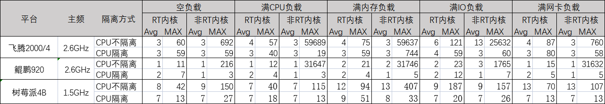

版权所有 © 2022  openEuler社区
 您对“本文档”的复制、使用、修改及分发受知识共享(Creative Commons)署名—相同方式共享4.0国际公共许可协议(以下简称“CC BY-SA 4.0”)的约束。为了方便用户理解，您可以通过访问https://creativecommons.org/licenses/by-sa/4.0/ 了解CC BY-SA 4.0的概要 (但不是替代)。CC BY-SA 4.0的完整协议内容您可以访问如下网址获取：https://creativecommons.org/licenses/by-sa/4.0/legalcode。

修订记录

| 日期       | 修订版本 | 修改章节 | 修改描述 |
| ---------- | -------- | -------- | -------- |
| 2021/03/29 | v1.0     | /        | 创建     |

关键词：Preempt-RT

摘要：依测试要求，对 openEuler 22.03 及合入Preempt-RT openEuler 22.03镜像，在空负载，CPU负载，内存负载，IO负载和网络负载等情况下针对不同硬件设备进行对比测试。

缩略语清单：

| 缩略语         | 英文全名        | 中文解释                                                     |
| -------------- | --------------- | ------------------------------------------------------------ |
| RT内核         | Realtime kernel | 实时内核，本文指合入Preempt-RT补丁的openEuler 22.03 LTS 的内核 |
| 非实时(RT)内核 | /               | 非实时内核，本文指 openEuler 22.03 LTS 官方内核              |

***

# 1   概述

该测试报告汇总了 openEuler 21.03  LTS 使用官方内核和RT内核在三种不同硬件设备的实时性测试信息。

# 2   测试版本说明

## 2.1  测试对象

| 版本名称                     | 测试起始时间 | 测试结束时间 |
| ---------------------------- | ------------ | ------------ |
| openEuler 22.03 LTS RC5 内核 | 2021/03/23   | 2021/03/25   |

## 2.2  硬件环境

| 硬件型号          | 硬件配置信息                                                 | 备注 |
| ----------------- | ------------------------------------------------------------ | ---- |
| 树莓派4B          | CPU:Cortex-A72 * 4 内存：8GB 存储设备：SanDisk Ultra 16GB micro SD |      |
| 飞腾2000/4 台式机 | CPU：4核 内存：16GB 存储设备：SSD                            |      |
| 鲲鹏920 台式机    | CPU：8核 内存：16GB 存储设备：SSD                            |      |

## 2.3  软件环境

| 测试软件              | 备注                                                         |
| --------------------- | ------------------------------------------------------------ |
| rt-test（cyclictest） | 通过cyclictest工具，每项测试500万次，并输出的avg(平均)，Max(最大)延迟 |

## 2.4  测试辅助工具

| 名称      | 备注                                                      |
| --------- | --------------------------------------------------------- |
| stress    | 压力测试工具，用于模拟测试CPU负载，内存负载，IO负载等情况 |
| iperf3    | 网络测试工具，用于模拟测试网络负载                        |
| memtester | 内存测试工具，用于模拟测试内存负载                        |
| shell脚本 | 用于轮询测试，测试信息的收集整理                          |

# 3   版本概要测试结论

​	总体来说内核实时性受CPU，内存和IO影响较大，空负载时和网卡负载实时性没有太大差异；其次CPU隔离对实时性有较大帮助；而RT内核实时性好于非实时内核。

# 4   版本详细测试结论

基于三种硬件，在CPU隔离，空负载，CPU负载  ，内存负载，IO负载和网卡负载测试数据如下：

​	归纳如下：

1. 正常情况下，即没有配置CPU隔离，在空负载，CPU负载  ，内存负载，IO负载和网卡负载等情况下，RT内核比非RT内核实时性要强。通过测试数据来看CPU负载和内存负载情况下，树莓派4B非RT内核是RT内核峰值延迟的3-4倍，飞腾2000设备非RT内核是RT内核800-1000倍，鲲鹏920设备非RT内核是RT内核1500-2600倍，详细非RT内核与RT内核在没有CPU隔离，空负载，CPU负载  ，内存负载，IO负载和网卡负载五种负载情况下比值如下(比值数据越大表明非RT内核实时性越差)：

| 平台       | 空负载 | CPU负载 | 内存负载 | IO负载 | 网卡负载 |
| ---------- | ------ | ------- | -------- | ------ | -------- |
| 飞腾2000/4 | 11.5   | 1047.2  | 795.2    | 211.8  | 8.7      |
| 鲲鹏920    | 19.6   | 2637.3  | 1511.7   | 76.7   | 2108.8   |
| 树莓派4B   | 3.6    | 2.9     | 4.3      | 0.8    | 1.5      |

​		通过以上数据可以说明，RT内核的峰值延迟普遍要优于非RT内核。

2. 正常情况下，即没有配置CPU隔离，空负载，CPU负载  ，内存负载，IO负载和网卡负载这五种情况下，CPU负载和内存负载对实时性影响较大，非RT内核在飞腾2000设备和鲲鹏920设备上，CPU负载和内存负载情况下是空负载峰值延迟相差100-150倍，树莓派4B受CPU影响较小，内存负载相差将近2.7倍，IO负载影响小于CPU负载和内存负载，网卡负载影响最小。非RT内核三种设备CPU负载  ，内存负载，IO负载和网卡负载与空负载比值如下(比值越小越稳定)：

| 平台       |  CPU负载 | 内存负载 | IO负载 | 网卡负载 |
| ---------- | ------- | -------- | ------ | -------- |
| 飞腾2000/4 | 86.3 | 86.2 | 37.0 | 1.1   |
| 鲲鹏920    | 146.5 | 147.0 | 8.2 | 146.4 |
| 树莓派4B   | 0.8  | 2.7   | 1.0 | 0.7   |

​		RT内核三种设备CPU负载  ，内存负载，IO负载和网卡负载与空负载比值如下(比值越小越稳定)：

| 平台       | CPU负载 | 内存负载 | IO负载 | 网卡负载 |
| ---------- | ------- | -------- | ------ | -------- |
| 飞腾2000/4 | 1.0     | 1.3      | 2.0    | 1.5      |
| 鲲鹏920    | 1.1     | 1.9      | 2.1    | 1.4      |
| 树莓派4B   | 1.0     | 2.2      | 4.5    | 1.7      |

​		通过以上数据可以说明，RT内核在负载情况下，实时性较为稳定。

**测试结论**

1. CPU隔离可以有效提高实时性，但是要考虑设备性能利用效率等问题。
2. Preempt-RT补丁可以有效提高内核实时性，并且实时性较为稳定。

# 5   问题单统计

| 编号                         | issue号 | 描述 | 版本 | 备注 |
| ---------------------------- | ------- | ---- | ---- | ---- |
| **注：上述测试项未发现问题** |         |      |      |      |

# 6   附件

## 6.1   附件1：遗留问题列表

截止RC3测试，各测试项均通过。