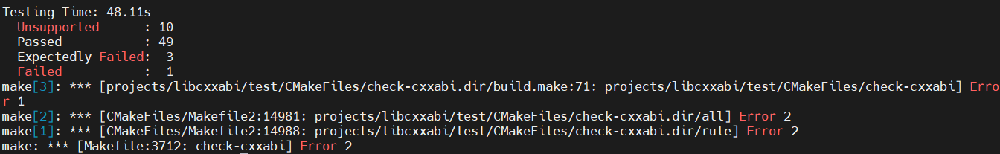
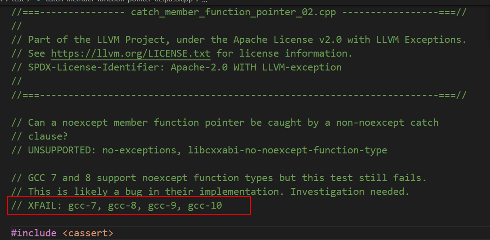

版权所有 © 2022 openEuler社区
您对“本文档”的复制、使用、修改及分发受知识共享(Creative Commons)署名—相同方式共享4.0国际公共许可协议(以下简称“CC BY-SA
4.0”)的约束。为了方便用户理解，您可以通过访问https://creativecommons.org/licenses/by-sa/4.0/ 了解CC BY-SA 4.0的概要 (
但不是替代)。CC BY-SA 4.0的完整协议内容您可以访问如下网址获取：https://creativecommons.org/licenses/by-sa/4.0/legalcode。

修订记录

| 日期        | 修订   版本 | 修改描述 | 作者  |
|-----------|---------|------|-----|
| 2023.2.28 | v1.0    | 初始化  | 王泽鸿 |

关键词： libcxxabi测试报告

摘要：依据测试要求，对libcxxabi进行自编译、安装卸载验证及功能测试。

缩略语清单：

| 缩略语 | 英文全名 | 中文解释 |
|-----|------|------|
|     |      |      |
|     |      |      |

# 1     特性概述

libc++和libc++ABI项目提供了C++标准库的标准一致性和高性能实现，包括对C++11和C++14的完全支持。

# 2     特性测试信息

本节描述被测对象的版本信息和测试的时间及测试轮次，包括依赖的硬件。

| 版本名称                | 测试起始时间    | 测试结束时间    |
|---------------------|-----------|-----------|
| openEuler 22.03_LTS | 2023-1-28 | 2023-2-28 |

描述特性测试的硬件环境信息

| 硬件型号 | 硬件配置信息                      | 备注        |
|------|-----------------------------|-----------|
| 容器   | CPU:8core MEM:32G DISK:200G | x86架构     |
| 容器   | CPU:8core MEM:32G DISK:200G | aarch64架构 |

# 3     测试结论概述

## 3.1   测试整体结论

libcxxabi特性，共执行63个单点测试用例，代码覆盖率90%。覆盖特性的基本功能，自编译以及安装卸载，不涉及命令验证和服务验证。未发现问题，所有测试点全部通过

| 测试活动   | 活动评价                       |
|--------|----------------------------|
| 自编译测试  | 自编译功能正常，结果如预期              |
| 安装卸载测试 | 安装卸载正常，结果如预期               |
| 功能测试   | 服务与命令行功能正常，结果如预期，安装包升级功能正常 |

## 3.2   约束说明

特性使用时涉及到的约束及限制条件

## 3.3   遗留问题分析

### 3.3.1 遗留问题影响以及规避措施

| 问题单号 | 问题描述 | 问题级别 | 问题影响和规避措施 | 当前状态 |
|------|------|------|-----------|------|
|      |      |      |           |      |
|      |      |      |           |      |

### 3.3.2 问题统计

|     | 问题总数 | 严重  | 主要  | 次要  | 不重要 |
|-----|------|-----|-----|-----|-----|
| 数目  | 0    |     |     |     |     |
| 百分比 |      |     |     |     |     |

# 4     测试执行

## 4.1   测试执行统计数据

| Name                        | Unsupported | Passed | Expectedly Failed | Failed |Sum |
|-----------------------------|-------------|--------|-------------------|-----|-------|
| libcxxabi                   | 10          | 49     |  4                |   0 |     63| 


*数据项说明：*

*测试用例数－－到本测试活动结束时，所有可用测试用例数；*

*发现问题单数－－本测试活动总共发现的问题单数。*

*Unsupported： c++03*


## 4.2   后续测试建议

后续测试需要关注点(可选)

# 5     附件

*此处可粘贴各类专项测试数据或报告*

## 自编译测试报告

### 执行步骤

```
rpm -ivh *.src.rpm
cd WORK_DIR/rpmbuild/SPECS/
dnf install dnf-plugins-core -y
dnf builddep *.spec
rpmbuild -ba *.spec
```

### 执行过程

```
Processing files: libcxxabi-12.0.1-1.x86_64
Provides: libc++abi.so.1()(64bit) libcxxabi = 12.0.1-1 libcxxabi(x86-64) = 12.0.1-1
Requires(rpmlib): rpmlib(CompressedFileNames) <= 3.0.4-1 rpmlib(FileDigests) <= 4.6.0-1 rpmlib(PayloadFilesHavePrefix) <= 4.0-1
Requires: libc.so.6()(64bit) libc.so.6(GLIBC_2.14)(64bit) libc.so.6(GLIBC_2.18)(64bit) libc.so.6(GLIBC_2.2.5)(64bit) libc.so.6(GLIBC_2.3)(64bit) libc.so.6(GLIBC_2.3.2)(64bit) libc.so.6(GLIBC_2.34)(64bit) libgcc_s.so.1()(64bit) libgcc_s.so.1(GCC_3.0)(64bit) rtld(GNU_HASH)
Processing files: libcxxabi-devel-12.0.1-1.x86_64
Provides: libc++abi.so.1()(64bit) libcxxabi-devel = 12.0.1-1 libcxxabi-devel(x86-64) = 12.0.1-1
Requires(rpmlib): rpmlib(CompressedFileNames) <= 3.0.4-1 rpmlib(FileDigests) <= 4.6.0-1 rpmlib(PayloadFilesHavePrefix) <= 4.0-1
Requires: libc.so.6()(64bit) libc.so.6(GLIBC_2.14)(64bit) libc.so.6(GLIBC_2.18)(64bit) libc.so.6(GLIBC_2.2.5)(64bit) libc.so.6(GLIBC_2.3)(64bit) libc.so.6(GLIBC_2.3.2)(64bit) libc.so.6(GLIBC_2.34)(64bit) libgcc_s.so.1()(64bit) libgcc_s.so.1(GCC_3.0)(64bit) rtld(GNU_HASH)
Checking for unpackaged file(s): /usr/lib/rpm/check-files /root/rpmbuild/BUILDROOT/libcxxabi-12.0.1-1.x86_64
Wrote: /root/rpmbuild/SRPMS/libcxxabi-12.0.1-1.src.rpm
Wrote: /root/rpmbuild/RPMS/x86_64/libcxxabi-12.0.1-1.x86_64.rpm
Wrote: /root/rpmbuild/RPMS/x86_64/libcxxabi-devel-12.0.1-1.x86_64.rpm
Executing(%clean): /bin/sh -e /var/tmp/rpm-tmp.vVrTOr
+ umask 022
+ cd /root/rpmbuild/BUILD
+ cd libcxxabi-12.0.1.src
+ /usr/bin/rm -rf /root/rpmbuild/BUILDROOT/libcxxabi-12.0.1-1.x86_64
+ RPM_EC=0
++ jobs -p
+ exit 0

```
### 执行结果

其中，failed用例为catch_member_function_pointer_02.pass.cpp 在当前运行gcc7.3.0环境中属于XFAIL预期失败。

测试通过

## 安装卸载测试报告

### 执行步骤

```
cd WORK_DIR/rpmbuild/RPM/x86_64/
rpm -i *.rpm
rpm -e libcxx-12.0.1-1.x86_64
```

### 执行结果

安装和卸载均成功，测试通过
 
