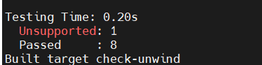

版权所有 © 2022 openEuler社区
您对“本文档”的复制、使用、修改及分发受知识共享(Creative Commons)署名—相同方式共享4.0国际公共许可协议(以下简称“CC BY-SA
4.0”)的约束。为了方便用户理解，您可以通过访问https://creativecommons.org/licenses/by-sa/4.0/ 了解CC BY-SA 4.0的概要 (
但不是替代)。CC BY-SA 4.0的完整协议内容您可以访问如下网址获取：https://creativecommons.org/licenses/by-sa/4.0/legalcode。

修订记录

| 日期        | 修订   版本 | 修改描述 | 作者  |
|-----------|---------|------|-----|
| 2023.2.28 | v1.0    | 初始化  | 王泽鸿 |

关键词： llvm-libunwind测试报告

摘要：依据测试要求，对llvm-libunwind进行自编译、安装卸载验证及功能测试。

缩略语清单：

| 缩略语 | 英文全名 | 中文解释 |
|-----|------|------|
|     |      |      |
|     |      |      |

# 1     特性概述

定义一个可移植且高效的C编程接口（API）来确定程序的调用链。

# 2     特性测试信息

本节描述被测对象的版本信息和测试的时间及测试轮次，包括依赖的硬件。

| 版本名称                | 测试起始时间    | 测试结束时间    |
|---------------------|-----------|-----------|
| openEuler 22.03_LTS | 2023-1-28 | 2023-2-28 |

描述特性测试的硬件环境信息

| 硬件型号 | 硬件配置信息                      | 备注        |
|------|-----------------------------|-----------|
| 容器   | CPU:8core MEM:32G DISK:200G | x86架构     |
| 容器   | CPU:8core MEM:32G DISK:200G | aarch64架构 |

# 3     测试结论概述

## 3.1   测试整体结论

llvm-libunwind特性，共执行9个单点测试用例，代码覆盖率90%。覆盖特性的基本功能，自编译以及安装卸载，不涉及命令验证和服务验证。未发现问题，所有测试点全部通过

| 测试活动   | 活动评价                       |
|--------|----------------------------|
| 自编译测试  | 自编译功能正常，结果如预期              |
| 安装卸载测试 | 安装卸载正常，结果如预期               |
| 功能测试   | 服务与命令行功能正常，结果如预期，安装包升级功能正常 |

## 3.2   约束说明

特性使用时涉及到的约束及限制条件

## 3.3   遗留问题分析

### 3.3.1 遗留问题影响以及规避措施

| 问题单号 | 问题描述 | 问题级别 | 问题影响和规避措施 | 当前状态 |
|------|------|------|-----------|------|
|      |      |      |           |      |
|      |      |      |           |      |

### 3.3.2 问题统计

|     | 问题总数 | 严重  | 主要  | 次要  | 不重要 |
|-----|------|-----|-----|-----|-----|
| 数目  | 0    |     |     |     |     |
| 百分比 |      |     |     |     |     |

# 4     测试执行

## 4.1   测试执行统计数据

| Name                        | Unsupported | Passed | Sum |
|-----------------------------|-------------|--------|-----|
| llvm-libunwind              | 1           | 8      |  9  | 

*数据项说明：*

*测试用例数－－到本测试活动结束时，所有可用测试用例数；*

*发现问题单数－－本测试活动总共发现的问题单数。*

*Unsupported： C++03*

## 4.2   后续测试建议

后续测试需要关注点(可选)

# 5     附件

*此处可粘贴各类专项测试数据或报告*

## 自编译测试报告

### 执行步骤

```
rpm -ivh *.src.rpm
cd WORK_DIR/rpmbuild/SPECS/
dnf install dnf-plugins-core -y
dnf builddep *.spec
rpmbuild -ba *.spec
```

### 执行过程

```
Provides: libunwind.so.1()(64bit) llvm-libunwind = 12.0.1-1 llvm-libunwind(x86-64) = 12.0.1-1
Requires(rpmlib): rpmlib(CompressedFileNames) <= 3.0.4-1 rpmlib(FileDigests) <= 4.6.0-1 rpmlib(PayloadFilesHavePrefix) <= 4.0-1
Requires: libc.so.6()(64bit) libc.so.6(GLIBC_2.14)(64bit) libc.so.6(GLIBC_2.2.5)(64bit) libc.so.6(GLIBC_2.34)(64bit) libgcc_s.so.1()(64bit) rtld(GNU_HASH)
Processing files: llvm-libunwind-devel-12.0.1-1.x86_64
Provides: libunwind(major) = 12 llvm-libunwind-devel = 12.0.1-1 llvm-libunwind-devel(x86-64) = 12.0.1-1
Requires(rpmlib): rpmlib(CompressedFileNames) <= 3.0.4-1 rpmlib(FileDigests) <= 4.6.0-1 rpmlib(PayloadFilesHavePrefix) <= 4.0-1
Checking for unpackaged file(s): /usr/lib/rpm/check-files /root/rpmbuild/BUILDROOT/llvm-libunwind-12.0.1-1.x86_64
Wrote: /root/rpmbuild/SRPMS/llvm-libunwind-12.0.1-1.src.rpm
Wrote: /root/rpmbuild/RPMS/x86_64/llvm-libunwind-devel-12.0.1-1.x86_64.rpm
Wrote: /root/rpmbuild/RPMS/x86_64/llvm-libunwind-12.0.1-1.x86_64.rpm
Executing(%clean): /bin/sh -e /var/tmp/rpm-tmp.Gw9HP8
+ umask 022
+ cd /root/rpmbuild/BUILD
+ cd libunwind-12.0.1.src
+ /usr/bin/rm -rf /root/rpmbuild/BUILDROOT/llvm-libunwind-12.0.1-1.x86_64
+ RPM_EC=0
++ jobs -p
+ exit 0

```
### 执行结果

测试通过

## 安装卸载测试报告

### 执行步骤

```
cd WORK_DIR/rpmbuild/RPM/x86_64/
rpm -i *.rpm
rpm -e llvm-libunwind-12.0.1-1.x86_64
```

### 执行结果

安装和卸载均成功，测试通过

## 执行构建
准备以下openEuler小包，放置在同一目录下，软件版本均为12.0.1
openEuler:clang, openEuler: libcxx, openEuler: libcxxabi, openEuler: libunwind, openEuler: lld, openEuler: llvm

执行构建

mkdir ./build
cd ./build
cmake -G "Unix Makefiles" -DLLVM_TARGETS_TO_BUILD="host;X86" -DCMAKE_BUILD_TYPE=Debug -DLLVM_ENABLE_PROJECTS="clang;lld;libcxx;libcxxabi;libunwind"  -DCMAKE_INSTALL_PREFIX=$PWD/../install ../llvm -DLLVM_ENABLE_LLD=ON
make -j 64 

构建通过，成功编译出编译器。
```
mkdir ./build
cd ./build
cmake -G "Unix Makefiles" -DLLVM_TARGETS_TO_BUILD="host;X86" -DCMAKE_BUILD_TYPE=Debug -DLLVM_ENABLE_PROJECTS="clang;lld;libcxx;libcxxabi;libunwind"  -DCMAKE_INSTALL_PREFIX=$PWD/../install ../llvm -DLLVM_ENABLE_LLD=ON
make -j 64
```
构建通过，成功编译出编译器。

验证构建binutils，binutils是一款由GNU社区提供的开源软件，用于处理.s，.o等编产生的文件。

使用上面编译出的编译器对binutils源码进行编译。
```
CC=/home/hq/test/llvm12/build/bin/clang CXX=/home/hq/test/llvm12/build/bin/clang++ ../binutils-2.38/configure  --prefix=/home/hq/test/tmp/installmake
make -j 96
```
构建成功。
## libunwind和llvm-libuwind对比
libunwind和llvm-libunwind是两款不同的软件，两款软件都是用于处理程序执行时产生的异常和调试的，分别由不同的社区开发和维护：
https://www.nongnu.org/libunwind/
https://github.com/llvm/llvm-project/tree/llvmorg-12.0.1/libunwind

通过在同一台机器上编译并对比生成动态链接库来看，libunwind和llvm-libunwind差异很大。下面是通过objdump反汇编查看两个库中的函数，两个库中存在少量相同名称函数，但更多的是各不相同的函数。所以两款软件应该不存在被混用的情况。

反汇编对比两款软件编出的so文件中包含函数，少量函数名称相同，大部分不同。

 
