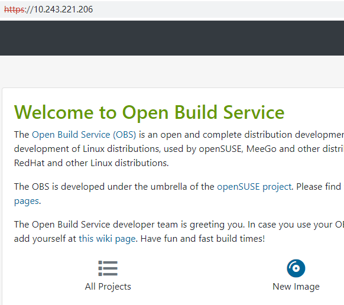
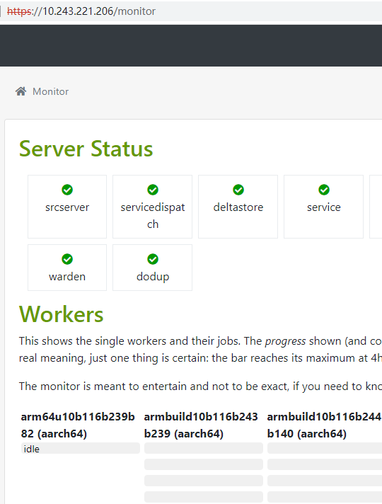
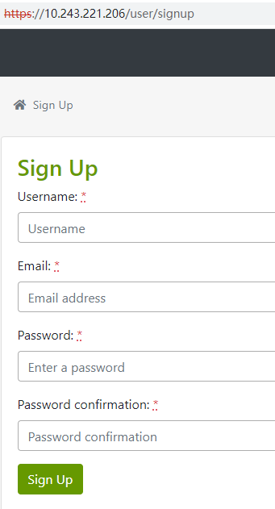
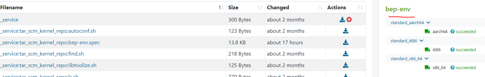

版权所有 © 2022  openEuler社区
 您对“本文档”的复制、使用、修改及分发受知识共享(Creative Commons)署名—相同方式共享4.0国际公共许可协议(以下简称“CC BY-SA 4.0”)的约束。为了方便用户理解，您可以通过访问https://creativecommons.org/licenses/by-sa/4.0/ 了解CC BY-SA 4.0的概要 (但不是替代)。CC BY-SA 4.0的完整协议内容您可以访问如下网址获取：https://creativecommons.org/licenses/by-sa/4.0/legalcode。

修订记录

| 日期 | 修订   版本 | 修改描述 | 作者 |
| ---- | ----------- | -------- | ---- |
| 2022/09/08|初稿 | 创建obs-server多版本测试报告 | 项宇宁 |


关键词： obs-server 多版本

 

摘要：对obs-server多版本的软件包 功能进行测试，验证能够制作构建工具

 

缩略语清单：

| 缩略语 | 英文全名 | 中文解释 |
| ------ | -------- | -------- |
|        |          |          |


# 1     特性概述

obs-server作为一款开源软件，用于制作构建工具

# 2     特性测试信息

本节描述被测对象的版本信息和测试的时间及测试轮次，包括依赖的硬件。

| 版本名称 | 测试起始时间 | 测试结束时间 |
| -------- | ------------ | ------------ |
| openEuler-22.03-LTS |  2022/09/08  | 2022/09/08 |


# 3     测试结论概述

## 3.1   测试整体结论

测试结论可以以一句话描述，如：XX特性，共计执行XX个用例，主要覆盖了XX测试和XX测试，通过经过fuzz和7*24的长稳测试，发现问题已解决，回归通过，无遗留风险，整体质量良好；或者表格的方式进行说明

| 测试活动 | 活动评价 |
| -------- | -------- |
| 功能测试 | 启动obs-server的服务正常，搭建obs-server工程正常，构建rpm包正常 |

## 3.2   约束说明

NA

## 3.3   遗留问题分析

### 3.3.1 遗留问题影响以及规避措施

NA

### 3.3.2 问题统计

NA

# 4     测试执行

## 4.1   测试执行统计数据

*本节内容根据测试用例及实际执行情况进行特性整体测试的统计，可根据第二章的测试轮次分开进行统计说明。*

| 版本名称 | 测试用例数 | 用例执行结果 | 发现问题单数 |
| -------- | ---------- | ------------ | ------------ |
NA

## 4.2   后续测试建议

NA

## 4.3   开发自验结果

1、使用obs-server多版本编译的rpm包，安装正常。
```bash
$ rpm -qa obs-server
obs-server-2.10.11-5.oe2203.noarch
```

2、查看obs-server服务状态，正常：
```bash
$ systemctl status obsservice
● obsservice.service - OBS source service server
     Loaded: loaded (/usr/lib/systemd/system/obsservice.service; enabled; vendor preset: disabled)
     Active: active (running) since Tue 2022-09-06 09:28:04 UTC; 1 day 23h ago
   Main PID: 1805 (bs_service)
      Tasks: 1 (limit: 821518)
     Memory: 22.6M
     CGroup: /system.slice/obsservice.service
             └─1805 /usr/bin/perl -w /usr/lib/obs/server/bs_service --logfile src_service.log
```

3、查看接口状态：
```bash
$ netstat -ntlp
(No info could be read for "-p": geteuid()=20002 but you should be root.)
Active Internet connections (only servers)
Proto Recv-Q Send-Q Local Address           Foreign Address         State       PID/Program name    
tcp        0      0 0.0.0.0:5152            0.0.0.0:*               LISTEN      -                                     
tcp        0      0 0.0.0.0:5252            0.0.0.0:*               LISTEN      -                   
tcp        0      0 0.0.0.0:5352            0.0.0.0:*               LISTEN      -
```

4、部署obs-server服务，搭建构建工具

1) obs-server主页：


2) obs workers：


3) obs 注册页面：


4) obs 构建结果：

