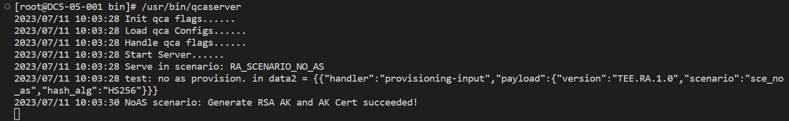
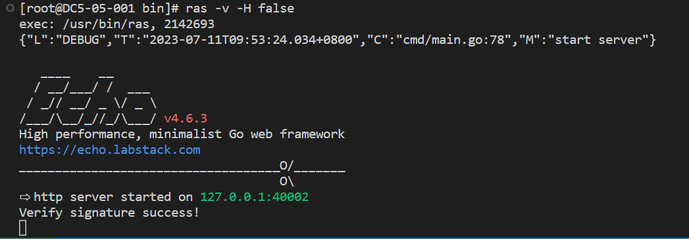
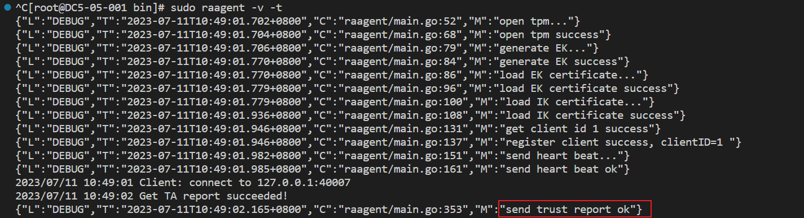

版权所有 © 2023 openEuler社区 您对“本文档”的复制、使用、修改及分发受知识共享(Creative Commons)署名—相同方式共享4.0国际公共许可协议(以下简称“CC BY-SA 4.0”)的约束。为了方便用户理解，您可以通过访问[https://creativecommons.org/licenses/by-sa/4.0/](https://gitee.com/link?target=https%3A%2F%2Fcreativecommons.org%2Flicenses%2Fby-sa%2F4.0%2F) 了解CC BY-SA 4.0的概要 (但不是替代)。CC BY-SA 4.0的完整协议内容您可以访问如下网址获取：[https://creativecommons.org/licenses/by-sa/4.0/legalcode。](https://gitee.com/link?target=https%3A%2F%2Fcreativecommons.org%2Flicenses%2Fby-sa%2F4.0%2Flegalcode%E3%80%82)

修订记录

| 日期       | 修订 版本 | 修改描述            | 作者   |
| ---------- | --------- | ------------------- | ------ |
| 2023/06/19 | v1.0      | TEE远程证明测试报告 | 朱晓莲 |

关键词： TEE，远程证明

摘要：本文是按照openEuler 22.03 LTS SP2版本上TEE远程证明特性的测试策略，对平台远程证明和TEE远程证明的实现流程和核心功能模块进行测试，形成测试报告文档。

缩略语清单：

| 缩略语 | 英文全名                      | 中文解释     |
| ------ | ----------------------------- | ------------ |
| TEE    | Trusted Execution Environment | 可信执行环境 |

# 1 特性概述

TEE远程证明是鲲鹏安全生态开源组件鲲鹏安全库的一个重要特性，支撑基于鲲鹏平台构建开源机密计算解决方案。当数据中心管理工具/管理员、云服务基础设施编排工具、密钥管理中心/模型提供方希望获取目标服务器上TEE中TA的可信状态时，需要触发TEE远程证明特性的功能。

# 2 特性测试信息

本节描述被测对象的版本信息和测试的时间及测试轮次，包括依赖的硬件。

| 版本名称                    | 测试起始时间 | 测试结束时间 |
| --------------------------- | ------------ | ------------ |
| openEuler 22.03-LTS-SP2 RC2 | 2023/05/24   | 2023/06/02   |
| openEuler 22.03-LTS-SP2 RC3 | 2023/06/07   | 2023/06/14   |
| openEuler 22.03-LTS-SP2 RC4 | 2023/06/15   | 2023/06/22   |
|                             |              |              |

描述特性测试的硬件环境信息

| 硬件型号 | 硬件配置信息 | 备注 |
| -------- | ------------ | ---- |
|          |              |      |

# 3 测试结论概述

## 3.1 测试整体结论

TEE远程证明特性，共计执行30个用例，主要覆盖了接口/功能测试和场景测试，通过3*5次的反复测试，发现问题已解决，回归通过，无遗留风险，整体质量良好。

## 3.2 约束说明

特性测试需要先进行TEE远程证明特性的yum安装。

## 3.3 遗留问题分析

### 3.3.1 遗留问题影响以及规避措施

| 序号 | 问题单号 | 问题简述 | 问题级别 | 影响分析 | 规避措施 | 历史发现场景 |
| ---- | -------- | -------- | -------- | -------- | -------- | ------------ |
|      |          |          |          |          |          |              |
|      |          |          |          |          |          |              |

### 3.3.2 问题统计

|        | 问题总数 | 严重 | 主要 | 次要 | 不重要 |
| ------ | -------- | ---- | ---- | ---- | ------ |
| 数目   |          |      |      |      |        |
| 百分比 |          |      |      |      |        |

# 4 详细测试结论

## 4.1 功能测试

*开源软件：主要关注开源软件升级后的变动点，继承特性由开源软件自带用例保证（需额外关注软件包提供可执行命令、库、服务功能）* *社区孵化软件：主要参考以下列表*

### 4.1.1 继承特性测试结论

| 序号 | 组件/特性名称 | 特性质量评估 | 备注 |
| ---- | ------------- | ------------ | ---- |
|      |               | ■            |      |
|      |               | ▲            |      |

●： 表示特性不稳定，风险高 ▲： 表示特性基本可用，遗留少量问题 ■： 表示特性质量良好

### 4.1.2 新增特性测试结论

| 序号 | 组件/特性名称 | 特性质量评估 | 备注 |
| ---- | ------------- | ------------ | ---- |
|      |               | ●            |      |
|      |               | ▲            |      |

●： 表示特性不稳定，风险高 ▲： 表示特性基本可用，遗留少量问题 ■： 表示特性质量良好

## 4.2 兼容性测试结论

*针对应用软件，主要考虑OS版本兼容性(在不同LTS SPx上的兼容性)、升降级兼容性、上层以来软件兼容性（如升级mysql后，对版本内已发布的使用mysql的软件的兼容性）*

## 4.3 DFX专项测试结论

### 4.3.1 性能测试结论

| 指标大项 | 指标小项 | 指标值 | 测试结论 |
| -------- | -------- | ------ | -------- |
|          |          |        |          |

### 4.3.2 可靠性/韧性测试结论

| 测试类型 | 测试内容 | 测试结论 |
| -------- | -------- | -------- |
|          |          |          |

### 4.3.3 安全测试结论

| 测试类型 | 测试内容 | 测试结论 |
| -------- | -------- | -------- |
|          |          |          |

## 4.4 资料测试结论

*建议附加资料PR链接*

| 测试类型 | 测试内容 | 测试结论 |
| -------- | -------- | -------- |
|          |          |          |

## 4.5 其他测试结论

| 测试类型 | 测试内容 | 测试结论 |
| -------- | -------- | -------- |
|          |          |          |

# 5 测试执行

## 5.1 测试执行统计数据

*本节内容根据测试用例及实际执行情况进行特性整体测试的统计，可根据第二章的测试轮次分开进行统计说明。*

| 版本名称                             | 测试用例数 | 用例执行结果 | 发现问题单数 |
| ------------------------------------ | ---------- | ------------ | ------------ |
| openEuler 22.03 LTS SP2 test round 2 | 30         | 通过         | 11           |
| openEuler 22.03 LTS SP2 test round 3 | 30         | 通过         | 2            |
| openEuler 22.03 LTS SP2 test round 4 | 30         | 通过         | 2            |

*数据项说明：*

*测试用例数－－到本测试活动结束时，所有可用测试用例数；*

*发现问题单数－－本测试活动总共发现的问题单数。*

## 5.2 后续测试建议

后续测试需要关注点(可选)

# 6 附件

*此处可粘贴各类专项测试数据或报告*
## 6.1运行流程

### 6.1.1  软件安装

首先在本地配置yum源，将/etc/yum.repos.d目录下的openEuler.repo文件中所有baseurl和gpgkey链接均替换为https://mirrors.nju.edu.cn/openeuler/openEuler-22.03-LTS-SP2/链接下对应的目录链接。

然后先后执行`yum clean all`和`yum makecache`两条命令完成yum源重新加载。

执行`yum install kunpengsecl-ras kunpengsecl-rac kunpengsecl-rahub kunpengsecl-tas` 命令安装RAS，RAC，RAHUB，QCASERVER，ATTESTER和TAS。

安装完成后，进入`/usr/share/attestation/ras`目录，执行prepare-database-env.sh准备数据库环境，运行结果可能是正常也可能是异常，如下：

正常运行：


正常运行prepare-database-env.sh无报错之后，可进入下一步，否则查看异常运行解决方法。

异常运行：


解决方法：

``` 
$ su postgres
$ pg_ctl -D /var/lib/pgsql/data stop
$ rm -rf /var/lib/pgsql/data/*
```

之后再次运行prepare-database-env.sh脚本，**正常运行无报错即可**。

之后进入`usr/share/attestation/ras(rac)(rahub)(qcaserver)(attester)(tas)`目录执行脚本prepare-ras(rac)(hub)(qcaserver)(attester)(tas)conf-env.sh配置家目录配置文件。

## 2 运行测试

ras，rac，rahub，qcaserver，attester和tas都在/usr/bin目录下。

选择某个路径作为运行路径，并将`/etc/attestation/default_test/`目录下的ascii_runtime_measurements、binary_bios_measurements文件复制到raagent的运行路径下，并在运行目录下新建名为talist的空文件；将/root/.config/attestation/rac/目录下的config.yaml文件复制到raagent的运行路径下。

### 启动qcaserver

进入`/usr/bin/`目录下，执行`/usr/bin/qcaserver`启动qcaserver，启动界面如下图所示：



在ras的运行目录下，执行`ras -T`，复制token值备用（单词“Bearer” 及之后的所有内容）。

### 启动ras和raagent

在运行目录下，分别通过`ras -v -H false`/`ras -v -H true`和`sudo raagent -v -t`开启ras和rac，启动界面分别如下图所示：





>注意：
>
>运行raagent时，需要看到`send trust report ok`提示信息，才说明raagent是正常运行的。若没有出现该提示信息，排查方法：
>
>1、检查qcaserver是否开启；
>
>2、检查postgresql数据库是否开启；
>
>3、检查是否缺少ascii_runtime_measurements、binary_bios_measurements和talist文件。
>
>4、重新运行/usr/share/attestation/rac/目录下的prepare-racconf-env.sh脚本，并将/root/.config/attestation/rac/目录下的config.yaml文件复制到raagent的运行路径下。

然后开启一个新的终端，首先执行`export AUTHTOKEN=”Bearer xxxx”`将ras -T输出的token值保存在环境变量$AUTHTOKEN中。之后就可以进行restapi的接口测试了。