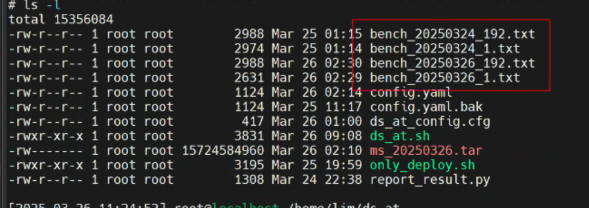
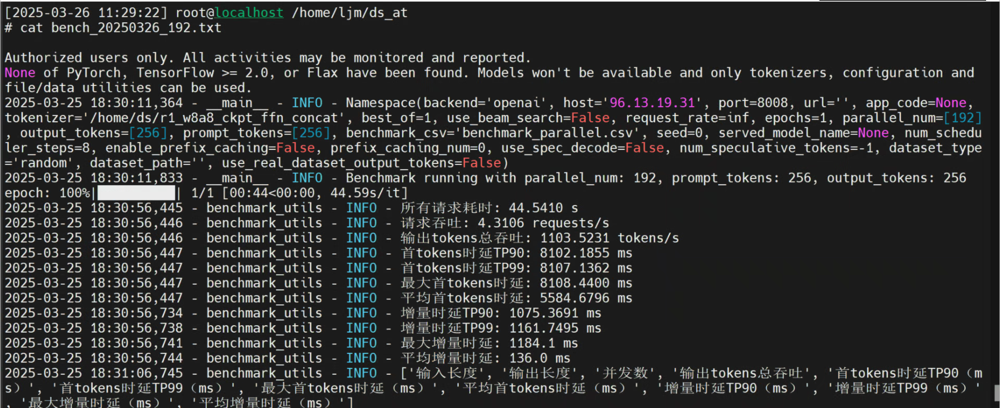
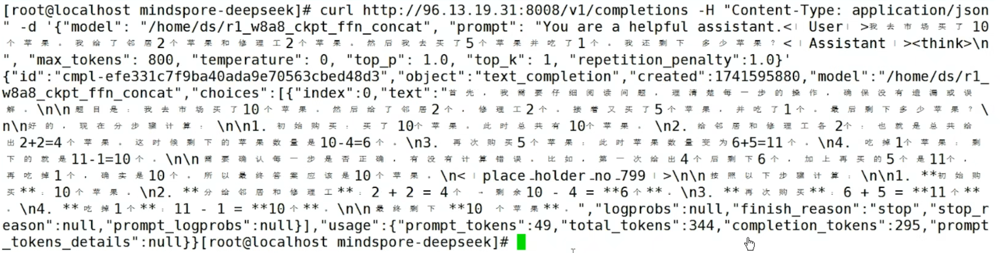
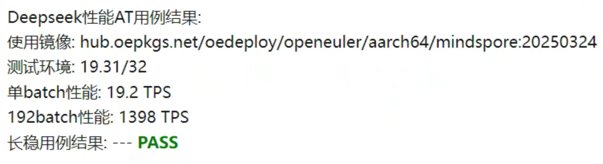

版权所有 © 2023  openEuler社区
 您对“本文档”的复制、使用、修改及分发受知识共享(Creative Commons)署名—相同方式共享4.0国际公共许可协议(以下简称“CC BY-SA 4.0”)的约束。为了方便用户理解，您可以通过访问https://creativecommons.org/licenses/by-sa/4.0/ 了解CC BY-SA 4.0的概要 (但不是替代)。CC BY-SA 4.0的完整协议内容您可以访问如下网址获取：https://creativecommons.org/licenses/by-sa/4.0/legalcode。

修订记录

| 日期       | 修订   版本 | 修改描述 | 作者 |
| --------- | ----------- | ------------------ | ---- |
| 2025/03/26| 初稿         | 创建vLLM特性测试报告 | 任文杰     |

关键词： vLLM 特性测试

摘要：安装vLLM打包完成后的rpm包，验证基本功能和vLLM的测试用例

缩略语清单：

| 缩略语 | 英文全名 | 中文解释 |
| ------ | -------- | -------- |
|  vLLM |virtual Large Language Model|大语言模型轻量化引擎|

# 1     特性概述

vLLM 是一个专为大语言模型（LLM）推理和服务设计的高速且易于使用的库

# 2     特性测试信息

本节描述被测对象的版本信息和测试的时间及测试轮次，包括依赖的硬件。

| 版本名称 | 测试起始时间 | 测试结束时间 |
| -------- | ------------ | ------------ |
| openEuler-22.03-LTS-SP4|2025/03/25|2025/03/25|

描述特性测试的硬件环境信息

| 硬件型号 | 硬件配置信息 | 备注 |
| -------- | ------------ | ---- |
| Atlas 800T A2|910B3 * 8|      |

# 3     测试结论概述

## 3.1   测试整体结论

| 测试活动 | 测试子项 | 活动评价 |
| ------- | -------- | ------- |
| 功能测试 | vLLM 8卡单节点推理 |验证通过     |
| 功能测试 | vLLM 16卡双节点分布式推理|验证通过      |
| 功能测试 | vLLM 32卡四节点分布式推理|验证通过      |
|长稳测试 | vLLM 长稳|验证通过|

## 3.2   约束说明

NA

## 3.3   遗留问题分析

### 3.3.1 遗留问题影响以及规避措施

| 序号 | 问题单号 | 问题简述 | 问题级别 | 影响分析 | 规避措施 | 历史发现场景 |
| --- | ------- | ------ | ------- | ------- | ------- | ---------- | 
| 1    | NA |CI无GPU环境，无法跑UT|中         |影响可控 |需要用户提交代码时提交测试报告|            |

# 4 详细测试结论

## 4.1 功能测试
*开源软件：主要关注开源软件升级后的变动点，继承特性由开源软件自带用例保证（需额外关注软件包提供可执行命令、库、服务功能）*
*社区孵化软件：主要参考以下列表*

1、vLLM单batch双节点测试: 图示中bench_20250324_1.txt为单batch验证截图，可以看到tokens数据为 12.1005 tokens/s，每个节点 8 * 910B3

2、vLLM 192 batch双节点测试: 测试共用到2个节点，tokens吞吐数据为 1103.5231 tokens/s，每个节点 8 * 910B3

3、vLLM端到端功能测试: 端到端测试模拟用户请求数据，构造请求体：”我去市场买了10个苹果···“的问题，测试HTTPServer到vLLM后端，再到推理卡的整体流程

## 4.2 长稳测试
1、长稳测试 24小时

## 4.3 DFX专项测试结论

### 4.3.1 性能测试结论

| 指标大项 | 指标值 | 测试结论 |
| ------- | ------ | ------- |
| 单batch性能|19.2 TPS| 符合预期|
|192batch性能|1398 TPS| 符合预期|

# 5     测试执行

## 5.1   测试执行统计数据

*本节内容根据测试用例及实际执行情况进行特性整体测试的统计，可根据第二章的测试轮次分开进行统计说明。*

| 版本名称 | 测试用例数 | 用例执行结果 | 发现问题单数 |
| -------- | ---------- | ------------ | ------------ |
| vllm-0.6.6.post1| 4|PASS   |        0      |

*数据项说明：*

*测试用例数－－到本测试活动结束时，所有可用测试用例数；*

 

 

 