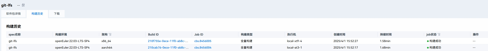
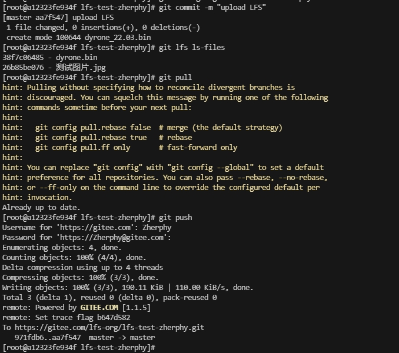
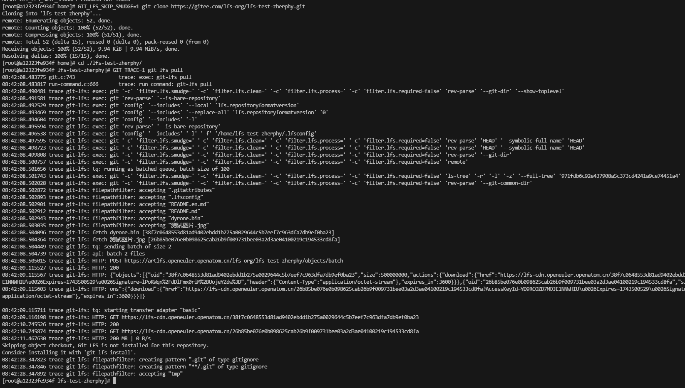

版权所有 © 2025  openEuler社区
 您对“本文档”的复制、使用、修改及分发受知识共享(Creative Commons)署名—相同方式共享4.0国际公共许可协议(以下简称“CC BY-SA 4.0”)的约束。为了方便用户理解，您可以通过访问https://creativecommons.org/licenses/by-sa/4.0/ 了解CC BY-SA 4.0的概要 (但不是替代)。CC BY-SA 4.0的完整协议内容您可以访问如下网址获取：https://creativecommons.org/licenses/by-sa/4.0/legalcode。

修订记录

| 日期         | 修订   版本 | 修改描述 | 作者 |
|------------| ----------- | -------- |----|
| 2025/04/01 |    1.0         |   创建       | 周奕 |

 关键词： git-lfs 测试报告

 

摘要：
本报告主要描述基于 openEuler-22.03-LTS-SP1 版本 git-lfs 基本能力及兼容性测试结果。
 

# 1     特性概述
Git LFS 填补了Git在二进制文件管理上的短板，成为现代软件开发中不可或缺的工具。它通过分离存储和指针机制，在保持Git工作流的同时，高效解决了大文件的版本控制问题。对于涉及多媒体、数据科学或游戏开发的项目，Git LFS是优化协作和存储的最佳实践之一。

# 2     特性测试信息

本节描述被测对象的版本信息和测试的时间及测试轮次，包括依赖的硬件。

| 版本名称          | 测试起始时间     | 测试结束时间     |
|---------------|------------|------------|
| git-lfs-3.5.1 | 2025/04/01 | 2025/04/01 |

描述特性测试的硬件环境信息

| 硬件型号 | 硬件配置信息 | 备注 |
| -------- | ------------ | ---- |
|     Docker 容器     |   无特殊配置     |  在 aarch64/x86_64 物理机上运行 Docker 容器测试    |

# 3     测试结论概述

## 3.1   测试整体结论

在 Docker 容器中启动 openEuler 22.03-LTS-SP4 测试镜像，在此基础上进行 git-lfs软件包基础功能测试，共执行3个测试用例，主要包含使用LFS功能的仓库下载、大文件上传、eulerMaker构建等方面，均通过，无风险，整体核心功能稳定正常。

## 3.2   约束说明

无。

## 3.3   遗留问题分析

### 3.3.1 遗留问题影响以及规避措施

不涉及。

### 3.3.2 问题统计

不涉及。

# 4 详细测试结论

## 4.1 功能测试
*开源软件：主要关注开源软件升级后的变动点，继承特性由开源软件自带用例保证（需额外关注软件包提供可执行命令、库、服务功能）*

### 4.1.1 继承特性测试结论

不涉及。

### 4.1.2 新增特性测试结论

不涉及。

## 4.2 兼容性测试结论

*针对应用软件，主要考虑OS版本兼容性(在不同LTS SPx上的兼容性)、升降级兼容性、上层以来软件兼容性（如升级mysql后，对版本内已发布的使用mysql的软件的兼容性）*

git-lfs软件需要考虑在当前环境下go语言的版本。通常升级Go语言后对git-lfs软件没有影响，但是如果升级git-lfs后没有同时升级go语言的版本，有可能会出现git-lfs软件包编译错误。

## 4.3 DFX专项测试结论

### 4.3.1 性能测试结论

不涉及。

### 4.3.2 可靠性/韧性测试结论

不涉及。

### 4.3.3 安全测试结论

不涉及。

## 4.4 资料测试结论

*建议附加资料PR链接*

不涉及。

## 4.5 其他测试结论

通过eulerMaker在openEuler 22.03-LTS-SP4编译软件包成功

在openEuler 24.03-LTS-SP1的docker容器中LFS文件上传成功

在openEuler 24.03-LTS-SP1的docker容器中LFS文件下载成功

# 5     测试执行

## 5.1   测试执行统计数据

*本节内容根据测试用例及实际执行情况进行特性整体测试的统计，可根据第二章的测试轮次分开进行统计说明。*

| 版本名称                    | 软件包名称   | 测试用例数 | 用例执行结果 | 发现问题单数 |
|-------------------------|---------|-------| ------------ | ------------ |
| openEuler 22.03-LTS-SP4 | git-lfs | 3     |     通过         |      0        |

*数据项说明：*

*测试用例数－－到本测试活动结束时，所有可用测试用例数；*

*发现问题单数－－本测试活动总共发现的问题单数。*

## 5.2   后续测试建议

后续测试需要关注点(可选)
需要关注git-lfs和Go的版本。

# 6     附件

*此处可粘贴各类专项测试数据或报告*

不涉及。
