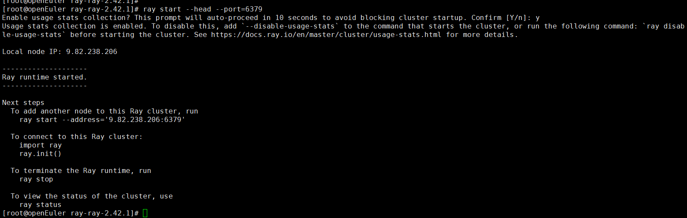
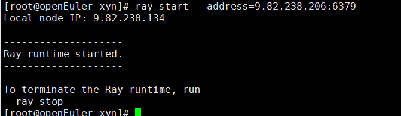
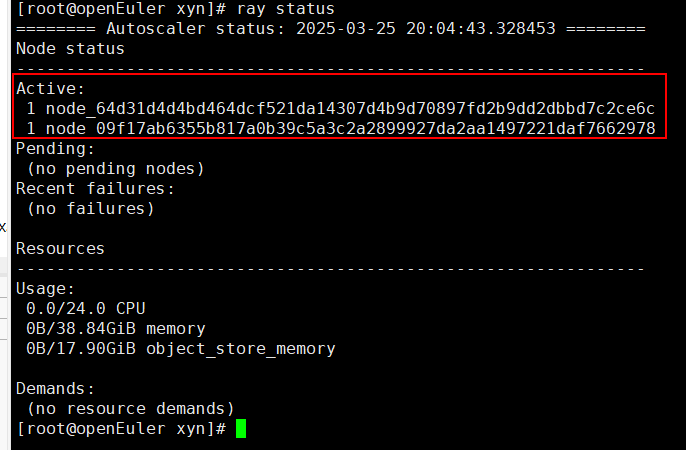
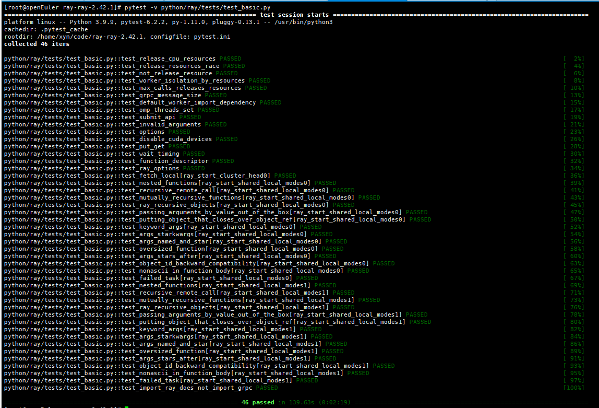

版权所有 © 2025  openEuler社区
 您对“本文档”的复制、使用、修改及分发受知识共享(Creative Commons)署名—相同方式共享4.0国际公共许可协议(以下简称“CC BY-SA 4.0”)的约束。为了方便用户理解，您可以通过访问https://creativecommons.org/licenses/by-sa/4.0/ 了解CC BY-SA 4.0的概要 (但不是替代)。CC BY-SA 4.0的完整协议内容您可以访问如下网址获取：https://creativecommons.org/licenses/by-sa/4.0/legalcode。

修订记录

| 日期         | 修订   版本 | 修改描述        | 作者 |
|------------|---------|-------------| ---- |
| 2025/03/25 | 初稿      | 创建RAY特性测试报告 | 项宇宁 |

关键词： RAY特性测试

摘要：安装RAY编译完成后的rpm包，验证基本功能和RAY的测试用例


缩略语清单：

# 1     特性概述

RAY是一个开源的AI计算引擎，致力于简化并加速机器学习（ML）工作负载。它包含了一个核心分布式运行时环境以及一系列用于加速ML任务的AI库。

# 2     特性测试信息

本节描述被测对象的版本信息和测试的时间及测试轮次，包括依赖的硬件。

| 版本名称 | 测试起始时间     | 测试结束时间 |
| -------- |------------| ------------ |
| openEuler-22.03-LTS-SP4 | 2025/03/25 | 2025/03/25 |


# 3     测试结论概述

## 3.1   测试整体结论

| 测试活动  | 测试子项            | 活动评价                |
|-------|-----------------|---------------------|
| 功能测试  | 验证RAY启动主节点      | 验证通过                |
| 功能测试  | 验证RAY的其他节点加入主节点 | 验证通过                |
| 功能测试  | 验证RAY自带的测试用例20个 | 验证通过 |
| 可靠性测试 | 验证RAY自带的测试用例10个 | 验证通过 |
| 兼容性测试 | 验证RAY自带的测试用例16个 | 验证通过 |

## 3.2   约束说明

NA

# 4 详细测试结论

## 4.1 功能测试
*开源软件：主要关注开源软件升级后的变动点，继承特性由开源软件自带用例保证（需额外关注软件包提供可执行命令、库、服务功能）*
*社区孵化软件：主要参考以下列表*

1、验证RAY启动主节点
```shell
# 关闭防火墙
$ systemctl stop firewalld
$ systemctl disable firewalld
$ setenforce 0

# 启动主节点
$ ray start --head --port=6379
```
主节点启动成功：



2、验证RAY的其他节点加入主节点
```shell
$ ray start --address=主节点ip:6379

# 查看主从节点的状态
$ ray status
```

从节点状态：



主节点状态：



3、验证RAY自带的测试用例
```shell
# 进入ray源码目录
$ cd ray-ray-2.42.1/
$ pytest -v python/ray/tests/test_basic.py
```
测试验证结果：



