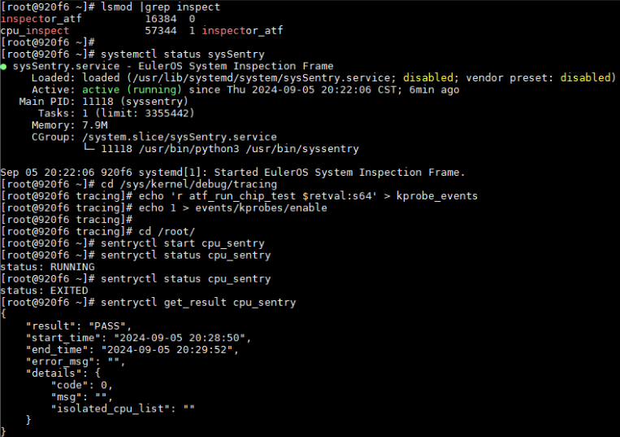

版权所有 © 2024  openEuler社区
 您对“本文档”的复制、使用、修改及分发受知识共享(Creative Commons)署名—相同方式共享4.0国际公共许可协议(以下简称“CC BY-SA 4.0”)的约束。为了方便用户理解，您可以通过访问https://creativecommons.org/licenses/by-sa/4.0/ 了解CC BY-SA 4.0的概要 (但不是替代)。CC BY-SA 4.0的完整协议内容您可以访问如下网址获取：https://creativecommons.org/licenses/by-sa/4.0/legalcode。

修订记录

| 日期       | 修订   版本 | 修改描述 | 作者   |
| ---------- | ----------- | -------- | ------ |
| 2024-09-10 | 1.0         | 创建     | 储成凯 |

 关键词： cpu_sentry、sysSentry

 

摘要：
本报告主要描述在使用sysSentry服务场景下，对于cpu巡检功能进行有效性可靠性等方面的测试，本文对测试过程进行记录说明，给出测试评估与总结。
本报告主要基于openEuler 22.03-LTS-SP4版本

缩略语清单：

| 缩略语 | 英文全名 | 中文解释 |
| ------ | -------- | -------- |
| sysSentry | system sentry | 系统巡检 |
| cpu_sentry | cpu sentry | cpu巡检 |

# 1     特性概述

由于 E 级超算规模大，器件故障率高，其中 CPU 和内存是服务器上故障率最高的关键器件，除了提 高器件基本可靠性外，在系统层面需要对其增加主被动容错，以提高系统的可用性。通过 CPU 的主动深 度巡检，提前隔离故障核，降低故障对应用的影响，并与 CCM、DonauKit 协同，保障是在计算节点上没 有作业时执行，避免巡检过程影响作业性能。增加对 OS 内核态内存进行镜像保护，确保 OS 内核态内存 UCE 但 OS 不宕机。
CPU在线巡检目的是通过执行巡检指令，发现存在静默故障的核，提前对故障核进行隔离，避免出现更严重的故障。

# 2     特性测试信息

本节描述被测对象的版本信息和测试的时间及测试轮次，包括依赖的硬件。

| 版本名称                    | 测试起始时间 | 测试结束时间 |
| --------------------------- | ------------ | ------------ |
| openEuler 22.03-LTS-SP4     | 2024-07-16   | 2024-07-29   |
| openEuler 22.03-LTS-SP4     | 2024-08-13   | 2024-08-26   |
| openEuler 22.03-LTS-SP4     | 2024-09-05   | 2024-09-11   |

描述特性测试的硬件环境信息

| 硬件型号 | 硬件配置信息 | 备注   |
| -------- | ------------ | ------ |
| NA       | NA           | 虚拟机 |
| 920f       | NA           | 物理机 |

本特性主要使用虚拟机模拟cpu故障进行测试，实际使用场景为arm架构920f物理机，但物理机无有效方式构造cpu故障，故只验证了功能正向流程，即cpu巡检任务正常执行结束，查看结果显示PASS，未发现故障cpu，截图如下：

# 3     测试结论概述

## 3.1   测试整体结论

【机架】OS支持CPU在线巡检和故障核隔离特性测试，共计执行22个用例，转测3轮，主要覆盖接口测试、功能测试、可靠性测试，测试过程发现有效问题6个，已提issue跟踪并完成修复。

| 测试活动   | 活动内容                                                     |
| ---------- | ------------------------------------------------------------ |
| 接口测试   | 内核接口参数测试 * 4 cat-cli参数测试 * 4 cpu巡检配置文件参数测试 * 3 cpu巡检get_result接口测试 |
| 功能测试   | 指定cpu功能验证 巡检时间验证 cpu利用率验证 |
| 可靠性测试 | 时间跳变测试 cpu_sentry进程异常退出 cat-cli进程异常退出 cpu巡检过程中模拟cpu故障 不支持并发 cpu巡检过程中反复构造cpu故障场景测试 反复插拔模块并验证功能正常场景测试        |

## 3.2   约束说明

1. 只支持arm架构920f物理机
2. 需要BIOS配套支持
3. 同时只能运行一个cpu巡检任务

## 3.3   问题分析

### 3.3.1 遗留问题影响以及规避措施

无遗留问题

### 3.3.2 问题统计

|        | 问题总数 | 严重 | 主要 | 次要 | 不重要 |
| ------ | ---- | ---- | ---- | ---- | ---- |
| 数目| 6 | 0 | 1 | 5 | 0 |
| 百分比| 100% | 0 | 16% | 84% | 0 |

# 4     详细测试结论

## 4.1.1 接口测试结论

| 序号 | 测试点 | 质量评估   | 备注
| -------- | ------------ | ------ |------ |
| 1        | 内核接口参数测试 * 4|   ■  |  NA  |
| 2        | cat-cli参数测试 * 4|   ■  |  NA  |
| 3        | cpu巡检配置文件参数测试 * 3|   ■  |  NA  |
| 4        | sentryctl框架调用cpu巡检命令参数测试|   ■  |  NA  |

## 4.1.2 功能测试结论

| 序号 | 测试点 | 质量评估   | 备注
| -------- | ------------ | ------ |------ |
| 1        | 指定cpu功能验证|   ■   |  NA  |
| 2        | 巡检时间验证|   ■   |  NA  |
| 3        | cpu利用率验证|   ■  |  NA  |

## 4.1.3 可靠性测试结论

| 序号 | 测试点 | 质量评估   | 备注
| -------- | ------------ | ------ |------ |
| 1        | 时间跳变测试|   ■  |  NA  |
| 2        | cpu_sentry进程异常退出|   ■  |  NA  |
| 3        | cat-cli进程异常退出|   ■  |  NA  |
| 4        | cpu巡检过程中模拟cpu故障|   ■  |  NA  |
| 5        | 不支持并发|   ■  |  NA  |
| 6        | cpu巡检过程中反复构造cpu故障场景测试|   ■   |  NA  |
| 7        | 反复插拔模块并验证功能正常场景测试|   ■   |  NA  |

●： 表示特性不稳定，风险高 ▲： 表示特性基本可用，遗留少量问题 ■： 表示特性质量良好

# 5     测试执行

## 5.1   测试执行统计数据

| 版本名称                    | 测试用例数 | 用例执行结果 | 发现问题单数 |
| --------------------------- | ---------- | ------------ | ------------ |
| openEuler 22.03-LTS-SP4  | 22          | 22            | 6            |

## 5.2   后续测试建议

NA

# 6     附件

issue详情：

| issue名称 | issue链接 | 闭环状态 |
| -------- | ---------- | ------------ |
| 在配置部分参数为小数时，cat-cli命令成功下发 | https://gitee.com/src-openeuler/sysSentry/issues/IAENNI?from=project-issue | 已闭环 |
| cpu巡检任务执行时偶现任务执行时间与配置时间不符| https://gitee.com/src-openeuler/sysSentry/issues/IAEZPO?from=project-issue| 已闭环 |
| 中断巡检任务时，日志重复打印 | https://gitee.com/src-openeuler/sysSentry/issues/IAEZPQ?from=project-issue | 已闭环 |
| cpu巡检过程中cat-cli进程异常退出时框架未检查到 | https://gitee.com/src-openeuler/sysSentry/issues/IAFSKR?from=project-issue | 已闭环 |
| 配置文件中配置参数包括特殊字符%时，打印异常日志 | https://gitee.com/src-openeuler/sysSentry/issues/IAQF9Y?from=project-issue | 已闭环 |
| 卸载cpu_inspect.ko时引起机器崩溃 | https://gitee.com/openeuler/kernel/issues/IAO4PE?from=project-issue | 已闭环 |
| 反复启动停止sysSentry服务时打印异常日志 | https://gitee.com/src-openeuler/sysSentry/issues/IAQRVG?from=project-issue | 已闭环 |
