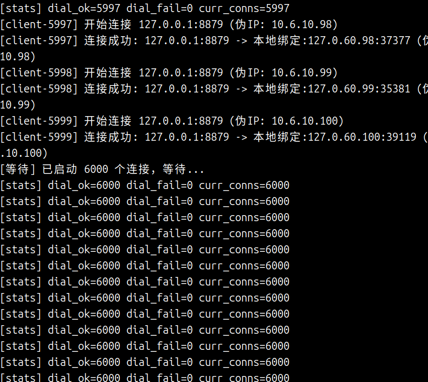
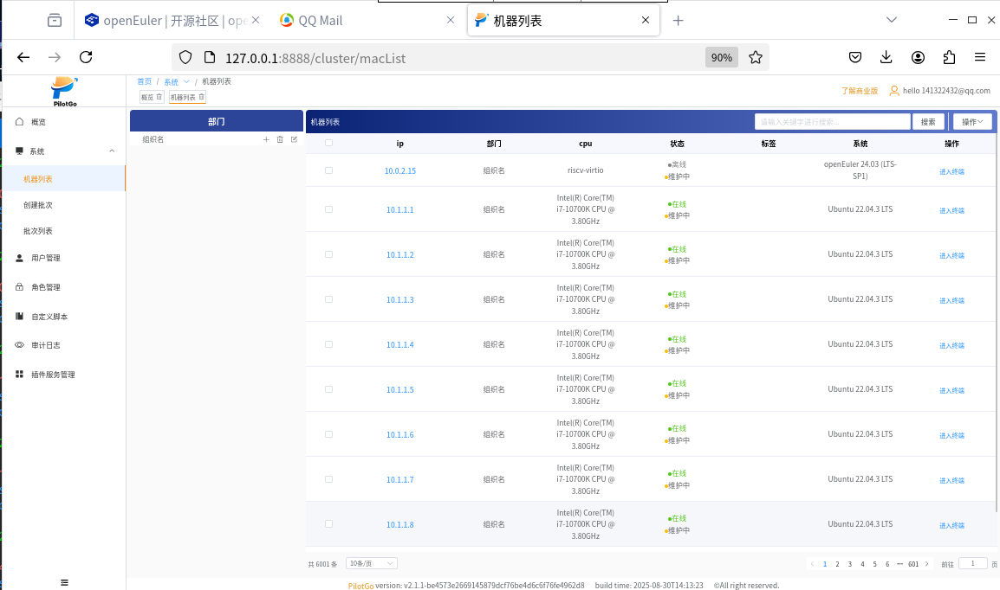

版权所有 © 2025 openEuler社区 您对“本文档”的复制、使用、修改及分发受知识共享(Creative Commons)署名—相同方式共享4.0国际公共许可协议(以下简称“CC BY-SA 4.0”)的约束。为了方便用户理解，您可以通过访问[https://creativecommons.org/licenses/by-sa/4.0/](https://gitee.com/link?target=https%3A%2F%2Fcreativecommons.org%2Flicenses%2Fby-sa%2F4.0%2F) 了解CC BY-SA 4.0的概要 (但不是替代)。CC BY-SA 4.0的完整协议内容您可以访问如下网址获取：[https://creativecommons.org/licenses/by-sa/4.0/legalcode。](https://gitee.com/link?target=https%3A%2F%2Fcreativecommons.org%2Flicenses%2Fby-sa%2F4.0%2Flegalcode%E3%80%82)

修订记录

| 日期       | 修订 版本 | 修改描述 | 作者        |
| ---------- | --------- | -------- | ----------- |
| 2025/09/14 | v1.0      | 创建     | @suguocheng |

关键词： PilotGo 适配 RISC-V 测试报告

摘要：PilotGo 是在社区孵化的一个插件式运维管理平台，采用插件式开发，增强平台的扩展性、并打通不同运维组件之间的壁垒，实现单一平台完整、流畅的运维体验。

缩略语清单：

| 缩略语 | 英文全名 | 中文解释 |
| ------ | -------- | -------- |
|        |          |          |

# 1 特性概述

当前的特性交付包括 PilotGo 基础的运维管理能力和四款插件：PilotGo-plugin-a-tune、PilotGo-plugin-grafana、PilotGo-plugin-prometheus、PilotGo-plugin-topology。

# 2 特性测试信息

PilotGo 特性在 openEuler-24.03-LTS-SP1-riscv64 上验证。

| 版本名称                        | 测试起始时间 | 测试结束时间 |
| ------------------------------- | ------------ | ------------ |
| openEuler-24.03-LTS-SP1-riscv64 | 2025/07/01   | 2025/09/10   |

描述特性测试的环境信息

| 虚拟机型号  | 虚拟机配置信息                          | 备注 |
| ----------- | --------------------------------------- | ---- |
| qemu 虚拟机 | CPU型号：sifive-u54 CPU核数：5 内存：8G |      |

# 3 测试结论概述

## 3.1 测试整体结论

PilotGo 在 openEuler-24.03-LTS-SP1-riscv64 版本的测试阶段，主要涵盖了功能测试、安全性测试和可靠性测试。通过7*24小时的长时间稳定性测试，顺利完成了 16 个子模块的测试。整体核心功能表现稳定，插件功能运行正常。但 PilotGo-plugin-topology 插件因使用的 neo4j 图数据库不支持 riscv64 架构，暂时无法使用。

## 3.2 约束说明

特性使用时涉及到的约束及限制条件

## 3.3 遗留问题分析

### 3.3.1 遗留问题影响以及规避措施

不涉及

### 3.3.2 问题统计

无

# 4 详细测试结论

## 4.1 功能测试

| 序号 | 子模块名称                                                   | 约束依赖说明                        | 质量评估 | 备注 |
| ---- | ------------------------------------------------------------ | ----------------------------------- | -------- | ---- |
| 1    | PilotGo 及其插件软件安装、卸载，服务启动                     | 暂无                                | ■        |      |
| 2    | PilotGo 支持用户添加、修改、删除功能                         | 用户登录                            | ■        |      |
| 3    | PilotGo 支持角色添加、修改、删除功能                         | 用户登录                            | ■        |      |
| 4    | PilotGo 支持部门树添加、修改、删除功能                       | 用户登录                            | ■        |      |
| 5    | PilotGo 支持变更和删除机器部门功能                           | 用户登录                            | ■        |      |
| 6    | PilotGo 支持批次添加、修改、删除功能                         | 用户登录、agent 启动                | ■        |      |
| 7    | PilotGo 支持批量软件包下发和卸载功能                         | 用户登录、agent 启动                | ■        |      |
| 8    | PilotGo 支持查看审计日志功能                                 | 用户登录、agent 启动                | ■        |      |
| 9    | PilotGo 支持机器 ip、内存、架构、系统版本等详细信息的查看    | 用户登录、agent 启动                | ■        |      |
| 10   | PilotGo-plugin-grafana 插件支持对接 grafana 平台             | 用户登录、agent 启动                | ■        |      |
| 11   | PilotGo-plugin-prometheus 插件支持监控机器性能指标，图表可视化展示 | 用户登录、agent 启动                | ■        |      |
| 12   | PilotGo-plugin-a-tune 插件支持查询、添加、修改、删除调优模板 | 用户登录、插件启动                  | ■        |      |
| 13   | PilotGo-plugin-a-tune 插件支持查询、添加、修改、删除调优任务列表 | 用户登录、插件启动                  | ■        |      |
| 14   | PilotGo-plugin-a-tune 插件支持单个调优任务的重启和详情查看   | 用户登录、插件启动                  | ■        |      |
| 15   | PilotGo-plugin-topology 插件支持拓扑配置信息的自定义         | 用户登录、插件启动、topo-agent 启动 | ●        |      |
| 16   | PilotGo-plugin-topology 插件支持查看所有机器的单机拓扑图和全局网络拓扑图 | 用户登录、插件启动、topo-agent 启动 | ●        |      |

●： 表示特性不稳定，风险高 ▲： 表示特性基本可用，遗留少量问题 ■： 表示特性质量良好

### 4.1.2 新增特性测试结论

无新增特性。

## 4.2 兼容性测试结论

在 qemu 虚拟机上，经过测试，PilotGo 及其插件均可以正常运行。

| 序号 | 型号        | 特性质量评估 | 备注                         |
| ---- | ----------- | ------------ | ---------------------------- |
| 1    | qemu 虚拟机 | ▲            | PilotGo 及其三个插件运行正常 |

●： 表示特性不稳定，风险高 ▲： 表示特性基本可用，遗留少量问题 ■： 表示特性质量良好

## 4.3 专项测试结论

### 4.3.1 可靠性/韧性测试结论

| 测试类型      | 测试内容                    | 测试结论                                                     |
| ------------- | --------------------------- | ------------------------------------------------------------ |
| 基础功能测试  | 基础功能                    | 基础功能完善，界面简洁友好，操作简单，响应迅速               |
| 压力长稳测试  | 支持连接 agent 数目与并发数 | PilotGo-server 最大支持 6000 个 agent 接入，最大支持 200 个并发操作 |
| 7*24 长稳测试 | 稳定运行时间                | 平台在 7*24 不间断运行未出现崩溃、故障等问题                 |
| 操作响应测试  | 操作响应速度                | 基本功能应做到即时响应 单个软件包的安装和卸载速度取决于软件包的大小及网络速度 对于批量操作任务，任务提交应立即得到响应 批次执行的完成时间与批次的大小和每个任务的执行时间相关 |

### 4.3.2 安全测试结论

| 测试类型     | 测试内容 | 测试结论                                                   |
| ------------ | -------- | ---------------------------------------------------------- |
| 用户身份测试 | 用户登录 | 不同用户可以正常登录                                       |
| 审计测试     | 日志审计 | 记录不同用户的不同操作，生成对应的审计日志信息显示在页面上 |
| 权限测试     | 用户权限 | 每个登录账号根据其角色分配不同的权限，展现出不同的系统功能 |
| 权限测试     | 插件权限 | 用户具备执行插件操作的权限                                 |

## 4.4 其他测试结论

无。

# 5. 后续测试建议

暂无