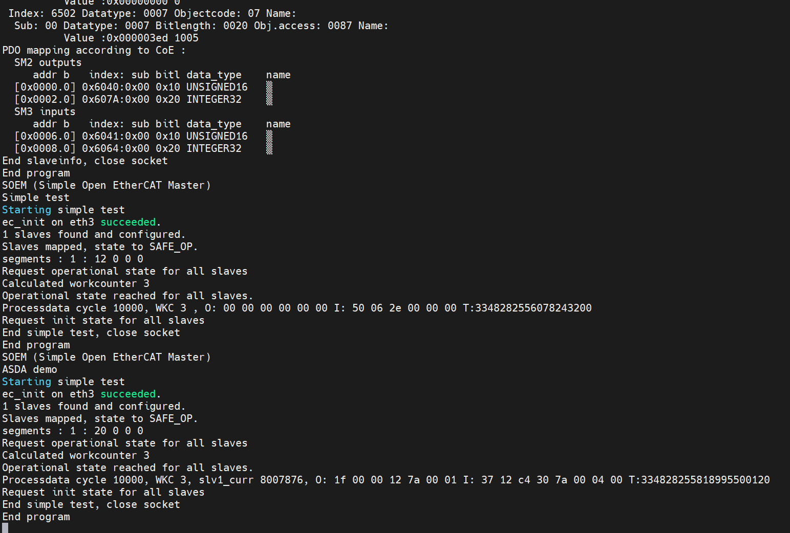

版权所有 © 2025  openEuler社区
 您对“本文档”的复制、使用、修改及分发受知识共享(Creative Commons)署名—相同方式共享4.0国际公共许可协议(以下简称“CC BY-SA 4.0”)的约束。为了方便用户理解，您可以通过访问https://creativecommons.org/licenses/by-sa/4.0/ 了解CC BY-SA 4.0的概要 (但不是替代)。CC BY-SA 4.0的完整协议内容您可以访问如下网址获取：https://creativecommons.org/licenses/by-sa/4.0/legalcode。

修订记录

| 日期       | 修订版本 | 修改描述 | 作者      |
| ---------- | :------- | -------- | --------- |
| 2025-05-17 | 1.0.0    | 初稿     | TianyuTim |

关键词： EtherCAT, UniProton, SOEM

摘要：openEuler 24.03-LTS-SP2版本，UniProton 增加新需求通过移植SOEM支持EtherCAT主站特性，基于特性测试设计，对主站发现从站，获取从站信息，测试PDO收发包功能，控制从站电机运动的功能进行测试。

缩略语清单：

| 缩略语   | 英文全名                                   | 中文解释                     |
| -------- | ------------------------------------------ | ---------------------------- |
| EtherCAT | Ethernet for Control Automation Technology |                              |
| SOEM     | Simple Open EtherCAT Master                |                              |
| PDO      | Process Data Object                        | EtherCAT主站周期性发送的数据 |

# 1     特性概述

EtherCAT (Ethernet for Control Automation Technology) 是一种基于以太网的实时工业通信协议，由德国的Beckhoff公司开发，用于满足工业自动化领域对高性能，低延迟和灵活性的需求。

SOEM (Simple Open EtherCAT Master) 是一个开源的EtherCAT主站协议库，Uniproton通过移植该开源库实现EtherCAT主站功能，对支持EtherCAT从站协议的设备（如电机，传感器等）进行实时的交互与控制。

# 2     特性测试信息

移植的SOEM基本功能在hi3093和专用硬件上进行了测试，

| 版本名称        | 测试起始时间 | 测试结束时间 |
| --------------- | ------------ | ------------ |
| UniProton (openEuler-24.03-LTS-SP2版本) | 2024-04-20   | 2024-04-24   |
| UniProton (openEuler-24.03-LTS-SP2版本) | 2025-02-22   | 2025-02-27   |

硬件环境信息

| 硬件型号   | 硬件配置信息        | 备注 |
| ---------- | ------------------- | ---- |
| hi3093     | ARMv8-a, CPU核数：4 |      |
| 专用硬件 | ARMv8-a, CPU核数：4 |      |

# 3     测试结论概述

## 3.1   测试整体结论

EtherCAT主站特性，共执行3个用例，主要覆盖了功能测试，整体质量良好。

| 测试活动 | 测试子项 | 活动评价 |
| ------- | -------- | ------- |
| 功能测试 | slaveinfo测试：发现从站，获取从站信息       | pass |
| 功能测试 | simpletest测试：控制从站进入op状态，发送pdo | pass |
| 功能测试 | demo测试：控制从站电机旋转 | pass |
| 兼容性测试 |          | 不涉及 |
| DFX专项测试 | 性能测试 | 不涉及 |
| DFX专项测试 | 可靠性/韧性测试 | 不涉及 |
| DFX专项测试 | 安全测试 | 不涉及 |
| 资料测试 |         | 不涉及 |
| 其他测试 |         | 不涉及 |

## 3.2   约束说明

依赖网络代理接口，需要连接从站测试

## 3.3   遗留问题分析

### 3.3.1 遗留问题影响以及规避措施

不涉及

### 3.3.2 问题统计

#### 3.3.2.1 问题数量

不涉及

#### 3.3.2.2 发现问题

不涉及

# 4     测试执行

## 4.1   测试执行统计数据

| 版本名称        | 测试用例数 | 用例执行结果 | 发现问题单数 |
| --------------- | ---------- | ------------ | ------------ |
| openEuler-24.03-LTS-SP2 | 3          | succeed      | 0            |

## 4.2   后续测试建议

后续关注其他新增硬件型号上的测试情况，更换网卡驱动后的测试情况

# 5     附件

SOEM模块测试结果:

