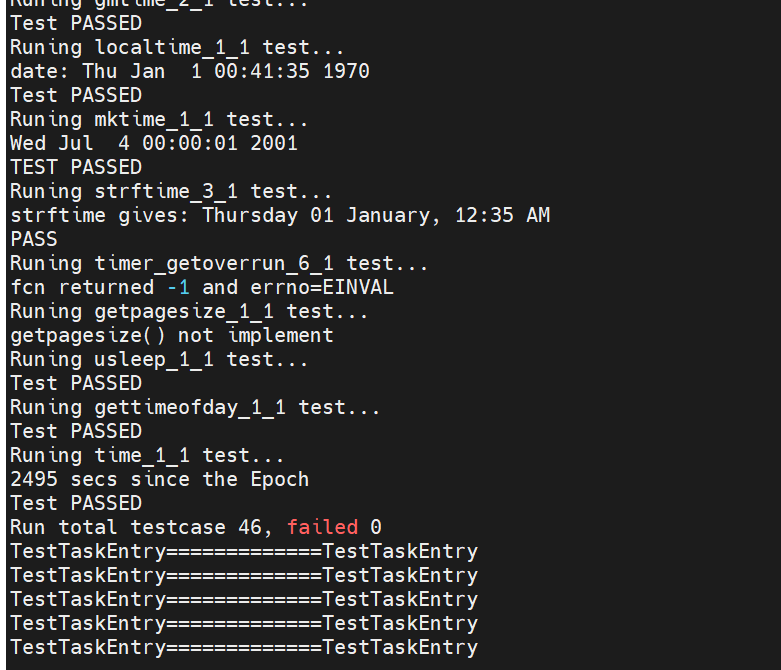
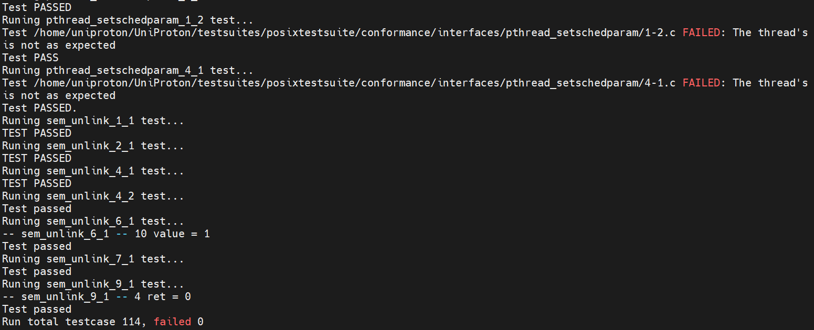
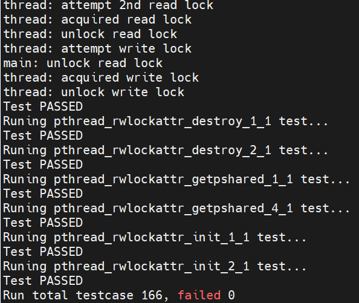
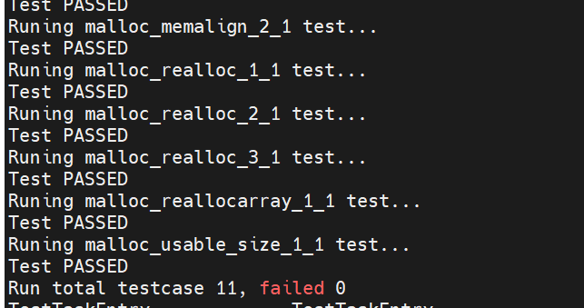
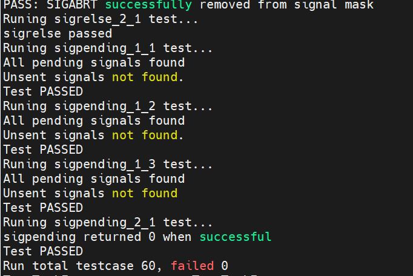
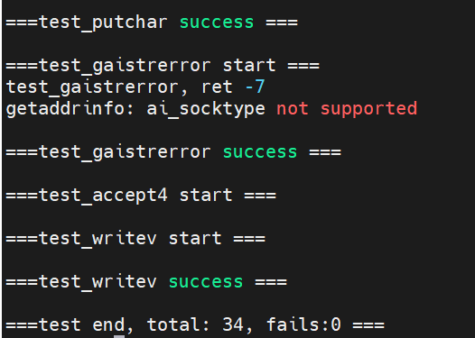
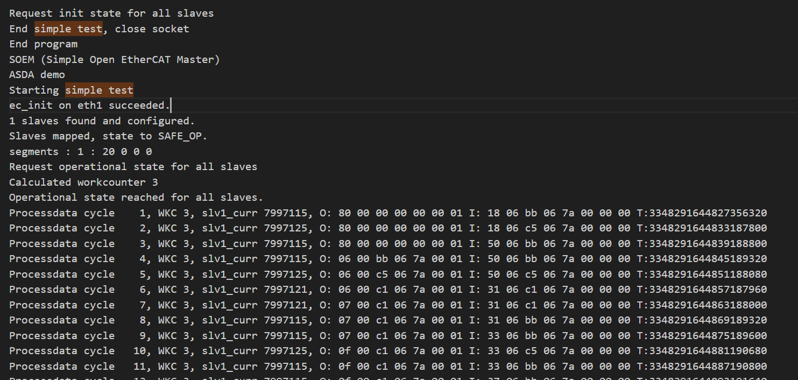

版权所有 © 2025  openEuler社区
 您对“本文档”的复制、使用、修改及分发受知识共享(Creative Commons)署名—相同方式共享4.0国际公共许可协议(以下简称“CC BY-SA 4.0”)的约束。为了方便用户理解，您可以通过访问https://creativecommons.org/licenses/by-sa/4.0/ 了解CC BY-SA 4.0的概要 (但不是替代)。CC BY-SA 4.0的完整协议内容您可以访问如下网址获取：https://creativecommons.org/licenses/by-sa/4.0/legalcode。

修订记录

| 日期       | 修订   版本 | 修改描述 | 作者      |
| ---------- | ----------- | -------- | --------- |
| 2025-06-03 | 1.0.0       | 初稿     | TianyuTim |

关键词： UniProton, mcs

摘要：openEuler 24.03-LTS-SP2版本，UniProton 增加对专用硬件单板的支持，并测试基础内核功能。

缩略语清单：

| 缩略语 | 英文全名                 | 中文解释       |
| ------ | ------------------------ | -------------- |
| mcs    | Mixed Criticality System | 混合关系性系统 |

# 1     特性概述

在专用硬件工控机上隔离一个核，运行UniProton实时操作系统。实现openEuler+UniProton的混合部署。通过openEuler Embedded拉起UniProton。并支持UniProton基础内核功能，如任务、中断。

# 2     特性测试信息

本节描述被测对象的版本信息和测试的时间及测试轮次，包括依赖的硬件。

| 版本名称        | 测试起始时间 | 测试结束时间 |
| --------------- | ------------ | ------------ |
| UniProton (openEuler-24.03-LTS-SP2版本)  | 2025-02-22   | 2025-02-27   |

描述特性测试的硬件环境信息

| 硬件型号   | 硬件配置信息        | 备注 |
| ---------- | ------------------- | ---- |
| 专用硬件 | ARMv8-a, CPU核数：4 |      |

# 3     测试结论概述

## 3.1   测试整体结论

成功通过openEuler Embedded拉起UniProton，并执行了7个模块的功能测试，覆盖了UniProton的基础内核功能，整体质量良好。

| 测试活动 | 测试子项 | 活动评价 |
| ------- | -------- | ------- |
| 功能测试 | posix时钟与睡眠模块测试  | pass |
| 功能测试 | posix信号量模块测试 | pass |
| 功能测试 | posix线程模块测试 | pass |
| 功能测试 | posix内存模块测试        | pass |
| 功能测试 | posix信号模块测试        | pass |
| 功能测试 | 混合部署代理接口模块测试 | pass |
| 功能测试 | SOEM模块测试 | pass |
| 兼容性测试 |          | 不涉及 |
| DFX专项测试 | 性能测试 | 不涉及 |
| DFX专项测试 | 可靠性/韧性测试 | 不涉及 |
| DFX专项测试 | 安全测试 | 不涉及 |
| 资料测试 |         | 不涉及 |
| 其他测试 |         | 不涉及 |

## 3.2   约束说明

部分文件相关接口，网络相关接口的测试，为代理接口，依赖混合部署框架。

SOEM模块测试，需要连接从站测试。

## 3.3   遗留问题分析

### 3.3.1 遗留问题影响以及规避措施

不涉及

### 3.3.2 问题统计

#### 3.3.2.1 问题数量

不涉及

#### 3.3.2.2 发现问题

不涉及

# 4     测试执行

## 4.1   测试执行统计数据

| 版本名称        | 测试用例数 | 用例执行结果 | 发现问题单数 |
| --------------- | ---------- | ------------ | ------------ |
| UniProton (openEuler-24.03-LTS-SP2版本)  | 434        | succeed      | 0            |

## 4.2   后续测试建议

NA

# 5     附件

posix时钟与睡眠模块测试结果:

posix信号量模块测试结果:

posix线程模块测试结果:

posix内存模块测试结果:

posix信号模块测试结果:

混合部署代理接口模块测试结果:

SOEM模块测试结果:

