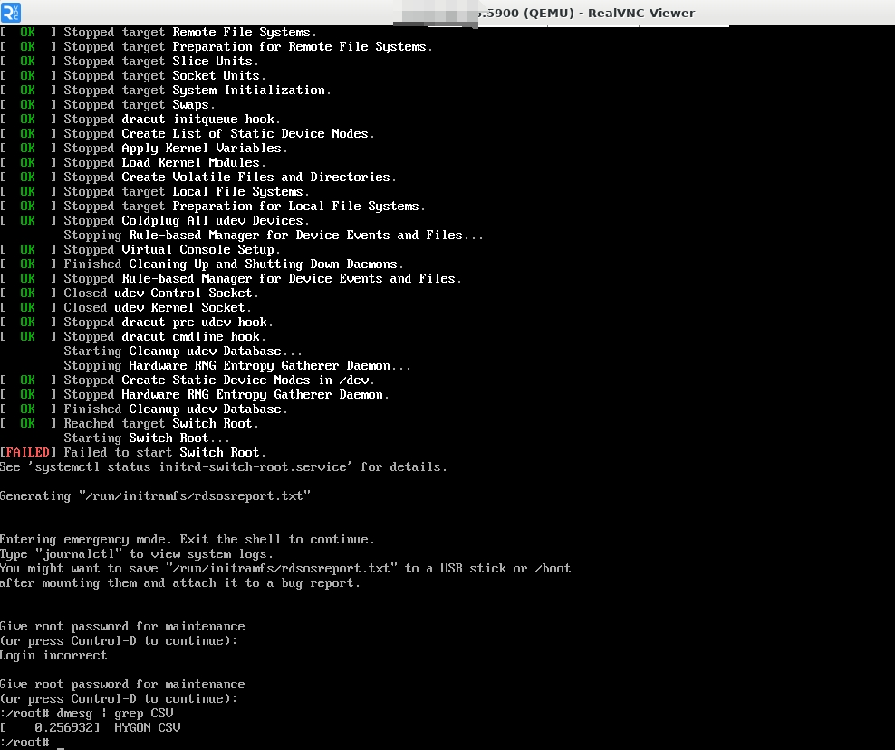
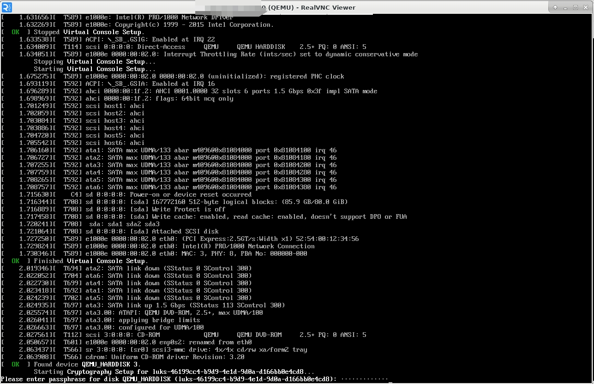

版权所有 © 2025  openEuler社区
 您对“本文档”的复制、使用、修改及分发受知识共享(Creative Commons)署名—相同方式共享4.0国际公共许可协议(以下简称“CC BY-SA 4.0”)的约束。为了方便用户理解，您可以通过访问https://creativecommons.org/licenses/by-sa/4.0/ 了解CC BY-SA 4.0的概要 (但不是替代)。CC BY-SA 4.0的完整协议内容您可以访问如下网址获取：https://creativecommons.org/licenses/by-sa/4.0/legalcode。

修订记录

| 日期 | 修订   版本 | 修改描述 | 作者 |
| ---- | ----------- | -------- | ---- |
| 2025/06/17 | v1.0 | 创建 | 韩里洋 |
|      |             |          |      |

关键词： 海光；机密虚拟机；kernel启动度量；机密计算全磁盘加密

摘要：本报告主要描述基于openEuler-24.03-LTS-SP2版本系统OVMF.fd文件对海光机密虚拟机进行测试，输出测试结果。


缩略语清单：

| 缩略语 | 英文全名 | 中文解释 |
| ------ | -------- | -------- |
| CSV | China Secure Virtualization |          |
|        |          |          |

# 1     特性概述

OVMF.fd是一种基于edk2仓库中AmdSevX64.dsc构建描述生成的OVMF文件，海光的Kernel Direct Boot和机密计算全磁盘加密依赖于这种OVMF文件。

OVMF.fd支持海光CSV1/2/3开箱即用，旨在提供openEuler-24.03-LTS的edk2仓库构建能力，使edk2-ovmf软件包自动包含可用于Kernel Direct Boot和机密计算全磁盘机密方案启动的海光CSV1/2/3虚拟机。

# 2     特性测试信息

本节描述被测对象的版本信息和测试的时间及测试轮次，包括依赖的硬件。

| 版本名称 | 测试起始时间 | 测试结束时间 |
| -------- | ------------ | ------------ |
| openEuler-24.03-LTS-SP2 | 2025/06/16 | 2025/06/17 |
|          |              |              |

描述特性测试的硬件环境信息

| 硬件型号 | 硬件配置信息 | 备注 |
| -------- | ------------ | ---- |
| Hygon C86-4G (7490) | 内存256G，cpu core 128 |      |
|          |              |      |

# 3     测试结论概述

## 3.1   测试整体结论

OVMF.fd支持海光CSV1/2/3机密虚拟机开箱即用特性，共执行8个用例：主要包括6项分别用于Kernel Direct Boot方式或机密计算全磁盘加密方案启动CSV1、CSV2、CSV3虚拟机的功能测试；以及2项分别针对Kernel Direct Boot启动和机密计算全磁盘加密方案启动混合了CSV1、CSV2、CSV3虚拟机的测试，用于测试多种类型海光机密虚拟机同时启动的功能稳定性。

| 测试活动 | 测试子项 | 活动评价 |
| ------- | -------- | ------- |
| 功能测试 | Kernel Direct Boot启动50个CSV1虚拟机 | 测试通过 |
| 功能测试 | Kernel Direct Boot启动50个CSV2虚拟机 | 测试通过 |
| 功能测试 | Kernel Direct Boot启动50个CSV3虚拟机 | 测试通过 |
| 功能测试 | 机密计算全磁盘加密方案启动50个CSV1虚拟机 | 测试通过 |
| 功能测试 | 机密计算全磁盘加密方案启动50个CSV2虚拟机 | 测试通过 |
| 功能测试 | 机密计算全磁盘加密方案启动50个CSV3虚拟机 | 测试通过 |
| 稳定性测试 | Kernel Direct Boot方式混合启动50个<br>CSV1/2/3虚拟机 | 测试通过 |
| 稳定性测试 | 机密计算全磁盘加密方案混合启动50个<br>CSV1/2/3虚拟机 | 测试通过 |

## 3.2   约束说明

支持OVMF.fd支持海光CSV1/2/3机密虚拟机开箱即用的代码Pull Request很早已经合入到主分支，但是未能同步到openEuler-24.03-LTS-SP2的分支，测试时基于主分支手动生成的OVMF.fd文件进行测试。

与openEuler Virt sig的老师沟通后，确认在2025/6/30之后，在SP2的release issue下方评论未能同步到openEuler-24.04-LTS-SP2中的edk2 PR，然后进行同步工作，同步后的PR将会体现在edk2-ovmf安装包更新中。

## 3.3   遗留问题分析

### 3.3.1 遗留问题影响以及规避措施

NA

### 3.3.2 问题统计

#### 3.3.2.1 问题数量

NA

#### 3.3.2.2 发现问题

NA  

# 4 详细测试结论

## 4.1 功能测试
*开源软件：主要关注开源软件升级后的变动点，继承特性由开源软件自带用例保证（需额外关注软件包提供可执行命令、库、服务功能）*
*社区孵化软件：主要参考以下列表*

### 4.1.1 继承特性测试结论

| 序号 | 组件/特性名称 | 特性质量评估 | 备注 |
| --- | ----------- | :--------: | --- |
| 1 | CSV1虚拟机 | <font color=green>■</font> |   |
| 2 | CSV2虚拟机 | <font color=green>■</font> |   |
| 3 | CSV3虚拟机 | <font color=green>■</font> |   |

<font color=red>●</font>： 表示特性不稳定，风险高
<font color=blue>▲</font>： 表示特性基本可用，遗留少量问题
<font color=green>■</font>： 表示特性质量良好

### 4.1.2 新增特性测试结论

| 序号 | 组件/特性名称 | 特性质量评估 | 备注 |
| --- | ----------- | :--------: | --- |
| 1 | OVMF.fd支持海光CSV1/2/3虚拟机开箱即用 | <font color=green>■</font> |   |

<font color=red>●</font>： 表示特性不稳定，风险高
<font color=blue>▲</font>： 表示特性基本可用，遗留少量问题
<font color=green>■</font>： 表示特性质量良好

## 4.2 兼容性测试结论

*针对应用软件，主要考虑OS版本兼容性(在不同LTS SPx上的兼容性)、升降级兼容性、上层以来软件兼容性（如升级mysql后，对版本内已发布的使用mysql的软件的兼容性）*

## 4.3 DFX专项测试结论

### 4.3.1 性能测试结论

NA

### 4.3.2 可靠性/韧性测试结论

| 测试类型 | 测试内容 | 测试结论 |
| ------- | ------- | -------- |
| 可靠性 | 使用OVMF.fd并行混合Kernel Direct Boot方式启动CSV1/2/3虚拟机 | 通过 |
| 可靠性 | 使用OVMF.fd并行混合机密计算全磁盘加密方案启动CSV1/2/3虚拟机 | 通过 |

### 4.3.3 安全测试结论

NA

## 4.4 资料测试结论
*建议附加资料PR链接*

NA

## 4.5 其他测试结论

NA

# 5     测试执行

## 5.1   测试执行统计数据

*本节内容根据测试用例及实际执行情况进行特性整体测试的统计，可根据第二章的测试轮次分开进行统计说明。*

| 版本名称 | 测试用例数 | 用例执行结果 | 发现问题单数 |
| -------- | ---------- | ------------ | ------------ |
| openEuler-24.03-LTS-SP2 | 8 | 通过 | 0 |
|          |            |              |              |

*数据项说明：*

*测试用例数－－到本测试活动结束时，所有可用测试用例数；*

*发现问题单数－－本测试活动总共发现的问题单数。*

## 5.2   后续测试建议

后续测试需要关注点(可选)

# 6     附件

> 附件描述OVMF.fd支持海光CSV1/2/3虚拟机开箱即用的示例。

> 以下测试中需要用到海光安全工具hag，其获取方法可以参考https://gitee.com/anolis/hygon-devkit。

**手动生成的edk2-ovmf安装包内容如下图：**

> /usr/share/edk2/ovmf.amdsev/OVMF.fd即是用来支持启动海光CSV1/2/3虚拟机的OVMF.fd文件。


## Kernel Direct Boot启动海光CSV1/2/3虚拟机

### 启动CSV1虚拟机

- 制作启动会话数据

> 这里为了方便演示没有区分环境，会话数据的制作实际应在虚拟机用户所处的安全环境内进行。

`generate-hygon-cc-launch-blobs.sh`见[脚本](./assets/csv-works-out-of-the-box/generate-hygon-cc-launch-blobs.sh)。
`cmdline.txt`见[文件](./assets/csv-works-out-of-the-box/cmdline.txt)。

```shell
./generate-hygon-cc-launch-blobs.sh -f /usr/share/edk2/ovmf.amdsev/OVMF.fd -H hag -k vmlinuz-6.6.0-97.0.0.102.oe2403sp2.x86_64 -i initramfs-6.6.0-97.0.0.102.oe2403sp2.x86_64.img -c cmdline.txt -B Kernel-Hashes -C csv1
```
- 执行的输出
```
this command is used to export PDH cert 'pdh.cert' and platform cert chain 'cert_chain.cert'
pdh_cert_export command success!

[csv] Command successful!
generate guest policy, writing to file 'guest_policy.txt'
guest policy is used for launch guest vitual machine
generate_policy command success!

[csv] Command successful!
generate guest owner dh(diffie hellman) cert, writing to file 'guest_owner_dh.cert'
dh cert is used for sm2 exchange
generate guest private key, writing to file guest_priv_key.bin
generate tek/tik, writing to file 'tmp_tk.bin'
tek/tik is used for data encryption and decryption
ms_enc_len_exp: 108
sizeof(cv) 8
enc ms ret: 1
SM2_compute_message_digest: ret: 1
SM2_sign: ret: 1
generate launch_blob_file session data, writing to file 'launch_blob.bin'
session data is used for launch_start, send_start and receive_start
generate_launch_blob command success!

[csv] Command successful!
```

- 启动虚拟机

`launch-with-hygon-cc-launch-blobs.sh`见[脚本](./assets/csv-works-out-of-the-box/launch-with-hygon-cc-launch-blobs.sh)。

```shell
./launch-with-hygon-cc-launch-blobs.sh -f /usr/share/edk2/ovmf.amdsev/OVMF.fd -k vmlinuz-6.6.0-97.0.0.102.oe2403sp2.x86_64 -i initramfs-6.6.0-97.0.0.102.oe2403sp2.x86_64.img -c cmdline.txt -B Kernel-Hashes -C csv1
```



### 启动CSV2虚拟机

- 制作启动会话数据

> 这里为了方便演示没有区分环境，会话数据的制作实际应在虚拟机用户所处的安全环境内进行。

```shell
./generate-hygon-cc-launch-blobs.sh -f /usr/share/edk2/ovmf.amdsev/OVMF.fd -H hag -k vmlinuz-6.6.0-97.0.0.102.oe2403sp2.x86_64 -i initramfs-6.6.0-97.0.0.102.oe2403sp2.x86_64.img -c cmdline.txt -B Kernel-Hashes -C csv2
```
- 执行的输出
```
this command is used to export PDH cert 'pdh.cert' and platform cert chain 'cert_chain.cert'
pdh_cert_export command success!

[csv] Command successful!
generate guest policy, writing to file 'guest_policy.txt'
guest policy is used for launch guest vitual machine
generate_policy command success!

[csv] Command successful!
generate guest owner dh(diffie hellman) cert, writing to file 'guest_owner_dh.cert'
dh cert is used for sm2 exchange
generate guest private key, writing to file guest_priv_key.bin
generate tek/tik, writing to file 'tmp_tk.bin'
tek/tik is used for data encryption and decryption
ms_enc_len_exp: 108
sizeof(cv) 8
enc ms ret: 1
SM2_compute_message_digest: ret: 1
SM2_sign: ret: 1
generate launch_blob_file session data, writing to file 'launch_blob.bin'
session data is used for launch_start, send_start and receive_start
generate_launch_blob command success!

[csv] Command successful!
```

- 启动虚拟机

```shell
./launch-with-hygon-cc-launch-blobs.sh
-f /usr/share/edk2/ovmf.amdsev/OVMF.fd -k vmlinuz-6.6.0-97.0.0.102.oe2403sp2.x86_64 -i initramfs-6.6.0-97.0.0.102.oe2403sp2.x86_64.img -c cmdline.txt -B Kernel-Hashes -C csv2
```


### 启动CSV3虚拟机

- 制作启动会话数据

> 这里为了方便演示没有区分环境，会话数据的制作实际应在虚拟机用户所处的安全环境内进行。

```shell
./generate-hygon-cc-launch-blobs.sh -f
/usr/share/edk2/ovmf.amdsev/OVMF.fd -H hag -k vmlinuz-6.6.0-97.0.0.102.oe2403sp2.x86_64 -i initramfs-6.6.0-97.0.0.102.oe2403sp2.x86_64.img -c cmdline.txt -B Kernel-Hashes -C csv3
```
- 执行的输出
```
this command is used to export PDH cert 'pdh.cert' and platform cert chain 'cert_chain.cert'
pdh_cert_export command success!

[csv] Command successful!
generate guest policy, writing to file 'guest_policy.txt'
guest policy is used for launch guest vitual machine
generate_policy command success!

[csv] Command successful!
Info: check for vcpu model: 'Dhyana'
Info: check for vcpu model: 'Dhyana-v1'
Info: check for vcpu model: 'Dhyana'
Info: check for vcpu model: 'Dhyana-v1'
Info: check for vcpu model: 'Dhyana'
Info: check for vcpu model: 'Dhyana-v1'
Info: check for vcpu model: 'Dhyana'
Info: check for vcpu model: 'Dhyana-v1'
Info: check for vcpu model: 'Dhyana'
Info: check for vcpu model: 'Dhyana-v1'
Info: check for vcpu model: 'Dhyana'
Info: check for vcpu model: 'Dhyana-v1'
Info: check for vcpu model: 'Dhyana'
Info: check for vcpu model: 'Dhyana-v1'
Info: check for vcpu model: 'Dhyana'
Info: check for vcpu model: 'Dhyana-v1'
generate guest owner dh(diffie hellman) cert, writing to file 'guest_owner_dh.cert'
dh cert is used for sm2 exchange
generate guest private key, writing to file guest_priv_key.bin
generate tek/tik, writing to file 'tmp_tk.bin'
tek/tik is used for data encryption and decryption
ms_enc_len_exp: 108
sizeof(cv) 8
enc ms ret: 1
SM2_compute_message_digest: ret: 1
SM2_sign: ret: 1
generate launch_blob_file session data, writing to file 'launch_blob.bin'
session data is used for launch_start, send_start and receive_start
generate_launch_blob command success!

[csv] Command successful!
```

- 启动虚拟机

```shell
./launch-with-hygon-cc-launch-blobs.sh
-f /usr/share/edk2/ovmf.amdsev/OVMF.fd -k vmlinuz-6.6.0-97.0.0.102.oe2403sp2.x86_64 -i initramfs-6.6.0-97.0.0.102.oe2403sp2.x86_64.img -c cmdline.txt -B Kernel-Hashes -C csv3
```


## 机密计算全磁盘加密启动海光CSV1/2/3虚拟机

### 安装机密计算全磁盘加密的虚拟机

- 使用edk2-ovmf中支持开箱即用的OVMF_CODE.fd安装虚拟机。

`install-launch-vm.sh`见[脚本](./assets/csv-works-out-of-the-box/install-launch-vm.sh)。

```shell
./install-launch-vm.sh -I -i openEuler-24.03-LTS-SP2-x86_64-dvd.iso -s 80G -d openEuler-24.03-LTS-SP2-x86_64.encrypted.qcow2 -f /usr/share/edk2/ovmf.nosb/OVMF_CODE.nosb.fd -C norm
```

- 安装过程中选择加密磁盘


> 安装过程中还需要输入磁盘数据分区的密钥。

- 安装完成后，重启并进入虚拟机

> 重启进入虚拟机时需要输入磁盘数据分区的密钥，才能解密挂载数据分区。



- 配置虚拟机的磁盘为全磁盘加密

> 执行脚本`guest-setup-full-disk-encryption.sh`，该脚本会提示系统缺失的包或工具。

`guest-setup-full-disk-encryption.sh`见[脚本](./assets/csv-works-out-of-the-box/guest-setup-full-disk-encryption.sh)。


> 安装系统缺失的包或工具后，再次执行脚本，脚本会提示用户设置其虚拟机磁盘启动分区的密码和数据分区密码。


> 脚本执行完成后，表示虚拟机磁盘启动分区也已经加密。此时，机密计算全磁盘加密方案的虚拟机磁盘已经制作完毕。


### 启动CSV1虚拟机

- 制作启动会话数据

> 这里为了方便演示没有区分环境，会话数据的制作实际应在虚拟机用户所处的安全环境内进行。

`pack-secret.py`见[脚本](./assets/csv-works-out-of-the-box/pack-secret.py)。

```shell
./generate-hygon-cc-launch-blobs.sh -f /usr/share/edk2/ovmf.amdsev/OVMF.fd -H hag -s Oe_123_Admin -p pack-secret.py -B FDE -C csv1
```
- 执行的输出
```
this command is used to export PDH cert 'pdh.cert' and platform cert chain 'cert_chain.cert'
pdh_cert_export command success!

[csv] Command successful!
generate guest policy, writing to file 'guest_policy.txt'
guest policy is used for launch guest vitual machine
generate_policy command success!

[csv] Command successful!
generate guest owner dh(diffie hellman) cert, writing to file 'guest_owner_dh.cert'
dh cert is used for sm2 exchange
generate guest private key, writing to file guest_priv_key.bin
generate tek/tik, writing to file 'tmp_tk.bin'
tek/tik is used for data encryption and decryption
ms_enc_len_exp: 108
sizeof(cv) 8
enc ms ret: 1
SM2_compute_message_digest: ret: 1
SM2_sign: ret: 1
generate launch_blob_file session data, writing to file 'launch_blob.bin'
session data is used for launch_start, send_start and receive_start
generate_launch_blob command success!

[csv] Command successful!

FW Build Id is:  2311

Secret is:  Oe_123_Admin
        1st len:  64
        2nd len:  33
Save secret to secret.txt
Package secret data used by qemu
generate encrypted secret file, writing to secret.bin
generate launch_secret packet header file, writing to secret_header.bin
package_secret command success!

[csv] Command successful!

Secret Package Succeed !
```

- 启动虚拟机

```shell
./launch-with-hygon-cc-launch-blobs.sh -f /usr/share/edk2/ovmf.amdsev/OVMF.fd -d openEuler-24.03-LTS-SP2-x86_64.encrypted.qcow2 -B FDE -C csv1
```

- 虚拟机启动过程中，无需输入任何磁盘分区密码即可进入


### 启动CSV2虚拟机

- 制作启动会话数据

> 这里为了方便演示没有区分环境，会话数据的制作实际应在虚拟机用户所处的安全环境内进行。

```shell
./generate-hygon-cc-launch-blobs.sh -f /usr/share/edk2/ovmf.amdsev/OVMF.fd -H hag -s Oe_123_Admin -p pack-secret.py -B FDE -C csv2
```
- 执行的输出
```
this command is used to export PDH cert 'pdh.cert' and platform cert chain 'cert_chain.cert'
pdh_cert_export command success!

[csv] Command successful!
generate guest policy, writing to file 'guest_policy.txt'
guest policy is used for launch guest vitual machine
generate_policy command success!

[csv] Command successful!
generate guest owner dh(diffie hellman) cert, writing to file 'guest_owner_dh.cert'
dh cert is used for sm2 exchange
generate guest private key, writing to file guest_priv_key.bin
generate tek/tik, writing to file 'tmp_tk.bin'
tek/tik is used for data encryption and decryption
ms_enc_len_exp: 108
sizeof(cv) 8
enc ms ret: 1
SM2_compute_message_digest: ret: 1
SM2_sign: ret: 1
generate launch_blob_file session data, writing to file 'launch_blob.bin'
session data is used for launch_start, send_start and receive_start
generate_launch_blob command success!

[csv] Command successful!

FW Build Id is:  2311

Secret is:  Oe_123_Admin
        1st len:  64
        2nd len:  33
Save secret to secret.txt
Package secret data used by qemu
generate encrypted secret file, writing to secret.bin
generate launch_secret packet header file, writing to secret_header.bin
package_secret command success!

[csv] Command successful!

Secret Package Succeed !
```

- 启动虚拟机

```shell
./launch-with-hygon-cc-launch-blobs.sh
-f /usr/share/edk2/ovmf.amdsev/OVMF.fd -d openEuler-24.03-LTS-SP2-x86_64.encrypted.qcow2 -B FDE -C csv2
```

- 虚拟机启动过程中，无需输入任何磁盘分区密码即可进入


### 启动CSV3虚拟机

- 制作启动会话数据

> 这里为了方便演示没有区分环境，会话数据的制作实际应在虚拟机用户所处的安全环境内进行。

```shell
./generate-hygon-cc-launch-blobs.sh -f
/usr/share/edk2/ovmf.amdsev/OVMF.fd -H hag -s Oe_123_Admin -p pack-secret.py -B FDE -C csv3
```
- 执行的输出
```
this command is used to export PDH cert 'pdh.cert' and platform cert chain 'cert_chain.cert'
pdh_cert_export command success!

[csv] Command successful!
generate guest policy, writing to file 'guest_policy.txt'
guest policy is used for launch guest vitual machine
generate_policy command success!

[csv] Command successful!
Info: check for vcpu model: 'Dhyana'
Info: check for vcpu model: 'Dhyana-v1'
Info: check for vcpu model: 'Dhyana'
Info: check for vcpu model: 'Dhyana-v1'
Info: check for vcpu model: 'Dhyana'
Info: check for vcpu model: 'Dhyana-v1'
Info: check for vcpu model: 'Dhyana'
Info: check for vcpu model: 'Dhyana-v1'
Info: check for vcpu model: 'Dhyana'
Info: check for vcpu model: 'Dhyana-v1'
Info: check for vcpu model: 'Dhyana'
Info: check for vcpu model: 'Dhyana-v1'
Info: check for vcpu model: 'Dhyana'
Info: check for vcpu model: 'Dhyana-v1'
Info: check for vcpu model: 'Dhyana'
Info: check for vcpu model: 'Dhyana-v1'
generate guest owner dh(diffie hellman) cert, writing to file 'guest_owner_dh.cert'
dh cert is used for sm2 exchange
generate guest private key, writing to file guest_priv_key.bin
generate tek/tik, writing to file 'tmp_tk.bin'
tek/tik is used for data encryption and decryption
ms_enc_len_exp: 108
sizeof(cv) 8
enc ms ret: 1
SM2_compute_message_digest: ret: 1
SM2_sign: ret: 1
generate launch_blob_file session data, writing to file 'launch_blob.bin'
session data is used for launch_start, send_start and receive_start
generate_launch_blob command success!

[csv] Command successful!

FW Build Id is:  2311

Secret is:  Oe_123_Admin
        1st len:  64
        2nd len:  33
Save secret to secret.txt
Package secret data used by qemu
generate encrypted secret file, writing to secret.bin
generate launch_secret packet header file, writing to secret_header.bin
package_secret command success!

[csv] Command successful!

Secret Package Succeed !
```

- 启动虚拟机

```shell
./launch-with-hygon-cc-launch-blobs.sh
-f /usr/share/edk2/ovmf.amdsev/OVMF.fd -d openEuler-24.03-LTS-SP2-x86_64.encrypted.qcow2 -B FDE -C csv3
```

- 虚拟机启动过程中，无需输入任何磁盘分区密码即可进入

 