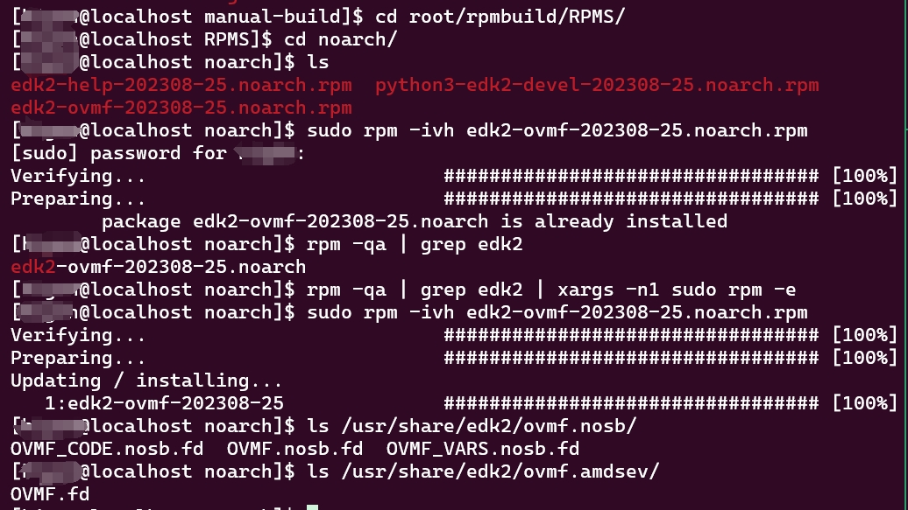
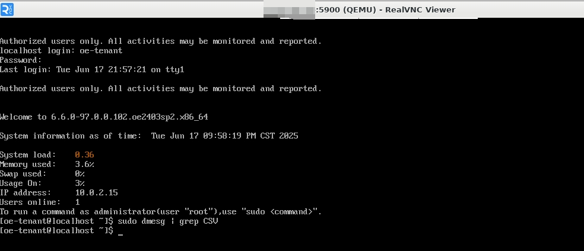

版权所有 © 2025  openEuler社区
 您对“本文档”的复制、使用、修改及分发受知识共享(Creative Commons)署名—相同方式共享4.0国际公共许可协议(以下简称“CC BY-SA 4.0”)的约束。为了方便用户理解，您可以通过访问https://creativecommons.org/licenses/by-sa/4.0/ 了解CC BY-SA 4.0的概要 (但不是替代)。CC BY-SA 4.0的完整协议内容您可以访问如下网址获取：https://creativecommons.org/licenses/by-sa/4.0/legalcode。

修订记录

| 日期 | 修订   版本 | 修改描述 | 作者 |
| ---- | ----------- | -------- | ---- |
| 2025/06/17 | v1.0 | 创建 | 韩里洋 |
|      |             |          |      |

关键词： 海光；机密虚拟机

摘要：本报告主要描述基于openEuler-24.03-LTS-SP2版本系统OVMF_CODE.fd文件对海光机密虚拟机进行测试，输出测试结果。


缩略语清单：

| 缩略语 | 英文全名 | 中文解释 |
| ------ | -------- | -------- |
| CSV | China Secure Virtualization |          |
|        |          |          |

# 1     特性概述

该特性旨在提供openEuler-24.03-LTS的edk2仓库构建能力，使edk2-ovmf软件包自动包含可用于Normal Boot启动海光CSV1/2/3机密虚拟机的OVMF_CODE.fd文件。

# 2     特性测试信息

本节描述被测对象的版本信息和测试的时间及测试轮次，包括依赖的硬件。

| 版本名称 | 测试起始时间 | 测试结束时间 |
| -------- | ------------ | ------------ |
| openEuler-24.03-LTS-SP2 | 2025/06/16 | 2025/06/17 |
|          |              |              |

描述特性测试的硬件环境信息

| 硬件型号 | 硬件配置信息 | 备注 |
| -------- | ------------ | ---- |
| Hygon C86-4G (7490) | 内存256G，cpu core 128 |      |
|          |              |      |

# 3     测试结论概述

## 3.1   测试整体结论

OVMF_CODE.fd支持海光CSV1/2/3机密虚拟机开箱即用特性，共计执行8个用例：主要包括4项功能测试，测试普通/CSV1/CSV2/CSV3虚拟机启动是否正常；4项稳定性测试，其中1项测试普通/CSV1/CSV2/CSV3虚拟机在各种配置下混合启动是否正常，另外3项分别测试CSV1/2/3虚拟机循环启动的压力测试是否正常。

| 测试活动 | 测试子项 | 活动评价 |
| ------- | -------- | ------- |
| 功能测试 | 启动50个普通虚拟机 | 测试通过 |
| 功能测试 | 启动50个CSV1虚拟机 | 测试通过 |
| 功能测试 | 启动50个CSV2虚拟机 | 测试通过 |
| 功能测试 | 启动50个CSV3虚拟机 | 测试通过 |
| 稳定性测试 | 虚拟机设置不同vcpu，不同内存混合启动50个<br>普通/CSV1/CSV2/CSV3虚拟机 | 测试通过 |
| 稳定性测试 | 连续启动&关闭CSV1虚拟机500次 | 测试通过 |
| 稳定性测试 | 连续启动&关闭CSV2虚拟机500次 | 测试通过 |
| 稳定性测试 | 连续启动&关闭CSV3虚拟机500次 | 测试通过 |

## 3.2   约束说明

支持OVMF_CODE.fd支持海光CSV1/2/3机密虚拟机开箱即用的代码Pull Request很早已经合入到主分支，但是未能同步到openEuler-24.03-LTS-SP2的分支，测试时基于主分支手动生成的OVMF_CODE.fd文件进行测试。

与openEuler Virt sig的老师沟通后，确认在2025/6/30之后，在SP2的release issue下方评论未能同步到openEuler-24.04-LTS-SP2中的edk2 PR，然后进行同步工作，同步后的PR将会体现在edk2-ovmf安装包更新中。

## 3.3   遗留问题分析

### 3.3.1 遗留问题影响以及规避措施

NA

### 3.3.2 问题统计

#### 3.3.2.1 问题数量

NA

#### 3.3.2.2 发现问题

NA 

# 4 详细测试结论

## 4.1 功能测试
*开源软件：主要关注开源软件升级后的变动点，继承特性由开源软件自带用例保证（需额外关注软件包提供可执行命令、库、服务功能）*
*社区孵化软件：主要参考以下列表*

### 4.1.1 继承特性测试结论

| 序号 | 组件/特性名称 | 特性质量评估 | 备注 |
| --- | ----------- | :--------: | --- |
| 1 | 普通虚拟机 | <font color=green>■</font> |   |
| 2 | CSV1虚拟机 | <font color=green>■</font> |   |
| 3 | CSV2虚拟机 | <font color=green>■</font> |   |
| 4 | CSV3虚拟机 | <font color=green>■</font> |   |

<font color=red>●</font>： 表示特性不稳定，风险高
<font color=blue>▲</font>： 表示特性基本可用，遗留少量问题
<font color=green>■</font>： 表示特性质量良好

### 4.1.2 新增特性测试结论

| 序号 | 组件/特性名称 | 特性质量评估 | 备注 |
| --- | ----------- | :--------: | --- |
| 1 | OVMF_CODE.fd支持海光CSV1/2/3虚拟机开箱即用 | <font color=green>■</font> |   |

<font color=red>●</font>： 表示特性不稳定，风险高
<font color=blue>▲</font>： 表示特性基本可用，遗留少量问题
<font color=green>■</font>： 表示特性质量良好

## 4.2 兼容性测试结论

*针对应用软件，主要考虑OS版本兼容性(在不同LTS SPx上的兼容性)、升降级兼容性、上层以来软件兼容性（如升级mysql后，对版本内已发布的使用mysql的软件的兼容性）*

## 4.3 DFX专项测试结论

### 4.3.1 性能测试结论

NA

### 4.3.2 可靠性/韧性测试结论

| 测试类型 | 测试内容 | 测试结论 |
| ------- | ------- | -------- |
| 可靠性 | 使用OVMF_CODE.fd并行混合启动普通/CSV1/CSV2/CSV3虚拟机 | 通过 |

### 4.3.3 安全测试结论

NA

## 4.4 资料测试结论
*建议附加资料PR链接*

NA

## 4.5 其他测试结论

NA

# 5     测试执行

## 5.1   测试执行统计数据

*本节内容根据测试用例及实际执行情况进行特性整体测试的统计，可根据第二章的测试轮次分开进行统计说明。*

| 版本名称 | 测试用例数 | 用例执行结果 | 发现问题单数 |
| -------- | ---------- | ------------ | ------------ |
| openEuler-24.03-LTS-SP2 | 8 | 通过 | 0 |
|          |            |              |              |

*数据项说明：*

*测试用例数－－到本测试活动结束时，所有可用测试用例数；*

*发现问题单数－－本测试活动总共发现的问题单数。*

## 5.2   后续测试建议

后续测试需要关注点(可选)

# 6     附件

> 附件描述OVMF_CODE.fd支持海光CSV1/2/3虚拟机开箱即用的示例。

**手动生成的edk2-ovmf安装包内容如下图：**

> /usr/share/edk2/ovmf.nosb/OVMF_CODE.nosb.fd即是用来支持启动海光CSV1/2/3虚拟机的OVMF_CODE.fd文件。


 
**OVMF_CODE.fd支持海光CSV1/2/3虚拟机开箱即用的启动虚拟机的命令**

- 启动CSV1虚拟机

```shell
sudo /usr/bin/qemu-system-x86_64 -enable-kvm -machine q35 -cpu host -smp 16 -m 8G -drive if=pflash,format=raw,unit=0,file=/usr/share/edk2/ovmf.nosb/OVMF_CODE.nosb.fd,readonly=on -boot d -device virtio-scsi-pci,id=scsi0,disable-legacy=on,iommu_platform=on -drive file=openEuler-24.03-LTS-SP2-x86_64.qcow2,if=none,id=drive.0 -device scsi-hd,bus=scsi0.0,id=scsi-hd.0,drive=drive.0 -object sev-guest,id=sev0,cbitpos=47,reduced-phys-bits=5,policy=0x1 -machine memory-encryption=sev0 -vnc 0.0.0.0:0,to=100
```


- 启动CSV2虚拟机

```shell
sudo /usr/bin/qemu-system-x86_64 -enable-kvm -machine q35 -cpu host -smp 16 -m 8G -drive if=pflash,format=raw,unit=0,file=/usr/share/edk2/ovmf.nosb/OVMF_CODE.nosb.fd,readonly=on -boot d -device virtio-scsi-pci,id=scsi0,disable-legacy=on,iommu_platform=on -drive file=openEuler-24.03-LTS-SP2-x86_64.qcow2,if=none,id=drive.0 -device scsi-hd,bus=scsi0.0,id=scsi-hd.0,drive=drive.0 -object sev-guest,id=sev0,cbitpos=47,reduced-phys-bits=5,policy=0x5 -machine memory-encryption=sev0 -vnc 0.0.0.0:0,to=100
```


- 启动CSV3虚拟机

```shell
sudo /usr/bin/qemu-system-x86_64 -enable-kvm -machine q35 -cpu host -smp 16 -m 8G -drive if=pflash,format=raw,unit=0,file=/usr/share/edk2/ovmf.nosb/OVMF_CODE.nosb.fd,readonly=on -boot d -device virtio-scsi-pci,id=scsi0,disable-legacy=on,iommu_platform=on -drive file=openEuler-24.03-LTS-SP2-x86_64.qcow2,if=none,id=drive.0 -device scsi-hd,bus=scsi0.0,id=scsi-hd.0,drive=drive.0 -object sev-guest,id=sev0,cbitpos=47,reduced-phys-bits=5,policy=0x45 -machine memory-encryption=sev0 -vnc 0.0.0.0:0,to=100
```


 
- 启动普通虚拟机

```shell
sudo /usr/bin/qemu-system-x86_64 -enable-kvm -machine q35 -cpu host -smp 16 -m 8G -drive if=pflash,format=raw,unit=0,file=/usr/share/edk2/ovmf.nosb/OVMF_CODE.nosb.fd,readonly=on -boot d -device virtio-scsi-pci,id=scsi0,disable-legacy=on,iommu_platform=on -drive file=openEuler-24.03-LTS-SP2-x86_64.qcow2,if=none,id=drive.0 -device scsi-hd,bus=scsi0.0,id=scsi-hd.0,drive=drive.0 -vnc 0.0.0.0:0,to=100
```

