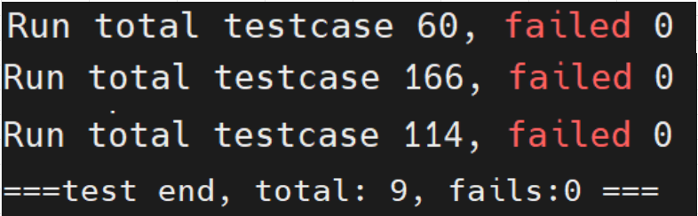
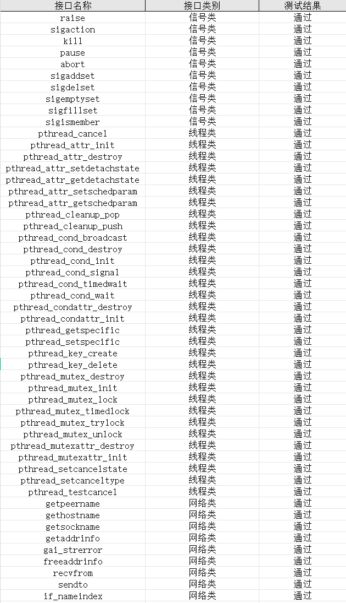

版权所有 © 2025  openEuler社区
 您对“本文档”的复制、使用、修改及分发受知识共享(Creative Commons)署名—相同方式共享4.0国际公共许可协议(以下简称“CC BY-SA 4.0”)的约束。为了方便用户理解，您可以通过访问https://creativecommons.org/licenses/by-sa/4.0/ 了解CC BY-SA 4.0的概要 (但不是替代)。CC BY-SA 4.0的完整协议内容您可以访问如下网址获取：https://creativecommons.org/licenses/by-sa/4.0/legalcode。

修订记录

| 日期      | 修订   版本 | 修改描述           | 作者        |
| --------- | ----------- | ------------------ | ----------- |
| 2025.5.21 | v1.0        | UniProton硬实时POSIX接口补齐55%测试报告 | 赵宏昊 |

关键词： POSIX

摘要：在UniProton上对比zephyr实时系统补齐55% POSIX接口，满足上层业务需求。

缩略语清单：

| 缩略语 | 英文全名 | 中文解释 |
| ------ | -------- | -------- |
|        |          |          |
|        |          |          |

# 1     特性概述

基于POSIX接口定义的功能，在当前UniProton提供的内核功能函数基础上，进行一定的封装、适配，实现POSIX API定义的功能。当前UniProton已支持部分POSIX接口，通过新增信号管理、线程管理、网络管理三类接口，满足接口实现对比zephyr系统补齐55%的要求。

# 2     特性测试信息

本节描述被测对象的版本信息和测试的时间及测试轮次，包括依赖的硬件。

| 版本名称 | 测试起始时间 | 测试结束时间 |
| -------- | ------------ | ------------ |
| UniProton(openEuler-24.03-LTS-SP2) | 2025-5-19 | 2025-5-21 |

描述特性测试的硬件环境信息

| 硬件型号 | 硬件配置信息 | 备注 |
| -------- | ------------ | ---- |
| 专用硬件 | ARMv8-a, CPU核数：4 |      |

# 3     测试结论概述

## 3.1   测试整体结论

POSIX接口补齐55%特性测试，共计执行349个接口测试用例，主要覆盖了原有的POSIX信号类接口、线程类接口以及网络类接口以及新增的51个接口的功能测试，未发现问题，整体质量良好。

| 测试活动 | 测试子项 | 活动评价 |
| ------- | -------- | ------- |
| 功能测试 | 继承特性测试 | 不涉及 |
| 功能测试 | 新增特性测试 | 通过 |
| 兼容性测试 |          | 不涉及 |
| DFX专项测试 | 性能测试 | 不涉及 |
| DFX专项测试 | 可靠性/韧性测试 | 不涉及 |
| DFX专项测试 | 安全测试 | 不涉及 |
| 资料测试 |         | 不涉及 |
| 其他测试 |         | 不涉及 |

## 3.2   约束说明

本特性当前只满足UniProton上，对比zephyr实时系统，POSIX接口实现率达55%，并未实现全部POSIX接口。

## 3.3   遗留问题分析

不涉及

# 4 详细测试结论

## 4.1 功能测试
*开源软件：主要关注开源软件升级后的变动点，继承特性由开源软件自带用例保证（需额外关注软件包提供可执行命令、库、服务功能）*
*社区孵化软件：主要参考以下列表*

### 4.1.1 继承特性测试结论

不涉及

### 4.1.2 新增特性测试结论

| 序号 | 组件/特性名称 | 特性质量评估 | 备注 |
| --- | ----------- | :--------: | --- |
| 1 | 新增POSIX信号类接口 | ■ | 接口功能用例测试通过 |
| 2 | 新增POSIX线程类接口 | ■ | 接口功能用例测试通过 |
| 3 | 新增POSIX网络类接口 | ■ | 接口功能用例测试通过 |

●： 表示特性不稳定，风险高
▲： 表示特性基本可用，遗留少量问题
■： 表示特性质量良好

## 4.2 兼容性测试结论

不涉及

## 4.3 DFX专项测试结论

### 4.3.1 性能测试结论

不涉及

### 4.3.2 可靠性/韧性测试结论

不涉及

### 4.3.3 安全测试结论

不涉及

## 4.4 资料测试结论

不涉及

## 4.5 其他测试结论

不涉及

# 5     测试执行

## 5.1   测试执行统计数据

*本节内容根据测试用例及实际执行情况进行特性整体测试的统计，可根据第二章的测试轮次分开进行统计说明。*

| 版本名称 | 测试用例数 | 用例执行结果 | 发现问题单数 |
| -------- | ---------- | ------------ | ------------ |
| openEuler-24.03-LTS-SP2 | 349 | 通过 | 0 |

*数据项说明：*

*测试用例数－－到本测试活动结束时，所有可用测试用例数；*

*发现问题单数－－本测试活动总共发现的问题单数。*

## 5.2   后续测试建议

不涉及

# 6     附件

posix信号类接口、线程类接口以及网络类接口整体测试结果：

posix新增接口测试情况：

