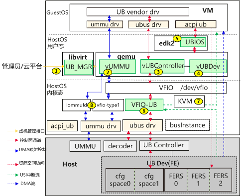

版权所有 © 2025  openEuler社区
 您对“本文档”的复制、使用、修改及分发受知识共享(Creative Commons)署名—相同方式共享4.0国际公共许可协议(以下简称“CC BY-SA 4.0”)的约束。为了方便用户理解，您可以通过访问<https://creativecommons.org/licenses/by-sa/4.0/>了解CC BY-SA 4.0的概要 (但不是替代)。CC BY-SA 4.0的完整协议内容您可以访问如下网址获取：<https://creativecommons.org/licenses/by-sa/4.0/legalcode>。

 修订记录

| 日期         | 修订版本  | 修改描述 | 作者  |
|------------|-------|----|-----|
| 2025-11-14 | 1.0.0 | 初稿 | 范丽蓉 |

关键词： UBNative、直通、虚拟化

摘要：本文从特性介绍、测试目标、测试内容、测试计划等说明UBNative直通虚拟化测试策略。

缩略语清单：

| 缩略语 | 英文全名 | 中文解释 |
| ------ | -------- | -------- |

# 特性描述
<!-- 主要介绍特性实现的背景、功能以及作用 -->
1. 虚拟机支持UB总线的模拟，支持GuestOS内的UB总线驱动发起UB设备枚举扫描； 
2. 虚拟机支持UB FE设备模型，并支持UB设备直通。

## 需求清单
|no|feature|status|sig|owner|发布方式|涉及软件包列表|
|:----|:---|:---|:--|:----|:----|:----|
|     | UBNative：灵衢虚拟化基础能力支持UBNative直通虚拟化 |    |   |     |     |     |

## 特性应用场景分析
<!-- 主要描述特性的应用场景分析，指导后面场景测试的测试策略制定 -->
1. 在灵衢硬件Matrix Server形态下，所有的设备资源通过UB总线进行池化共享，支持UB设备直通以提升设备资源的利用率和极限IO带宽。

## 特性实现流程描述
<!-- 主要描述特性实现的流程，可使用流程图等方式描述 -->

## 与其他特性交互描述
<!-- 主要描述特性与其他特性或功能的交互 -->
1. 交互生命周期
2. 交互qemu去root

## 风险项
<!-- 主要描述特性已知风险项 -->
NA

# 特性分层策略
## 总体测试策略
<!-- 主要描述特性的整体测试策略，主要开展哪些测试(接口/功能/场景/专项) -->
本次测试主要覆盖功能测试、可靠性测试，验证基于虚拟机ub设备直通功能正常。

## 接口/功能测试
<!-- 主要描述接口级测试策略及测试设计思路 -->
| 接口描述         | 设计思路                               | 测试重点                       | 备注 |
|--------------|------------------------------------|----------------------------| ---- |
| 虚机支持UB总线模拟   | ub控制器接口默认值、合法入参、非法入参、对应返回值以及配置交互验证 | 默认值符合预期，合法值虚拟机启动成功，非法值启动失败 |      |
| 虚机支持UB设备模拟   | ub设备接口默认值、合法入参、非法入参、对应返回值以及配置交互验证 | 默认值符合预期，合法值虚拟机启动成功，非法值启动失败 |      |
| 虚机支持UMMU设备模拟 | ummu接口默认值、合法入参、非法入参、对应返回值以及配置交互验证 | 默认值符合预期，合法值虚拟机启动成功，非法值启动失败 |      |

## 场景测试
<!-- 主要描述对特性使用的主要场景的测试策略及测试思路 -->
| 场景描述 | 设计思路                             | 测试重点             | 备注 |
| ------- |----------------------------------|------------------| ---- |
| 虚机支持UB设备直通 | 验证带直通设备虚机带外信息、内部设备查询信息准确以及功能交互正常 | 虚拟机正常，ub相关信息查询准确 |      |

## 专项测试
<!-- 主要描述其他专项测试,如安全测试 可靠性、韧性测试 性能测试 兼容性测试等 -->
| 专项测试类型 | 专项测试描述                      | 测试预期结果             | 备注 |
|------|-----------------------------|--------------------| ---- |
| 可靠性测试 | 验证关键服务、进程、驱动异常场景下ub虚拟机不core | 虚拟机不core |      |

# 特性测试执行策略

## 特性测试依赖描述
<!-- 主要描述特性测试所依赖的执行环境、软件包、环境变量等依赖 -->
1.ub软件包

## 特性测试约束
<!-- 主要描述特性测试的约束条件 -->
1. 单个VM目前最多支持1个UB控制器、16个UB直通设备；
2. 单个UB控制器最多支持256个port；
3. HostOS和GuestOS需要支持灵衢总线驱动；
4. Host已使能UMMU；
5. 当前libvirt暂时不支持hostdev.managed='yes'，需要手动管理vfio-ub用户态驱动的切换以及BusInstance的创建和绑定等； 
6. GuestOS内grub配置内核启动参数需要使能acpi=on；
7. 因为UMMU权限表的内存连续性要求，虚拟机必须使用大页；
8. 当前仅支持单机模式，确认Host已开启单机模式，可以在Host上执行如下命令确认回显为0即为单机模式。

## 特性测试环境描述
<!-- 主要描述执行测试的硬件信息 -->
| 硬件型号 | 硬件配置信息 | 备注 |
| -------- | ------------ | ---- |
|          |              |      |

## 测试计划
<!-- 测试执行策略主要描述该轮次执行的分层策略中的测试项 -->
| Stange name                 | Begin time | End time   | Days | 测试执行策略 | 备注   |
|:----------------------------|:-----------|:-----------|------|------| ------ |
| Test round 3 - Test round 7 | 2025/11/7  | 2025/12/11 | 35   | 全量测试 |        |
| Test round 8 - Test round 9 | 2025/12/12 | 2025/12/25 | 14   | 回归测试 |        |

## 入口标准
<!-- 描述整个测试执行阶段的入口条件，包括前个阶段的检查、用例执行、问题修复等情况
例如: -->
1. 功能开发已完成
2. 上阶段无block问题遗留
3. 基础功能验证正常

## 出口标准
<!-- 本节描述整个测试执行阶段的出口 -->
1. 策略规划的测试活动涉及测试用例100%执行完毕
2. 性能基线、功能基线等满足特性规划目标
3. 无block问题遗留，其它严重问题要有相应规避措施或说明

# 附件