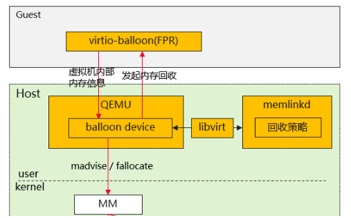

版权所有 © 2025  openEuler社区
 您对“本文档”的复制、使用、修改及分发受知识共享(Creative Commons)署名—相同方式共享4.0国际公共许可协议(以下简称“CC BY-SA 4.0”)的约束。为了方便用户理解，您可以通过访问<https://creativecommons.org/licenses/by-sa/4.0/>了解CC BY-SA 4.0的概要 (但不是替代)。CC BY-SA 4.0的完整协议内容您可以访问如下网址获取：<https://creativecommons.org/licenses/by-sa/4.0/legalcode>。

 修订记录

| 日期         | 修订版本  | 修改描述 | 作者  |
|------------|-------|----|-----|
| 2025-11-14 | 1.0.0 | 初稿 | 范丽蓉 |

关键词： memlink、内存回收、FPR、balloon、弹性内存

摘要：本文从特性介绍、测试目标、测试内容、测试计划等说明memlink大规格虚拟机、内存回收测试策略。

缩略语清单：

| 缩略语 | 英文全名 | 中文解释 |
| ------ | -------- | -------- |

# 特性描述
<!-- 主要介绍特性实现的背景、功能以及作用 -->
1. 支持虚拟机大页按需分配、大页空闲内存回收、大页OOM上报、虚拟机内存按策略分配（大规格虚拟机）等功能；
2. 支持在MatrixServer场景下的大规格虚拟机、内存超分功能，支撑客户侧相关诉求。

## 需求清单
|no| feature                               |status|sig|owner|发布方式|涉及软件包列表|
|:----|:--------------------------------------|:---|:--|:----|:----|:----|
|     | memlink：灵衢虚拟化基础能力支持memlink大规格虚拟机、内存回收 |    |   |     |     |     |

## 特性应用场景分析
<!-- 主要描述特性的应用场景分析，指导后面场景测试的测试策略制定 -->
1. 使用memlinkd进程对Guest内存进行释放，使qemu进程使用内存数量减少；
2. numa内存支持按策略绑定，一定程度降低远端内存对业务性能的影响；
3. 虚拟机大页紧急事件，单台主机内存不足时可以利用别的内存压力相对较小主机的闲置内存资源，从而可以进一步提升内存资源的整体利用率。

## 特性实现流程描述
<!-- 主要描述特性实现的流程，可使用流程图等方式描述 -->

## 与其他特性交互描述
<!-- 主要描述特性与其他特性或功能的交互 -->
1. 交互生命周期
2. 交互内存借用
2. 交互ub直通设备
3. 交互qemu去root
4. 交互urma、tcp热迁移

## 风险项
<!-- 主要描述特性已知风险项 -->
NA

# 特性分层策略
## 总体测试策略
<!-- 主要描述特性的整体测试策略，主要开展哪些测试(接口/功能/场景/专项) -->
本次测试主要覆盖功能测试、可靠性、性能测试，验证memlink内存回收功能正常。

## 接口/功能测试
<!-- 主要描述接口级测试策略及测试设计思路 -->
| 接口描述                    | 设计思路                       | 测试重点                     | 备注 |
|-------------------------|----------------------------|--------------------------| ---- |
| memlinkd配置(配置balloon策略) | memlink配置默认值、正常值、异常值、边界值测试 | 默认值符合预期，虚拟机内存与配置的值一致     |      |
| 配置numa内存绑定策略 | proportion配置正常值、异常值、最大段数测试 | 虚拟机启动正常，proportion查询信息准确 |      |

## 场景测试
<!-- 主要描述对特性使用的主要场景的测试策略及测试思路 -->
| 场景描述 | 设计思路                           | 测试重点               | 备注 |
| ------- |--------------------------------|--------------------| ---- |
| 虚拟机弹性内存 | 验证FPR、balloon内存回收基本功能测试以及功能交互正常 | 虚拟机内存回收正常          |      |
| 虚拟机大页紧急借用 | 验证虚拟机不同阶段触发内存借用以及内存借用交互热迁移     | 内存借用成功，热迁移成功，虚拟机正常 |      |
| 虚拟机内存按策略分配 | 验证配置proportion后的功能交互正常 | 配置正确，交互功能正常 |      |

## 专项测试
<!-- 主要描述其他专项测试,如安全测试 可靠性、韧性测试 性能测试 兼容性测试等 -->
| 专项测试类型 | 专项测试描述                    | 测试预期结果              | 备注 |
|------|---------------------------|---------------------| ---- |
| 可靠性测试 | 验证关键服务、进程异常场景下弹性内存、大页紧急借用正常 | 故障时虚拟机不core，故障后功能恢复 |      |
| 性能测试 | 验证memlink大规格虚拟机启动时延符合性能指标 | 3TB<3min |      |

# 特性测试执行策略

## 特性测试依赖描述
<!-- 主要描述特性测试所依赖的执行环境、软件包、环境变量等依赖 -->
NA

## 特性测试约束
<!-- 主要描述特性测试的约束条件 -->
1. 只支持2M大页虚拟机，不支持4K和1G大页虚拟机内存弹性； 
2. balloon和FPR需要Guest内部支持（balloon需要内核3.1版本以上，FPR需要内核5.7以上），需要发行版同样支持，否则本特性不生效；
3. 由于虚拟机在主机侧使用的是2M大页，所以无法回收虚拟机内部的空闲内存的碎片部分（碎片是指虚拟机内部2M以下粒度的空闲页）；
4. 由于回收了虚拟机空闲内存，当虚拟机再次访问时会走缺页流程，因此对虚拟机内部业务性能有一定的影响；
5. 由于虚拟机生命周期、热迁移等操作会操作虚拟机，此时会导致虚拟机空闲内存回收的效果、时长受影响；
6. 除DMMU直通外，不支持其他直通设备虚拟机释放内存，因为内存会被pin住从而无法回收； 
7. 虚拟机大页紧急事件依赖Sysentry组件上报到上层（RackManager），由上层组件发起热迁移和内存借用等； 
8. proportion最多支持10段，各段内存加一起与总内存规格需要相等； 
9. proportion配置项单位为MB，如果不按照规定单位配置，大页数量将与预期不符；
10. proportion配置会导致/proc/虚拟机pid/numa_maps这个文件内容对应的虚拟机内存的描述产生多段，如果涉及解析该文件的上层业务，需要做相应适配； 
11. 虚拟化层只提供基础绑定功能，绑定策略由上层指定，虚拟层不保证虚拟机业务性能； 
12. 由于计算产品的SMAPS会在numa node之间搬迁内存，可能会导致绑定策略失效。

## 特性测试环境描述
<!-- 主要描述执行测试的硬件信息 -->
| 硬件型号 | 硬件配置信息 | 备注 |
| -------- | ------------ | ---- |
|          |              |      |

## 测试计划
<!-- 测试执行策略主要描述该轮次执行的分层策略中的测试项 -->
| Stange name   | Begin time | End time   | Days | 测试执行策略                   | 备注   |
| :------------ | :--------- | :--------- | ---- | ----------------------------- | ------ |
| Test round 3 - Test round 7 | 2025/11/7  | 2025/12/11 | 35   | 全量测试 |        |
| Test round 8 - Test round 9 | 2025/12/12 | 2025/12/25 | 14   | 回归测试 |        |

## 入口标准
<!-- 描述整个测试执行阶段的入口条件，包括前个阶段的检查、用例执行、问题修复等情况
例如: -->
1. 功能开发已完成
2. 上阶段无block问题遗留
3. 基础功能验证正常

## 出口标准
<!-- 本节描述整个测试执行阶段的出口 -->
1. 策略规划的测试活动涉及测试用例100%执行完毕
2. 性能基线、功能基线等满足特性规划目标
3. 无block问题遗留，其它严重问题要有相应规避措施或说明

# 附件