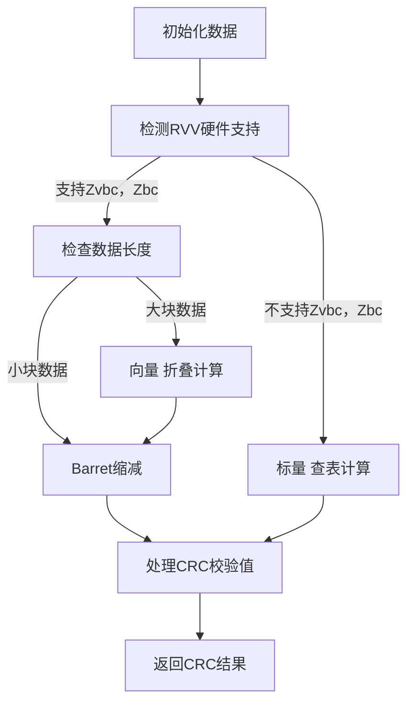

版权所有 © 2022  openEuler社区
 您对“本文档”的复制、使用、修改及分发受知识共享(Creative Commons)署名—相同方式共享4.0国际公共许可协议(以下简称“CC BY-SA 4.0”)的约束。为了方便用户理解，您可以通过访问https://creativecommons.org/licenses/by-sa/4.0/ 了解CC BY-SA 4.0的概要 (但不是替代)。CC BY-SA 4.0的完整协议内容您可以访问如下网址获取：https://creativecommons.org/licenses/by-sa/4.0/legalcode。

 修订记录

| 日期 | 修订版本     | 修改描述  | 作者 |
| ---- | ----------- | -------- | ---- |
|   2025-11-05   |      1.0.0       |     初稿     |   董骥、刘庆涛   |
|      |             |          |      |
|      |             |          |      |

关键词： 
ISA-L CRC 

摘要：
本文是openEuler 24.03 LTS SP3版本的ISA-L CRC测试策略，用于指导该版本后续测试活动的开展。

缩略语清单：

| 缩略语 | 英文全名 | 中文解释 |
| ------ | -------- | -------- |
|    CRC    |     Cyclic redundancy check     |    循环冗余校验      |
|    EC    |     Erasure Code     |     纠删码     |

# 特性描述
<!-- 主要介绍特性实现的背景、功能以及作用 -->
该ISA-L版本基于开源库版本扩展了CRC计算中RISC-V平台的向量汇编支持，为RISC-V平台上的CRC校验计算提供了较大的性能提升。

## 需求清单
|no|feature|status|sig|owner|发布方式|涉及软件包列表|
|:----|:---|:---|:--|:----|:----|:----|
|   [ICW20J](https://gitee.com/openeuler/release-management/issues/ICW20J?from=project-issue)  |  isa-l库：CRC算法在RISC-V架构的优化  |Accepted|dev-utils|@qtliu666|EPOL|isa-l|

## 特性应用场景分析
<!-- 主要描述特性的应用场景分析，指导后面场景测试的测试策略制定 -->
1. 验证数据块在EC计算过程中的完整性
2. 对象存储的数据完整性检查

## 特性实现流程描述
<!-- 主要描述特性实现的流程，可使用流程图等方式描述 -->

## 与其他特性交互描述
<!-- 主要描述特性与其他特性或功能的交互 -->
1. 与EC纠删码集成，保证数据的完整性
2. 与igzip压缩算法写作，保护压缩数据的完整性

## 风险项
<!-- 主要描述特性已知风险项 -->

# 特性分层策略
## 总体测试策略
<!-- 主要描述特性的整体测试策略，主要开展哪些测试(接口/功能/场景/专项) -->
需要验证该CRC向量汇编实现的特性在功能上是否与C语言标准实现一致，验证新的CRC特性与EC，IGZIP等功能一起工作是否可靠，最后验证新CRC特性的性能数据是否满足需求。主要开展功能，场景以及性能测试。
## 接口/功能测试
<!-- 主要描述接口级测试策略及测试设计思路 -->
| 功能描述 | 设计思路 | 测试重点 | 备注 |
| ------- | ------- | ------- | ---- |
|    CRC校验测试     |    使用ISA-L自带的test测试CRC校验输出结果是否正确     |     在多种校验值、待校验数据的输入测试中验证CRC16,CRC32,CRC64各算法功能实现的覆盖率    |      |

## 场景测试
<!-- 主要描述对特性使用的主要场景的测试策略及测试思路 -->
| 场景描述 | 设计思路 | 测试重点 | 备注 |
| ------- | ------- | ------- | ---- |
|    IGZIP压缩解压缩测试     |    使用IGZIP的test测试验证其调用的CRC校验功能运行情况     |    检验证IGZIP工作期间CRC新特性的正确性，是否会影响IGZIP的功能     |      |
|         |         |         |      |

## 专项测试
<!-- 主要描述其他专项测试,如安全测试 可靠性、韧性测试 性能测试 兼容性测试等 -->
| 专项测试类型 | 专项测试描述 | 测试预期结果 | 备注 |
| ----------- | ----------- | ----------- | ---- |
|      CRC校验性能测试       |       使用ISA-L库自带的perf性能测试代码测试      |      -       |   仅测试摸底   |
|      CRC校验可靠性测试       |      自带的test测试已经验证了全零，全一，随机数据以及不同数据长度的情况，我还需要额外测试一些极限情况，比如单比特，超大数据等测试。       |       -      |      |
|CRC校验兼容性测试|需要使用多个支持不同RISC-V扩展（主要差别为Zvbc，Zbc扩展）的机器进行测试|-||
|CRC校验资料测试|从总体介绍和特性介绍，保证描述准确。上手和指南需要描述详细，正确，包含从构建到使用整条流程|-||

# 特性测试执行策略

## 特性测试依赖描述
<!-- 主要描述特性测试所依赖的执行环境、软件包、环境变量等依赖 -->
1. GCC版本至少为12.1版本及以上，或保证其支持RISC-V的Zbc，Zvbc扩展
2. 内核版本至少为6.8版本及以上，或保证其hwprobe.h头文件中有Zvbc，Zbc的检测宏

## 特性测试约束
<!-- 主要描述特性测试的约束条件 -->
1. 需要目标平台支持RISC-V的Zvbc，Zbc扩展
2. 使用内存对齐的数据指针进行测试

## 特性测试环境描述
<!-- 主要描述执行测试的硬件信息 -->
| 硬件型号 | 硬件配置信息 | 备注 |
| -------- | ------------ | ---- |
|     -     |      -        |      |

## 测试计划
<!-- 测试执行策略主要描述该轮次执行的分层策略中的测试项 -->
| Stange name   | Begin time | End time   | Days | 测试执行策略                   | 备注   |
| :------------ | :--------- | :--------- | ---- | ----------------------------- | ------ |
|Alpha|            |            |      |验证特性基本功能。测试功能，场景；专项测试兼容性|        |
|Test round 1|            |            |      |全量验证，测试覆盖所有组件，特性的功能。专项测试性能，可靠性|        |
|Test round 2|            |            |      |全量自动化验证，问题单回归。测试特性功能场景，专项测试性能，资料|        |
|Test round 3||||自动化验证，问题单全量回归。交付件病毒扫描，资料测试||

## 入口标准
1. 功能开发已完成
2. 上阶段无block问题遗留
3. 基础功能验证正常

## 出口标准 
1. 策略规划的测试活动涉及测试用例100%执行完毕
2. 性能基线、功能基线等满足特性规划目标
3. 无block问题遗留，其它严重问题要有相应规避措施或说明

# 附件