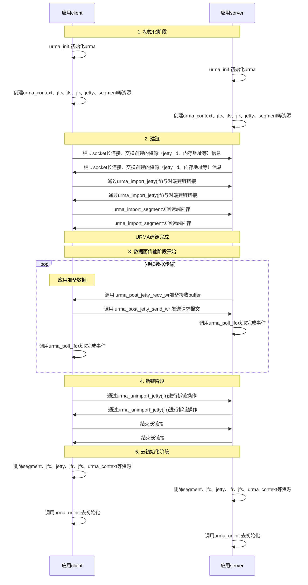

版权所有 © 2022  openEuler社区
 您对“本文档”的复制、使用、修改及分发受知识共享(Creative Commons)署名—相同方式共享4.0国际公共许可协议(以下简称“CC BY-SA 4.0”)的约束。为了方便用户理解，您可以通过访问https://creativecommons.org/licenses/by-sa/4.0/ 了解CC BY-SA 4.0的概要 (但不是替代)。CC BY-SA 4.0的完整协议内容您可以访问如下网址获取：https://creativecommons.org/licenses/by-sa/4.0/legalcode。

 修订记录

| 日期 | 修订版本     | 修改描述  | 作者 |
| ---- | ----------- | -------- | ---- |
|2025-11-14|1.0.0|初稿|李树琛|

关键词： URMA

 
摘要：本文从特性介绍、测试目标、测试内容、测试计划等说明URMA特性测试策略。

缩略语清单：

| 缩略语 | 英文全名 | 中文解释 |
| ------ | -------- | -------- |
|UBUS|Unified Bus|统一总线|
|URMA|Unified Remote Memory Access|统一远端内存访问，UB协议原生的内存语义和消息语义接口，支持高带宽、低时延，具有良好的可扩展性|

# 特性描述
<!-- 主要介绍特性实现的背景、功能以及作用 -->
URMA子系统在UBUS系统中提供高带宽低时延的数据服务。主要用于对数据中心的各种业务提供消息通信，数据转发的基础功能。对于大数据业务，减少端到端的通信时延。对于HPC和AI业务，提供高带宽、低时延的服务。

## 需求清单
|no|feature|status|sig|owner|发布方式|涉及软件包列表|
|:----|:---|:---|:--|:----|:----|:----|
|[ID3WJX](https://gitee.com/openeuler/release-management/issues/ID3WJX?from=project-issue)|URMA：URMA支持UB基础通信能力|Developing|sig-UnifiedBus|@qianguoxin|ISO|liburma,libubagg,urma-tools,uvs|

## 特性应用场景分析
<!-- 主要描述特性的应用场景分析，指导后面场景测试的测试策略制定 -->
1. URMA资源初始化
2. URMA基础建链
3. URMA数据面不同模式打流

## 特性实现流程描述
<!-- 主要描述特性实现的流程，可使用流程图等方式描述 -->
1、URMA功能实现流程

## 与其他特性交互描述
<!-- 主要描述特性与其他特性或功能的交互 -->
无

## 风险项
<!-- 主要描述特性已知风险项 -->
无

# 特性分层策略
## 总体测试策略
<!-- 主要描述特性的整体测试策略，主要开展哪些测试(接口/功能/场景/专项) -->
覆盖对用户呈现的接口测试，功能方面覆盖URMA初始化、管理面建链、数据面收发等测试，对资源不足、对端进程异常退出等可靠性场景开展测试。

## 接口/功能测试
<!-- 主要描述接口级测试策略及测试设计思路 -->
| 接口描述 | 设计思路 | 测试重点 | 备注 |
| ------- | ------- | ------- | ---- |
|URMA初始化|考虑遍历不同参数组合配置|针对不同参数组合遍历测试|无|
|URMA管理面建链|单链接、多链接|client端、server端多连接测试|无|
|URMA数据面收发|围绕数据面资源、链接数量测试|多链接收发测试|无|
|URMA基础语义测试|围绕单边/双边不同收发语义测试|单边Read/Write、双边Send/Receive测试|无|

## 场景测试
<!-- 主要描述对特性使用的主要场景的测试策略及测试思路 -->
| 场景描述 | 设计思路 | 测试重点 | 备注 |
| ------- | ------- | ------- | ---- |
|URMA单边read语义功能场景|覆盖资源创建、建链和read语义数据面操作|单边read语义|无|
|URMA单边write语义功能场景|覆盖资源创建、建链和write语义数据面操作|单边write语义|无|
|URMA单边write_imm语义功能场景|覆盖资源创建、建链和write_imm语义数据面操作|write_imm语义|无|
|URMA双边send语义功能场景|覆盖资源创建、建链和send/recv语义数据面操作|双边send/recv语义|无|
|URMA双边send_imm语义功能场景|覆盖资源创建、建链和send_imm语义数据面操作|send_imm语义|无|

## 专项测试
<!-- 主要描述其他专项测试,如安全测试 可靠性、韧性测试 性能测试 兼容性测试等 -->
| 专项测试类型 | 专项测试描述 | 测试预期结果 | 备注 |
| ----------- | ----------- | ----------- | ---- |
|可靠性测试|构造数据面资源不足，对端进程异常退出测试|不会出现崩溃、资源无法释放等问题，故障恢复后使用正常|无|
|安全测试|病毒/安全编译选项/敏感信息/代码片段引用扫描，开源合规license检查|无安全问题|无|

# 特性测试执行策略

## 特性测试依赖描述
<!-- 主要描述特性测试所依赖的执行环境、软件包、环境变量等依赖 -->
1. 目前只支持UB硬件使用，依赖UB连接正常通信

## 特性测试约束
<!-- 主要描述特性测试的约束条件 -->
1. 现阶段不支持TP异常处理，如果出现TP异常，需要重新import_jetty建链

## 特性测试环境描述
<!-- 主要描述执行测试的硬件信息 -->
| 硬件型号 | 硬件配置信息 | 备注 |
| -------- | ------------ | ---- |
|MatrixServer服务器|典型配置|NA|

## 测试计划
<!-- 测试执行策略主要描述该轮次执行的分层策略中的测试项 -->
| Stange name   | Begin time | End time   | Days | 测试执行策略                   | 备注   |
| :------------ | :--------- | :--------- | ---- | ----------------------------- | ------ |
|Test round 4/5/6/7|2025/11/14|2025/12/11|28|全量测试|NA|
|Test round 8/9|2025/12/12|2025/12/25|14|回归测试|NA|

## 入口标准
<!-- 描述整个测试执行阶段的入口条件，包括前个阶段的检查、用例执行、问题修复等情况-->
1. 功能开发已完成
2. 上阶段无block问题遗留
3. 基础功能验证正常

## 出口标准
<!-- 本节描述整个测试执行阶段的出口 -->
1. 策略规划的测试活动涉及测试用例100%执行完毕
2. 性能基线、功能基线等满足特性规划目标
3. 无block问题遗留，其它严重问题要有相应规避措施或说明

# 附件