# Ci集成环境简介<br />
ci集成 由一系列jenkins工程 ，1个openqa server ，1个arm worker，1一个x86  woker，一台pxe 组成。<br />
* 大致流程： 
Jenkin 上Iso构建-> new_repo工程远程让pxe机器执行脚本->pxe机器判断对应版本的iso是否同步成功->部署pxe安装需要的文件>向server端发送start消息->server根据消息中版本信息，来拉起不同版本的任务->install_testcase任务成功后将生成的qcow传到pxe机器<br />
##	1. server  <br />
提供openqa web页面， 作为openqa server<br />
ip： 172.168.131.95<br />
Web网站：http://172.168.131.95/<br />
## 2. openqa-arm-x86<br />
作为 arm worker<br />
ip：172.168.131.74<br />
## 3. openqa-work-x86<br />
作为 x86 worker <br />
ip：172.168.131.73<br />
## 4. pxe<br />
作为dhcp服务器
作为repo源
ip： 172.168.131.94<br />
## 5. jekins 网站 <br />
旧jenkins链接：https://openeulerci.osinfra.cn/　<br />
新jenkins链接：https://jenkins.openeuler.org/ <br />
# openqa 环境搭建 <br />
## 1. openqa服务端搭建 <br />
### 1.1 yum 源配置 <br />
```
cat /etc/yum.repos.d/fedora.repo
[fedora]
name=fedora
baseurl=https://archives.fedoraproject.org/pub/archive/fedora/linux/releases/29/Everything/aarch64/os/
enabled=1
gpgcheck=0
sslverify=0
gpgkey=https://archives.fedoraproject.org/pub/archive/fedora/linux/releases/29/Everything/aarch64/os/
```
### 1.2 postgresql安装启动 <br />
安装软件包： <br />
```
yum  -y install postgresql -y
yum  -y install postgresql-libs
yum  -y install postgresql-server
```
初始化库： <br />
```
postgresql-setup  initdb 
systemctl enable postgresql
systemctl start postgresql
```
### 1.4 修改hosts,，配置域名解析 <br /> 
```
echo "172.168.131.95 server" >> /etc/hosts
hostnamectl set-hostname server
```
### 1.5 openqa server安装启动 <br />
* 安装软件包：<br />  
```
yum install openqa openqa-local-db openqa-httpd openqa-worker 
```
* 修改openqa.ini文件  <br />  
```
[auth]   
 method = Fake  
[logging]   
file = /var/log/openqa  
```
* 修改workers.ini  <br />
```
[global]
HOST = http://server
[server]
SHARE_DIRECTORY = /var/lib/openqa/share 
```
* 修改 openqa.conf  <br /> 
```
cp /etc/httpd/conf.d/openqa.conf.template  /etc/httpd/conf.d/openqa.conf  
```
* ssl配置  <br /> 
```
cp /etc/httpd/conf.d/openqa-ssl.conf.template  /etc/httpd/conf.d/openqa-ssl.conf
```
安装包 :
```
yum install mod_ssl -y
```
密钥设置:<br />
```
openssl  genrsa -des3 -out server.key 2048
openssl  rsa -in server.key -out server.key 
openssl req -new -key server.key -out server.csr 
openssl  req -new -x509 -key server.key -out ca.crt -days 3650  
openssl x509 -req -days 3650 -in server.csr -CA ca.crt -CAkey server.key -CAcreateserial -out server.crt  
cp server.crt  /etc/pki/tls/certs/
cp server.key /etc/pki/tls/certs/
chmod 644 /etc/pki/tls/certs/server.crt
chmod 644 /etc/pki/tls/certs/server.key
cp server.key  /etc/pki/tls/private/
```
修改/etc/httpd/conf.d/openqa-ssl.conf<br />
```
cat /etc/httpd/conf.d/openqa-ssl.conf
<VirtualHost *:443>
    SSLEngine on
    SSLProtocol all -SSLv2 -SSLv3
    SSLCipherSuite HIGH:MEDIUM:!aNULL:!MD5
    SSLCertificateFile /etc/pki/tls/certs/server.crt
    SSLCertificateKeyFile /etc/pki/tls/private/server.key
    Include /etc/httpd/conf.d/openqa-common.inc
</VirtualHost>
```
修改/etc/httpd/conf.d/ssl.conf 中如下参数<br />
```
SSLCipherSuite HIGH:MEDIUM:!aNULL:!MD5
SSLProxyCipherSuite PROFILE=SYSTEM
SSLCertificateFile /etc/pki/tls/certs/server.crt
SSLCertificateKeyFile /etc/pki/tls/private/server.key
```
* 关闭selinux<br />
```
getenforce
setenforce 0
```
* 启动httpd<br />
* openqa 服务启动，文件权限修改<br />
```
touch /var/log/openqa
chmod 777 /var/log/openqa
systemctl  start  openqa-scheduler.service
systemctl  start  openqa-websockets.service
chown geekotest:geekotest /var/lib/openqa/db -R
chown geekotest:geekotest /var/lib/openqa/images/ -R
chown geekotest:geekotest /var/lib/openqa/share/ -R
chown geekotest:geekotest /var/lib/openqa/tests -R
chown geekotest:geekotest /var/lib/openqa/testresults/ -R
chown geekotest:geekotest /var/lib/openqa/factory -R
chown _openqa-worker:_openqa-worker   /var/lib/openqa/pool/ -R
systemctl  start  openqa-webui
```
### 1.6 设置key<br />
打开web页面 使用https打开（login默认账户只有在https登录时才生效）  
点击登录->点击Manage Api keys<br />
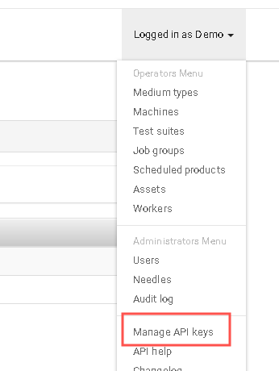<br />
点击创建<br />
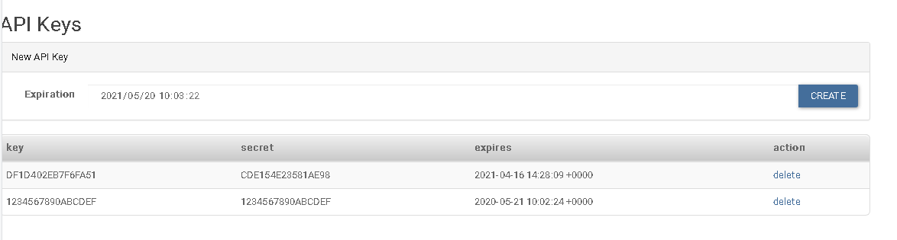<br />
根据新增key修改/etc/openqa/client.conf<br />
```
[server]
key = xxx
secret = xxxx
```
### 1.8 openqa worker启动<br />
```
systemtcl start openqa-worker@1 openqa-worker@2
```
### 1.9 放入openeuler用例到  /var/lib/openqa/share/tests，修改所属组和权限<br />
```
chown geekotest:geekotest /var/lib/openqa/share/tests -R
chmod 777  /var/lib/openqa/share/tests -R
```
### 1.10 搭建nfs服务器<br />
```
systemctl start nfs-server rpcbind
echo "/var/lib/openqa/share *(fsid=0,rw,no_root_squash,sync,no_subtree_check)">/etc/exports
chmod 777 /var/lib/openqa/share -R
exportfs -avr
```
### 1.10 给_openqa-worker用户添加sudo权限<br />
在/etc/sudoers 文件中添加以下内容：<br />
```
_openqa-worker  ALL=(ALL)   NOPASSWD: ALL
```
## 2. worker 节点搭建 ，以ci-server-0002  为例<br />
### 2.1 网络配置 <br />
搭建br0
```
cat /etc/sysconfig/network-scripts/ifcfg-br0
TYPE=Bridge
BOOTPROTO=static
DEFROUTE=yes
PEERDNS=yes
PEERROUTES=yes
IPV4_FAILURE_FATAL=no
DEVICE=br0
ONBOOT=yes
IPADDR=172.168.131.74
PREFIX=22
GATEWAY=172.168.131.111
DNS1=114.114.114.114
```
将网卡绑定到br0
echo "BRIDGE=br0" >> /etc/sysconfig/network-scripts/ifcfg-enp125s0f0
### 2.2 yum 源配置<br />
配置ferdora29 源<br />
### 2.3 修改host ，配置域名解析<br />
```
echo "172.168.131.95 server" >> /etc/hosts
hostnamectl set-hostname openqa-work-arm
```
### 2.4  安装包<br />
```
yum install -y openqa-worker
```
### 2.5 设置qemu-system-aarch64命令权限<br />
```
setcap cap_net_admin+ep  /usr/bin/qemu-system-aarch64
```
### 2.6 给_openqa-worker用户添加sudo权限<br />
```
_openqa-worker  ALL=(ALL)   NOPASSWD: ALL
```
### 2.7 nfs挂载<br />
```
systemctl start nfs-server rpcbind
mount -t nfs  172.16.1.224:/var/lib/openqa/ share /var/lib/openqa/share
chown _openqa-worker:_openqa-worker  /var/lib/openqa/ -R
```
### 2.8 修改 /etc/openqa/worker.ini 和/etc/openqa/client.conf
跟 server 配置成一样的<br />
### 2.9 openqa worker启动<br />
```
systemtcl start openqa-worker@1 openqa-worker@2  openqa-worker@3
```
### 2.10 修改/etc/qemu-ifup <br />
```
#!/bin/bash

switch=br0

if [ -n "$1" ]; then
	sudo ip link set $1 up
	sleep 1

	sudo brctl addif ${switch} $1
	sudo brctl show >> /tmp/log
	exit 0
else
	exit 1
fi
```
#  pxe 搭建   以SP1版本为例<br />
## 1. pxe 原理<br />
* 客户机从pxe网卡启动后，向本网络中的DHCP服务器索取IP，并搜寻引导文件的位置<br />
* DHCP服务器返回分给客户机IP以及引导文件的放置位置(该文件一般是放在一台TFTP服务器上)<br />
* 客户机向本网络中的TFTP服务器索取引导文件<br />
* 客户机取得引导文件后之执行该文件，加载内核和文件系统<br />
* 在引导文件里，设置vmlinux 和 initrd.img 以及ks文件路径<br />
## 2. 设置tftp 工作目录<br />
### 2.1 安装tftp<br />
```
yum install tftp-server -y 
systemctl start tftp-server 
```
### 2.2 存放引导文件 grub<br />
arm 在/var/lib/tftpboot/openEuler/GUI_20.03_LTS_SP2/<br />
x86 在/var/lib/tftpboot/openEuler/GUI_20.03_LTS_SP1_x86/<br />
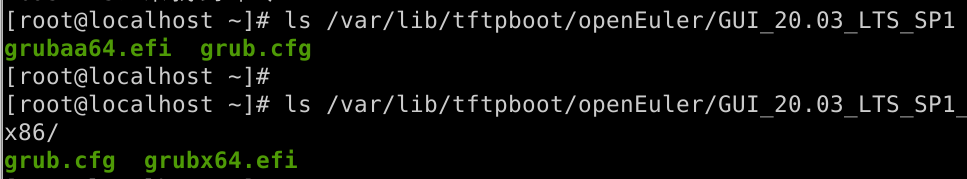<br />
grubaa64.efi 和 grubx64.efi   是从镜像里拷过来的<br />
#### 2.2.1 arm版本 GUI/grub.cfg 文件<br />
指定tftp服务器，指定vmlinuz，ks文件 initrd.img 所在位置<br />
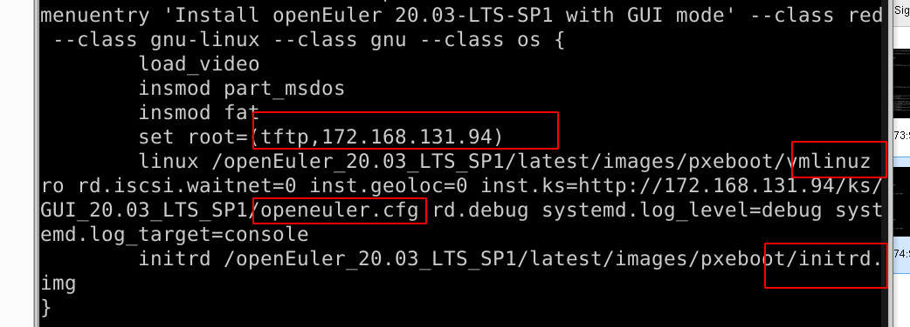<br />
#### 2.2.2 x86版本 GUI_x86/grub.cfg 文件<br />
指定tftp服务器，指定vmlinuz，ks文件 initrd.img 所在位置<br />
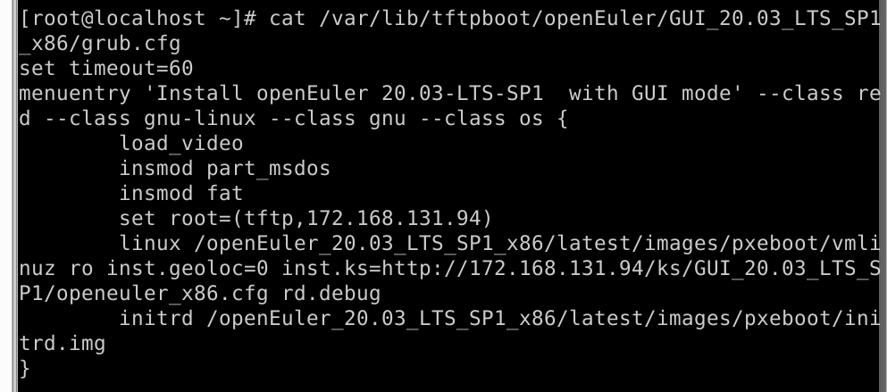<br />
### 2.3 存放image<br />
arm版本  /var/lib/tftpboot/openEuler_20.03_LTS_SP1/latest/<br />
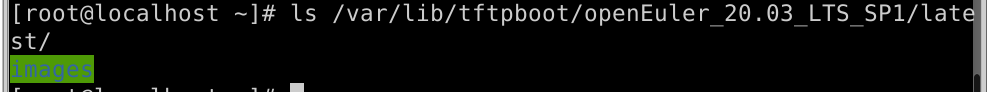<br />
x86版本  /var/lib/tftpboot/openEuler_20.03_LTS_SP1_x86/latest/ <br />
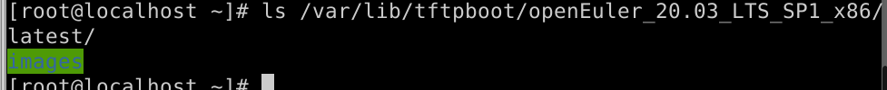<br />
* image ，是从iso镜像里复制的<br />
## 3 设置httpd工作目录<br />
### 3.1 安装<br />
```
yum install httpd
systemcl start httpd
```
### 3.2 存放ks文件<br />
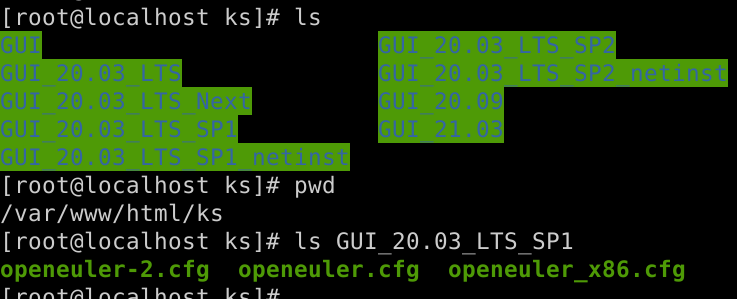<br />
* 在ks文件中指定安装源，arm版本<br />
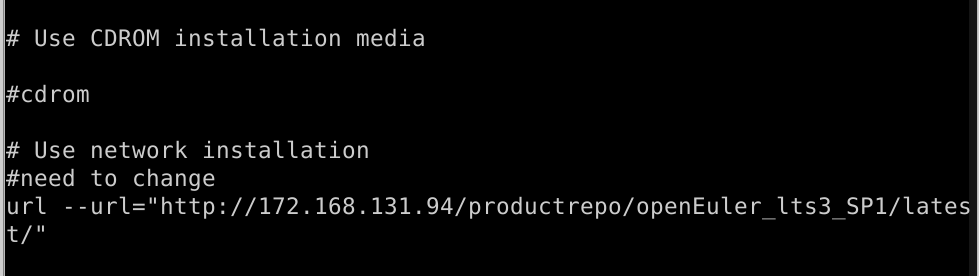<br />
* 在ks文件中指定安装源，x86版本<br />
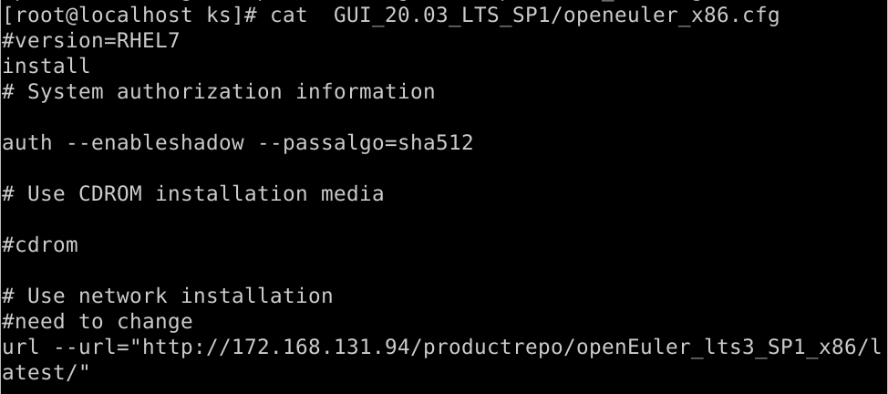<br />
### 3.3 存放repo 源<br />
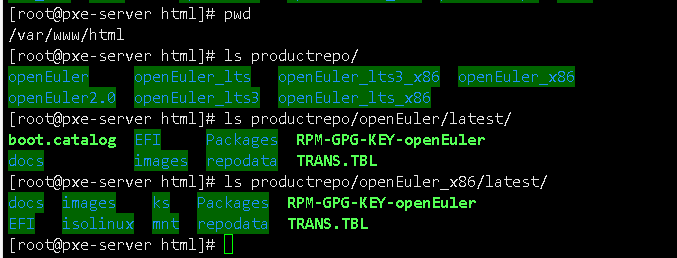<br />
* repo 源，是iso镜像挂载出来，复制进去的<br />
### 3.4 存放repo 文件<br />
```
/var/www/html/openEuler  
```
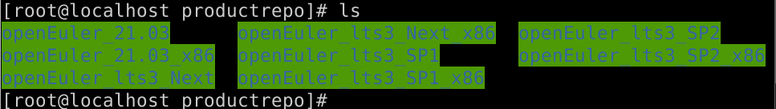<br />
arm 
<br />
x86 
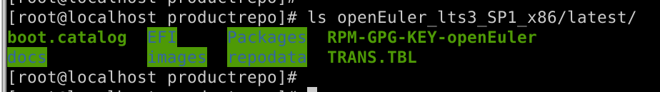<br />
## 4 pxe 作dhcp 服务器搭建<br />
修改dhcp配置文件<br />
* 设置分配的ip地址范围，网关<br />
* 指定grub引导文件所在位置：<br />
* 客户机在找grub文件时会默认从dhcp所在服务器找tftp服务器，找不到去 next-server 找tftp服务器 <br />
    此配置文件配置了next-server，指定pxe服务器为tftp服务器<br />
* 设置一个group，指定filename 为 openEuler/GUI_20.03_LTS_SP1_x86/grubx64.efi，pxe网卡绑定 <br />
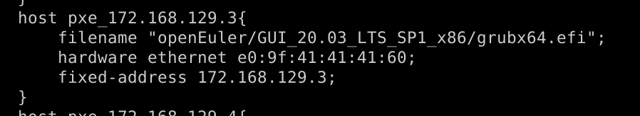<br />
## 5. 模板添加pxe用例，pxe网卡绑定<br />
模板文件 /var/lib/openqa/tests/openeuler/templates-openeuler<br />
关于模板组成，参考《openQA用例开发》文档<br />
### 5.1 模板JobTemplates 里面加上任务<br />
arm版本job:<br />
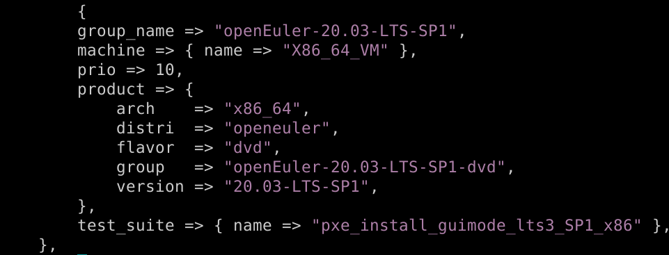<br />
### 5.2 模板test_suite 里面加上 pxe用例<br />
arm版本 pxe用例pxe_install_guimode：<br />
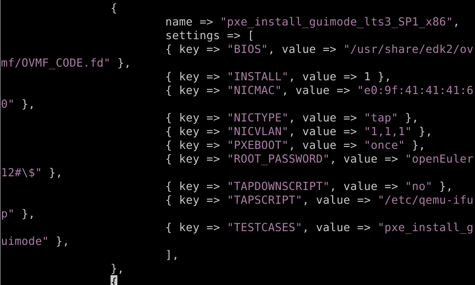<br />
* 绑定网卡e0:9f:41:41:41:60 ， 与dhcp.conf 配置文件相对应<br />
## 6 pxe 作dailybuild_repo源<br />
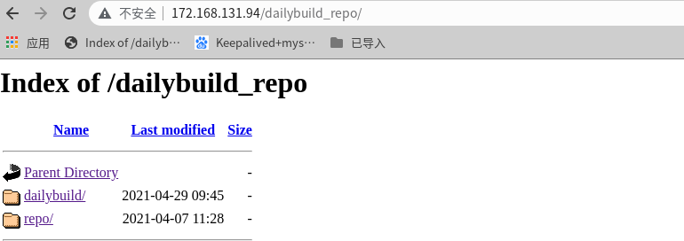<br />
* 每隔十分钟从121.36.84.172同步<br />
```
rsync -avzrtopg --progress root@121.36.84.172::openeuler/dailybuild /var/www/html/dailybuild_repo/
rsync -avzrtopg --progress root@121.36.84.172::openeuler/repo.openeuler.org /var/www/html/dailybuild_repo/
```
# openqa 工程<br />
## 1.各个版本工程对应<br />

| 版本        | iso编译工程                                                                | openqa工程arm       | openqa工程x86       | pxe上iso链接                                                                          |
| ----------- | :------------------------------------------------------------------------- | :-------------------------------- | :-------------------------- | :------------------------------------------------------------------------------- |
| 每日构建 | Main-openEuler-Mainline-build                                              | new_openEuler_Mainline_repo            | new_openEuler_Mainline_repo_x86            | http://172.168.131.94/dailybuild_repo/dailybuilds/openeuler/openEuler-Mainline            |
| 20.03_LTS_SP1    | Main-openEuler-20.03-LTS-SP1-build                                                             | new_openEuler_product_lts3_SP1_repo        | new_openEuler_product_lts3_SP1_repo_x86        | http://172.168.131.94/dailybuild_repo/dailybuilds/openeuler/openEuler-20.03-LTS-SP1 |
| 21.03    | Main-openEuler-21.03-build                                                             | new_openEuler_product_21.03_repo    | new_openEuler_product_21.03_repo_x86    | http://172.168.131.94/dailybuild_repo/dailybuilds/openeuler/openEuler-21.03   |
| 20.03_LTS_SP2    | Main-openEuler-20.03-LTS-SP2-build                                                             | new_openEuler_product_lts3_SP2_repo    | new_openEuler_product_lts3_SP2_repo_x86    | http://172.168.131.94/dailybuild_repo/dailybuilds/openeuler/openEuler-20.03-LTS-SP2   |
| 20.03_LTS_SP2_netinst    | Main-openEuler-20.03-LTS-SP2-build                                                             | new_openEuler_product_lts3_SP2_netinst_repo    | new_openEuler_product_lts3_SP2_netinst_repo_x86    | http://172.168.131.94/dailybuild_repo/dailybuilds/openeuler/openEuler-20.03-LTS-SP2   |
| 20.03_LTS_Next    | Main-openEuler-20.03-LTS-Next-build                                                             | new_openEuler_product_lts3_Next_repo        | new_openEuler_product_lts3_Next_repo_x86        | http://172.168.131.94/dailybuild_repo/dailybuilds/openeuler/openEuler-20.03-Next |

## 2. 工程下发流程    以SP1 arm 版本为例子<br />
### 2.1 更新pxe repo源和image的工程  以每日构建arm 版本为例子<br />
new_openEuler_product_lts3_SP1_repo 工程 依赖 Main-openEuler-20.03-LTS-SP1-build 工程完成后，自动执行<br />
在configure配置中设置<br />
http://114.116.250.98/view/openEuler-test/job/new_openEuler_product_lts3_SP1_repo/configure
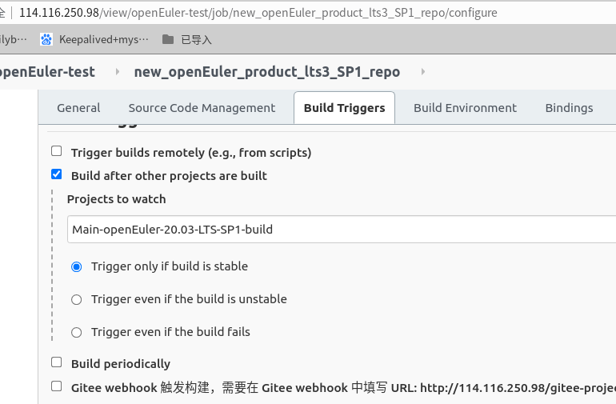<br />
* 远程使pxe机器调用jekins_openqa.sh脚本<br />
  * 检查iso标准镜像是否同步结束
  * 挂载iso，在pxe服务器 /var/www/html/productrepo/openEuler_lts3_SP1目录下配置repo源    
  * 在pxe服务器 /var/lib/tftpboot/openEuler_lts3_SP1/ 目录下配置image文件
  * 在pxe服务器 /var/lib/tftpboot/openEuler/GUI_20.03_LTS_SP1/ 目录下配置efi文件
* 远程使pxe机器调用run_openeuler_at.s脚本<br />
  * 调用openeuler_at_operation.py start openEuler-20.03-LTS-SP1-aarch64-dvd朝server服务器8090 端口发送消息，消息内容包含api/start/openEuler-20.03-LTS-SP1-aarch64-dvd
  * server通过openapy.py 脚本 监听8090端口
  * 等待jobs任务结束，获取任务结果，安装任务结束，传送qcow2到pxe上
#### 2.1.1 关于jekins_openqa.sh脚本调用方法<br />
* 每日构建arm 版本：<br />
  sh -x jekins_openqa.sh openEuler-1.0-aarch64-dvd
* 每日构建x86 版本 ：<br />
  sh -x jekins_openqa.sh openEuler-1.0-x86_64-dvd  
* 21.03 arm 版本 ：<br />
  sh -x jekins_openqa.sh openEuler-21.03-aarch64-dvd  
* 21.03 x86版本 ： <br />
  sh -x jekins_openqa.sh openEuler-21.03-x86_64-dvd
* SP1 arm 版本 ：<br /> 
  sh -x jekins_openqa.sh openEuler-20.03-LTS-SP1-aarch64-dvd
* SP1 x86 版本 ：<br />
  sh -x jekins_openqa.sh openEuler-20.03-LTS-SP1_x86_64-dvd
* SP2 arm 版本 ：<br /> 
  sh -x jekins_openqa.sh openEuler-20.03-LTS-SP2-aarch64-dvd
* SP2 x86 版本 ：<br />
  sh -x jekins_openqa.sh openEuler-20.03-LTS-SP2_x86_64-dvd
* Next arm 版本 ：<br /> 
  sh -x jekins_openqa.sh openEuler-20.03-LTS-Next-aarch64-dvd
* Next x86 版本 ：<br />
  sh -x jekins_openqa.sh openEuler-20.03-LTS-Next_x86_64-dvd
#### 2.1.2 关于run_openeuler_at.sh脚本调用方法<br />
* 每日构建arm 版本：<br />
  sh -x run_openeuler_at.sh openEuler-1.0-aarch64-dvd
* 每日构建x86 版本 ：<br />
  sh -x run_openeuler_at.sh openEuler-1.0-x86_64-dvd  
* 21.03 arm 版本 ：<br />
  sh -x run_openeuler_at.sh openEuler-21.03-aarch64-dvd  
* 21.03 x86版本 ： <br />
  sh -x run_openeuler_at.sh openEuler-21.03-x86_64-dvd
* SP1 arm 版本 ：<br /> 
  sh -x run_openeuler_at.sh openEuler-20.03-LTS-SP1-aarch64-dvd
* SP1 x86 版本 ：<br />
  sh -x run_openeuler_at.sh openEuler-20.03-LTS-SP1_x86_64-dvd
* SP2 arm 版本 ：<br /> 
  sh -x run_openeuler_at.sh openEuler-20.03-LTS-SP2-aarch64-dvd
* SP2 x86 版本 ：<br />
  sh -x run_openeuler_at.sh openEuler-20.03-LTS-SP2_x86_64-dvd
* Next arm 版本 ：<br /> 
  sh -x run_openeuler_at.sh openEuler-20.03-LTS-Next-aarch64-dvd
* Next x86 版本 ：<br />
  sh -x run_openeuler_at.sh openEuler-20.03-LTS-Next_x86_64-dvd
### 2.3 server 的openapi.py 脚本<br />
```
 /tmp/openapi.py
```
* openapi 监听8090 端口<br />
* 根据pxe发送来的消息中版本信息，下载ISO镜像到/var/lib/openqa/factory/iso/<br />
* 根据消息中版本信息 执行最小化安装和pxe安装<br />
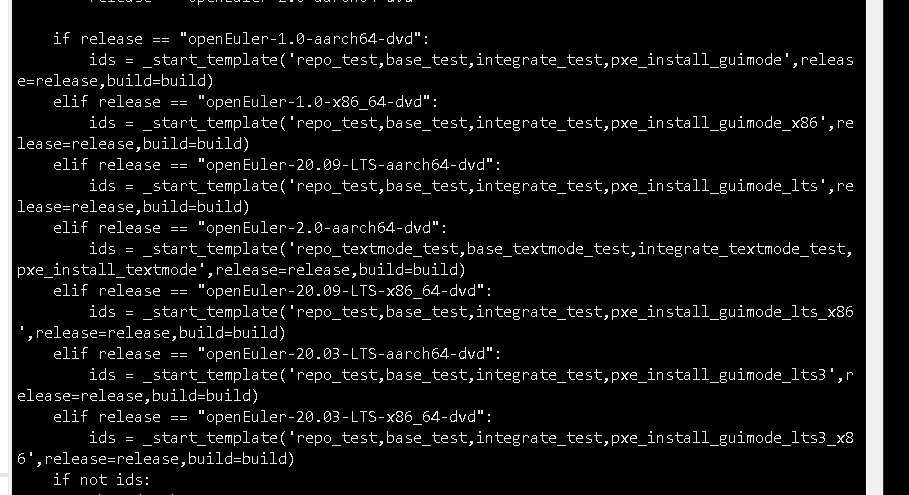<br />
## 2.4 如何新增加at任务  以集成用例为例<br />
### 2.4.1 模板介绍<br />
模板分为JobTemplates， Machines，Products，TestSuites 四个部分  
* JobTemplates 用来添加TestSuites到job，其中包含有几个 group<br />
  openEuler-20.03-LTS     对应20.03-LTS 版本<br />
  openEuler-21.03-LTS     对应21.03 版本<br />
  openEuler-build-daily   对应每日构建Mainline版本<br />
  openEuler-20.03-LTS-SP1     对应20.03-LTS-SP1 版本<br />
  openEuler-20.03-LTS-SP2     对应20.03-LTS-SP2 版本<br />
  openEuler-20.03-LTS-Next     对应20.03-LTS-Next 版本<br />
* Machines  机器信息，现在有x86 和arm 两种类型<br />
* TestSuites 测试套<br />
### 2.4.2 修改模板<br />
#### 2.4.2.1 模板JobTemplates 里面加上任务，如：<br />
  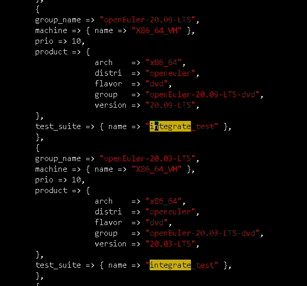<br />
  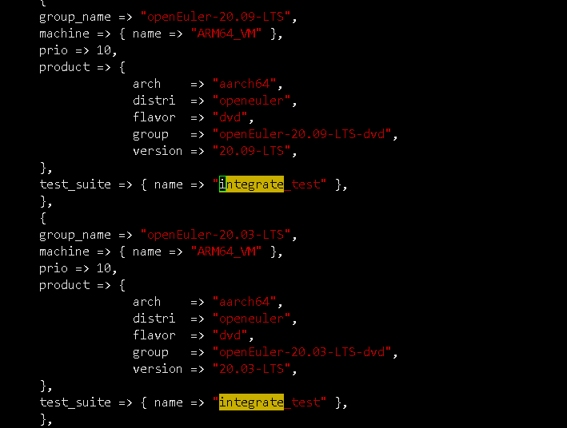<br />
* 模板JobTemplates 中每个group，的x86 和 arm 版本都要添加<br />
### 2.4.2.2 模板加测试套 integrate_test<br />
  <br />
* START_AFTER_TEST:integrate_test 依赖 install_common_testsuite 测试套<br />
* install_common_testsuite 测试用例执行结束后会生成openEuler-Server-%VERSION%-%ARCH%-common.qcow2<br />
* HDD_1：integrate_test 使用 openEuler-Server-%VERSION%-%ARCH%-common.qcow2  创建虚拟机<br />
* INTEGRATE_INSTALL_CMD： 在执行用例前会先执行这个，从pxe下载用例<br />
* TESTSUITE_CMD：执行用例的命令<br />
* WRAPPER_TESTSUITES：带入TESTSUITE_CMC中#TESTSUITE# 参数<br />
### 2.4.2.3 使模板生效<br />
执行以下命令<br />
```
./templates-openeuler   --apikey DF1D402EB7F6FA51 --apisecret  CDE154E23581AE98 
```
### 2.4.2.4 查看web页面模板是否生效<br />
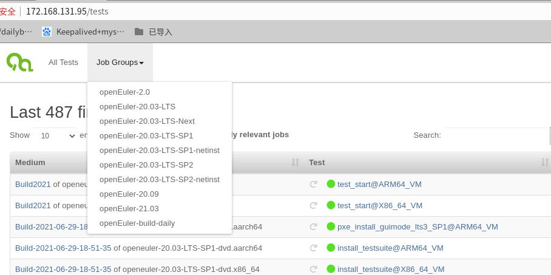<br />
挨个点开，查看，确认生效，如：<br />
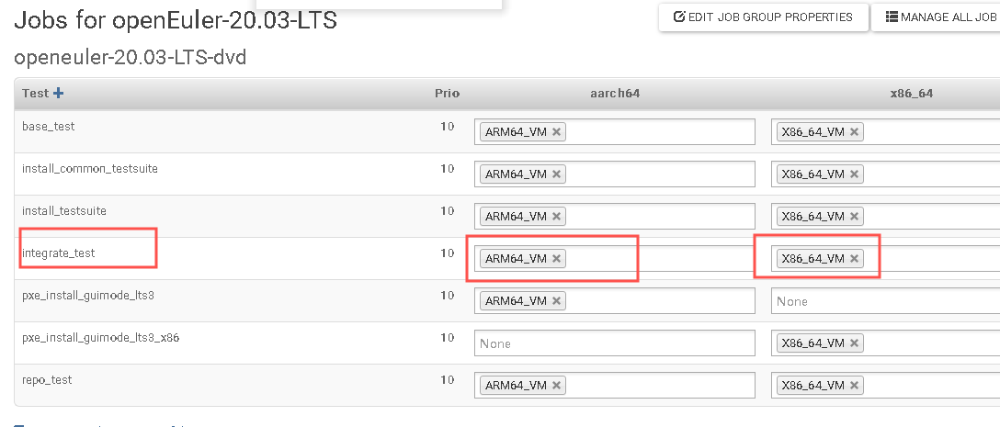<br />
### 2.4.2.5 用例放到到pxe上<br />
放在 /var/www/html/目录下<br />
### 2.4.2.6  拉取用例测试<br />
```
/usr/share/openqa/script/client isos post DISTRI=openeuler RELEASE=openEuler-20.03-LTS-aarch64-dvd VERSION=20.03-LTS  FLAVOR=dvd ARCH=aarch64 BUILD=20200515 --apikey DF1D402EB7F6FA51 --apisecret  CDE154E23581AE98 test=integrate_test
```
查看web页面是否拉取成功<br />
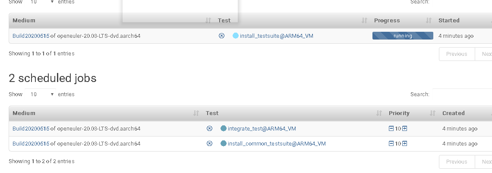<br />
查看已经结束的用例执行日志：<br />
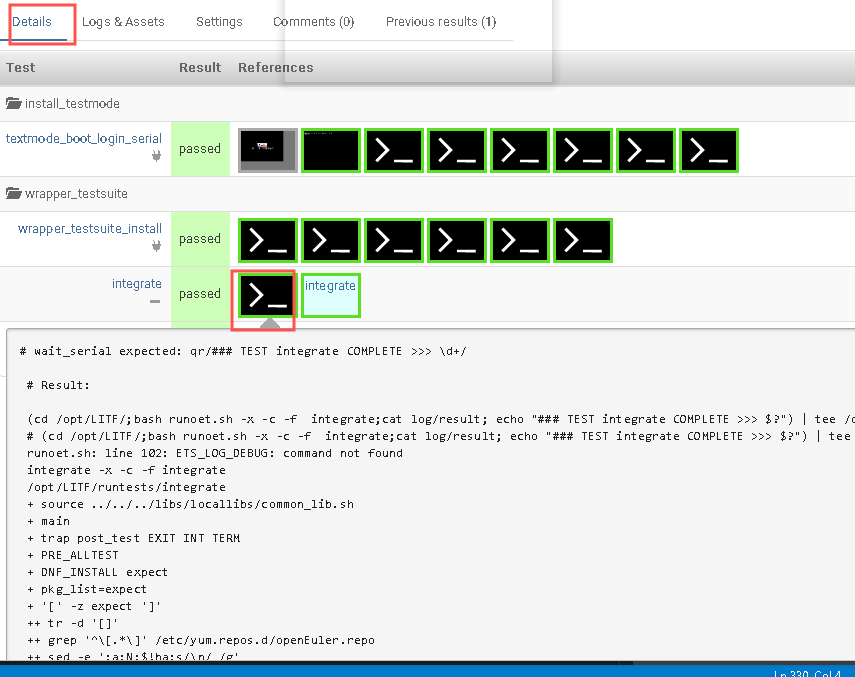<br />
查看正在运行的用例日志：<br />
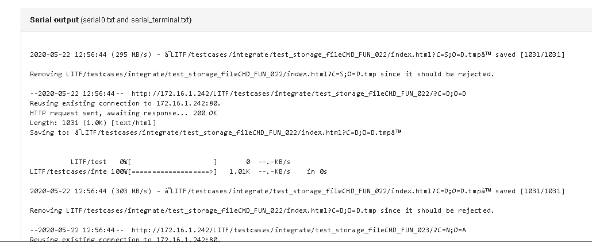<br />
