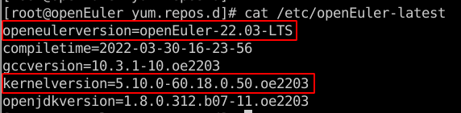
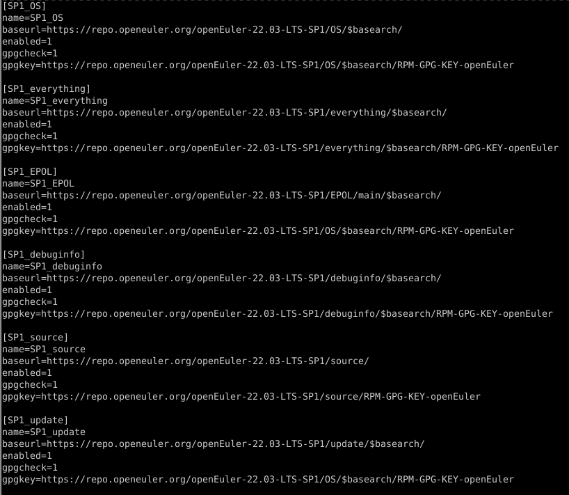
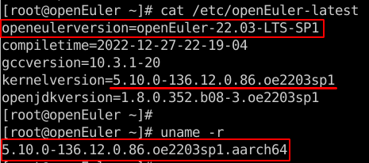

## **1**. **系统安装**
获取openEuler-22.03-LTS镜像，参考安装指南，完成openEuler操作系统的安装。

查看当前环境openEuler、kernel版本




## **2**. **升级兼容性**

### 2.1 添加openEuler-22.03-LTS-SP1 repo源 (openEuler-22.03-LTS-SP1.repo)

```
SP1_OS、SP1_everything、SP1_EPOL、SP1_debuginfo、SP1_source、SP1_update 
```




### 2.2 获取openEuler-22.03-LTS-SP1中可安装的软件包名，并生成upgrade_list文件

```
dnf list --available --repo='SP1_OS' --repo='SP1_everything' --repo='SP1_EPOL' | grep "arch\|x86_64" | awk '{print $1}' | awk -F. 'OFS="."{$NF="";print}' | awk '{print substr($0, 1, length($0)-1)}'  > upgrade_list
```

### 2.3 执行升级

```
dnf install -y $(cat upgrade_list) | tee update_log
```

```
补充说明：     
1、安装报错时，通过执行 dnf install -y $(cat upgrade_list) --skip-broken -x conflict_pkg1 |tee update_log 规避安装冲突问题，如果有多个包冲突，添加多个-x conflict_pkg1 -x conflict_pkg2 -x conflict_pkg3，待升级完成后，对跳过的软件包单独进行分析、验证、升级;  
2、参数释义：
--allowerasing  通过卸载已安装的软件包解决依赖关系 
--skip-broken 通过跳过软件包解决依赖问题
-x 跟--skip-broken配合使用，后边跟需要跳过的软件包名
```

#### 22.03-LTS 到 22.03-LTS-SP1升级脚本如下：
```
dnf install -y $(cat upgrade_list) --allowerasing --skip-broken -x hadoop-3.1* -x redis5* -x redis6* -x ansible-2.9 -x ansible-2.9-test -x ros-noetic-ros-nodelet_core -x python3-yarg -x protobuf-devel -x aops-web -x openvswitch -x protobuf-compiler -x LZMA-SDK -x libisal -x pin-server-demo -x kernel-rt-tools -x libtraceevent -x postgresql-server-devel -x dtkwidget-devel -x libreswan -x nodejs-yarn -x python3-edk2-devel -x xorg-x11-server-help -x kiran-wallpapers -x mysql-config -x kata-containers  | tee update_log
```

```
批注：  
hadoop-3.1、redis5、redis6、ansible是因为多版本导致的文件冲突，无法和hadoop、redis、ansible-2.9、ansible-2.9-test同时进行安装;    
ros-noetic-ros-nodelet_core和ros-noetic-ros-comm、  
python3-yarg和python3-prometheus-api-client、  
protobuf-devel和protobuf2-vim、  
aops-web和aops-hermes、  
openvswitch和python3-ovs、  
protobuf-compiler和protobuf2-compiler、  
LZMA-SDK和xz-lzma-compat、  
libisal和libisa-l、libisa-l-devel、isa-l、   
kernel-rt-tools和kernel-tools、  
libtraceevent和perf、  
postgresql-server-devel和libpq-devel、  
dtkwidget-devel和dtkwidget2、  
libreswan和strongswan、  
nodejs-yarn和hadoop-yarn、  
python3-edk2-devel和build、  
xorg-x11-server-help和cvt、  
kiran-wallpapers和mate-backgrounds、  
mysql和mariadb、  
kata-containers和kata-micro-kernel、  
是不同名同源的软件，也无法同步进行安装。
```


### 2.4 重启系统

```
reboot
```


## **3**. **升级结果验证**

查看当前环境的openEuler、kernel版本




## **4**. **降级兼容性**

### 4.1 执行降级

```
dnf downgrade -y $(cat upgrade_list) | tee downgrade_log
```

### 4.2 重启系统

```
reboot
```

## **5**. **降级结果验证**

查看当前环境的openEuler、kernel版本

