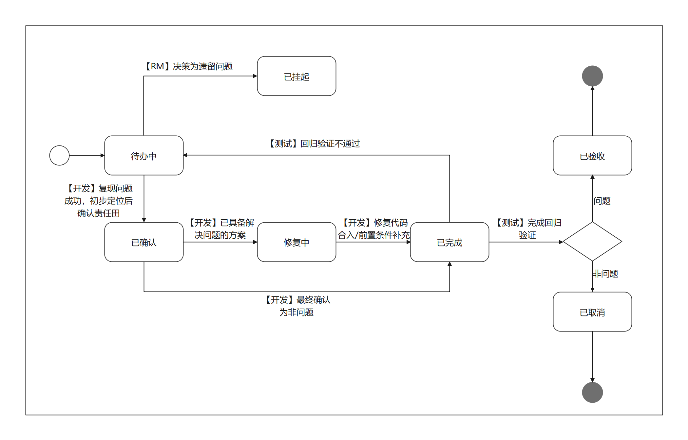

# 社区版本issue创建处理流程与规范
openEuler是一个开源、免费的Linux发行版平台，通过开放的社区形式与全球的开发者共同构建一个开放、多元并且架构包容的软件生态体系。openEuler发布每年均会发布多个版本，在版本测试过程中，会通过缺陷类的issue跟踪测试发布问题的修复，为了更好的协同测试参与人员、开发参与人员以及release团队的协同，现将社区issue的规范流程文档化以支持版本的规范运作。

# 社区版本ISSUE提单规范
## ISSUE属性
|属性|是否必须|规范内容|
|:-:|:-:|:-|
|类型|是|问题类issue选择`缺陷`;需求类issue选择`需求`|
|负责人|是|根据[community](https://gitee.com/openeuler/community)仓库中各[sig](https://gitee.com/openeuler/community/tree/master/sig)目录sig-info.yaml中的committer/maintainer填写对应责任人|
|里程碑|是|选择对应版本的里程碑，里程碑命名如下`openEuler-<os_version>-round-<test_round>` or `openEuler-<os_version>-<extension>-round-<test_round>`|
|优先级|否|基于问题严重级别进行选择：严重/主要/次要/不重要|
|标签|否|sig信息/是否DT缺陷流出等(FST)|

版本测试里程碑命名规范：
- 根据openEuler版本和测试轮次组合里程碑名
- 扩展信息`extension`可附在os版本信息和测试轮次终件
> 注：以openEuler 22.09版本，第4次转测轮次为例，里程碑为`openEuler-22.09-round-4`;以openEuler 22.03 LTS的xx架构版本，第2次转测轮次为例，里程碑为`openEuler-22.03-LTS-xx-round-2`

## 缺陷类ISSUE处理流程

- 问题遗留需在release-sig例会上公开评审并给出结论。(挂起状态应由release成员进行修改)
- `已完成`状态为问题修复责任开发者在修复问题或者给出一定闭环结论后修改的状态，并不等于`已验收`，后续需要问题提出者进行回归闭环
- 已经过测试验收的已验收状态是为问题解决。（已验收状态应由测试人员(问题创建人)/QA committer/maintainer进行修改）
- 版本`已挂起`的问题需要在后续版本持续跟踪